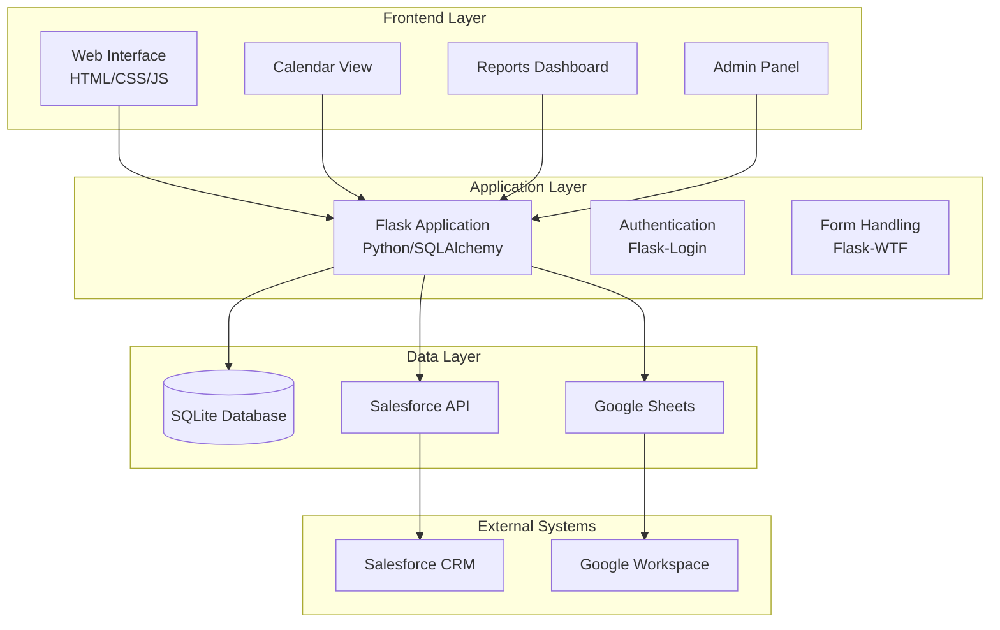
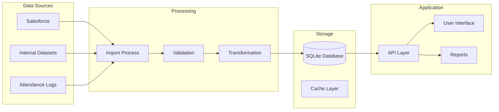

# Volunteer Management System (VMS) - System Overview

## 🎯 Project Purpose

The Volunteer Management System (VMS) is a centralized web-based application designed to streamline volunteer data management, event tracking, and reporting for educational organizations. The system serves as a single source of truth for volunteer activities while integrating with external systems like Salesforce.

### Primary Goals
- **Centralize volunteer data** from multiple sources (Salesforce, internal datasets, attendance logs)
- **Track events and attendance** with comprehensive reporting capabilities
- **Provide actionable insights** through detailed analytics and reports
- **Support district coordinators** and internal teams in volunteer management
- **Enable data-driven decisions** through comprehensive reporting

## 🏗️ System Architecture

## 🔧 Technology Stack

### Backend
- **Framework**: Flask (Python)
- **ORM**: SQLAlchemy
- **Database**: SQLite (with Salesforce sync capability)
- **Authentication**: Flask-Login
- **Forms**: Flask-WTF

### Frontend
- **Markup**: HTML5
- **Styling**: CSS3 with custom design system
- **Interactivity**: Vanilla JavaScript
- **Responsive**: Mobile-first design approach

### Data Integration
- **Primary Source**: Salesforce CRM
- **Secondary Sources**: Internal datasets, attendance logs
- **File Handling**: Google Sheets integration
- **Data Sync**: Automated import processes

## 📊 Core Modules

### 1. Event Management
- **Purpose**: Track and manage volunteer events
- **Features**:
  - Interactive calendar with color-coded status
  - Event lifecycle management (Draft → Published → Confirmed → Completed → Cancelled)
  - Attendance tracking and reporting
  - Event type categorization

### 2. Organization Management
- **Purpose**: Manage partner organizations and their relationships
- **Features**:
  - Complete organization profiles
  - Directory system with search and filtering
  - Interaction tracking and history
  - Salesforce integration

### 3. Volunteer Management
- **Purpose**: Comprehensive volunteer tracking and engagement
- **Features**:
  - Volunteer profiles with skills and experience
  - Engagement history and participation tracking
  - Search and filtering capabilities
  - Import/export functionality

### 4. Attendance System
- **Purpose**: Track participation in events and programs
- **Features**:
  - Manual attendance entry
  - Spreadsheet upload capabilities
  - Attendance analytics and reporting
  - Student and teacher tracking

### 5. Reporting System
- **Purpose**: Generate insights and analytics
- **Features**:
  - Usage reports and metrics
  - Organization performance analytics
  - Volunteers by Event report (identify volunteers for selected event types like Career Fair and Data Viz) with Excel export
  - Data visualization
  - Export capabilities (Excel, PDF)

### 6. Calendar System
- **Purpose**: Visual event management and scheduling
- **Features**:
  - Interactive calendar interface
  - Color-coded events by status and type
  - Date range filtering
  - Event details on click

## 🔄 Data Flow

## 🎯 Key User Personas

### 1. District Coordinators
- **Primary Needs**: Event management, volunteer coordination, reporting
- **Key Features**: Calendar view, volunteer search, attendance tracking

### 2. Internal Teams
- **Primary Needs**: Data management, system administration, analytics
- **Key Features**: Admin panel, import/export, comprehensive reporting

### 3. Volunteers (Future)
- **Primary Needs**: Self-service profile management, event participation
- **Key Features**: Profile updates, event registration, participation history

## 📈 Success Metrics

### Data Quality
- **Completeness**: Percentage of volunteer profiles with complete information
- **Accuracy**: Data validation and error rates
- **Timeliness**: Data freshness and sync frequency

### User Adoption
- **Active Users**: Number of regular system users
- **Feature Usage**: Most used features and modules
- **User Satisfaction**: Feedback and support ticket trends

### Operational Efficiency
- **Time Savings**: Reduction in manual data entry and reporting
- **Data Consistency**: Single source of truth effectiveness
- **Reporting Accuracy**: Report generation time and accuracy

## 🚀 Future Roadmap

### Phase 1: Core Stability (Current)
- [x] Complete core functionality
- [x] Establish data sync processes
- [x] Implement comprehensive testing

### Phase 2: Enhanced Features
- [ ] Email management system
- [ ] Mobile-responsive improvements
- [ ] Advanced search functionality
- [ ] API integrations

### Phase 3: Advanced Capabilities
- [ ] Machine learning insights
- [ ] Predictive analytics
- [ ] Advanced reporting dashboards
- [ ] Multi-tenant architecture

## 🔗 Related Documentation

- [Architecture Details](02-architecture.md)
- [Data Model](03-data-model.md)
- [API Specification](04-api-spec.md)
- [Development Guide](05-dev-guide.md)
- [Feature Matrix](FEATURE_MATRIX.md)

---

*Last updated: August 2025*
