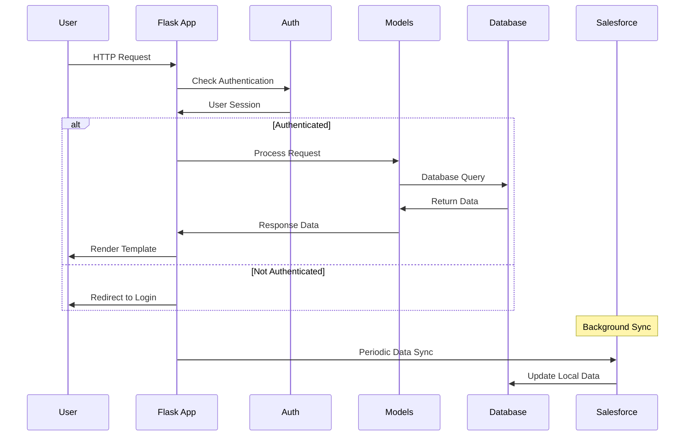
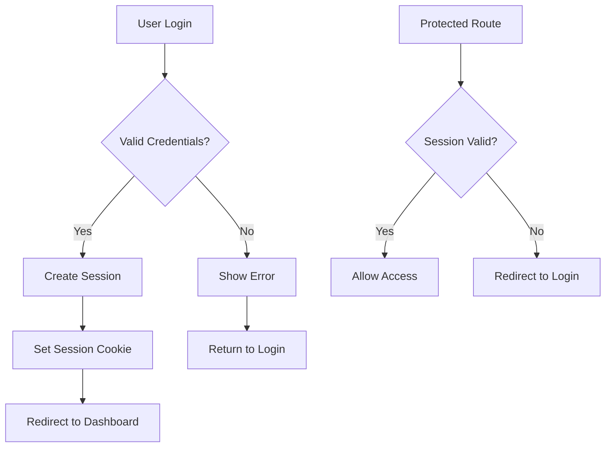
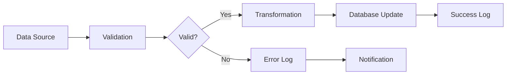

# VMS Architecture

## 🏗️ System Design Principles

### 1. Single Source of Truth
- **Primary Data**: Salesforce CRM serves as the authoritative source
- **Local Cache**: SQLite database maintains synchronized local copy
- **Data Consistency**: Import processes ensure data integrity

### 2. Modular Design
- **Separation of Concerns**: Clear boundaries between models, routes, and templates
- **Plugin Architecture**: Routes organized by feature domain
- **Reusable Components**: Shared utilities and common patterns

### 3. Security First
- **Authentication**: Flask-Login for session management
- **Authorization**: Role-based access control (RBAC)
- **Data Protection**: Encrypted sensitive data storage

## 📁 Project Structure

```
VMS/
├── app.py                 # Application entry point
├── config.py             # Configuration management
├── forms.py              # Form definitions
├── models/               # Data models
│   ├── __init__.py
│   ├── user.py           # User authentication
│   ├── volunteer.py      # Volunteer data
│   ├── organization.py   # Organization data
│   ├── event.py          # Event management
│   ├── attendance.py     # Attendance tracking
│   └── ...
├── routes/               # Route handlers
│   ├── __init__.py
│   ├── auth/            # Authentication routes
│   ├── volunteers/      # Volunteer management
│   ├── organizations/   # Organization management
│   ├── events/          # Event management
│   ├── reports/         # Reporting system
│   └── ...
├── templates/           # HTML templates
│   ├── base.html       # Base template
│   ├── volunteers/     # Volunteer templates
│   ├── organizations/  # Organization templates
│   └── ...
├── static/             # Static assets
│   ├── css/           # Stylesheets
│   ├── js/            # JavaScript
│   └── ...
└── tests/             # Test suite
    ├── unit/          # Unit tests
    └── integration/   # Integration tests
```

## 🔄 Application Flow



## 🗄️ Database Design

### Core Tables

```sql
-- Users and Authentication
CREATE TABLE users (
    id INTEGER PRIMARY KEY,
    username VARCHAR(80) UNIQUE NOT NULL,
    email VARCHAR(120) UNIQUE NOT NULL,
    password_hash VARCHAR(255),
    role VARCHAR(20) DEFAULT 'user',
    created_at TIMESTAMP DEFAULT CURRENT_TIMESTAMP
);

-- Volunteers
CREATE TABLE volunteers (
    id INTEGER PRIMARY KEY,
    salesforce_id VARCHAR(50) UNIQUE,
    first_name VARCHAR(100),
    last_name VARCHAR(100),
    email VARCHAR(120),
    phone VARCHAR(20),
    organization_id INTEGER,
    skills TEXT,
    status VARCHAR(20) DEFAULT 'active',
    created_at TIMESTAMP DEFAULT CURRENT_TIMESTAMP,
    updated_at TIMESTAMP DEFAULT CURRENT_TIMESTAMP,
    FOREIGN KEY (organization_id) REFERENCES organizations(id)
);

-- Organizations
CREATE TABLE organizations (
    id INTEGER PRIMARY KEY,
    salesforce_id VARCHAR(50) UNIQUE,
    name VARCHAR(200) NOT NULL,
    type VARCHAR(50),
    address TEXT,
    city VARCHAR(100),
    state VARCHAR(50),
    postal_code VARCHAR(20),
    country VARCHAR(50),
    created_at TIMESTAMP DEFAULT CURRENT_TIMESTAMP,
    updated_at TIMESTAMP DEFAULT CURRENT_TIMESTAMP
);

-- Events
CREATE TABLE events (
    id INTEGER PRIMARY KEY,
    title VARCHAR(200) NOT NULL,
    description TEXT,
    event_type VARCHAR(50),
    status VARCHAR(20) DEFAULT 'draft',
    start_date DATE,
    end_date DATE,
    location VARCHAR(200),
    created_by INTEGER,
    created_at TIMESTAMP DEFAULT CURRENT_TIMESTAMP,
    updated_at TIMESTAMP DEFAULT CURRENT_TIMESTAMP,
    FOREIGN KEY (created_by) REFERENCES users(id)
);

-- Attendance
CREATE TABLE attendance (
    id INTEGER PRIMARY KEY,
    event_id INTEGER,
    volunteer_id INTEGER,
    student_id INTEGER,
    teacher_id INTEGER,
    status VARCHAR(20) DEFAULT 'present',
    notes TEXT,
    created_at TIMESTAMP DEFAULT CURRENT_TIMESTAMP,
    FOREIGN KEY (event_id) REFERENCES events(id),
    FOREIGN KEY (volunteer_id) REFERENCES volunteers(id),
    FOREIGN KEY (student_id) REFERENCES students(id),
    FOREIGN KEY (teacher_id) REFERENCES teachers(id)
);
```

## 🔐 Security Architecture

### Authentication Flow



### Authorization Matrix

| Role | Volunteers | Organizations | Events | Reports | Admin |
|------|------------|---------------|--------|---------|-------|
| User | Read | Read | Read | Read | None |
| Coordinator | Read/Write | Read/Write | Read/Write | Read/Write | None |
| Admin | Full | Full | Full | Full | Full |

## 🔄 Data Integration Patterns

### Salesforce Sync

```python
class SalesforceSync:
    def __init__(self, config):
        self.client = SalesforceClient(config)
        self.db = Database()
    
    def sync_volunteers(self):
        """Sync volunteer data from Salesforce"""
        sf_volunteers = self.client.get_volunteers()
        for volunteer in sf_volunteers:
            self.db.upsert_volunteer(volunteer)
    
    def sync_organizations(self):
        """Sync organization data from Salesforce"""
        sf_orgs = self.client.get_organizations()
        for org in sf_orgs:
            self.db.upsert_organization(org)
```

### Import Process Flow



## 🎨 Frontend Architecture

### Template Hierarchy

```
base.html
├── base-nonav.html
├── volunteers/
│   ├── volunteers.html
│   ├── add_volunteer.html
│   ├── edit.html
│   └── view.html
├── organizations/
│   ├── organizations.html
│   ├── add_organization.html
│   └── view.html
└── reports/
    ├── reports.html
    └── [report-specific templates]
```

### CSS Architecture

```css
/* Design System */
:root {
    --primary-color: #007bff;
    --secondary-color: #6c757d;
    --success-color: #28a745;
    --warning-color: #ffc107;
    --danger-color: #dc3545;
    --light-color: #f8f9fa;
    --dark-color: #343a40;
}

/* Component Classes */
.btn { /* Button styles */ }
.card { /* Card styles */ }
.table { /* Table styles */ }
.form { /* Form styles */ }
```

### JavaScript Patterns

```javascript
// Module Pattern for Feature-Specific JS
const VolunteerManager = {
    init() {
        this.bindEvents();
        this.initializeComponents();
    },
    
    bindEvents() {
        document.querySelectorAll('.volunteer-action').forEach(el => {
            el.addEventListener('click', this.handleAction.bind(this));
        });
    },
    
    handleAction(event) {
        // Handle volunteer actions
    }
};
```

## 🧪 Testing Strategy

### Test Pyramid

```
    /\
   /  \     E2E Tests (Few)
  /____\    
 /      \   Integration Tests (Some)
/________\  Unit Tests (Many)
```

### Test Categories

1. **Unit Tests**: Individual functions and methods
2. **Integration Tests**: Database interactions and API endpoints
3. **End-to-End Tests**: Complete user workflows
4. **Performance Tests**: Load testing and response times

## 📊 Monitoring and Logging

### Logging Strategy

```python
import logging
import structlog

# Structured logging
logger = structlog.get_logger()

def log_user_action(user_id, action, details):
    logger.info(
        "user_action",
        user_id=user_id,
        action=action,
        details=details,
        timestamp=datetime.utcnow()
    )
```

### Health Checks

```python
@app.route('/health')
def health_check():
    return {
        'status': 'healthy',
        'database': check_database_connection(),
        'salesforce': check_salesforce_connection(),
        'timestamp': datetime.utcnow().isoformat()
    }
```

## 🚀 Deployment Architecture

### Development Environment

```yaml
# docker-compose.yml
version: '3.8'
services:
  app:
    build: .
    ports:
      - "5000:5000"
    environment:
      - FLASK_ENV=development
      - DATABASE_URL=sqlite:///vms.db
    volumes:
      - .:/app
```

### Production Considerations

1. **Database**: PostgreSQL for production
2. **Caching**: Redis for session storage
3. **Load Balancing**: Nginx reverse proxy
4. **Monitoring**: Application performance monitoring
5. **Backup**: Automated database backups

## 🔧 Configuration Management

### Environment Variables

```python
# config.py
class Config:
    SECRET_KEY = os.environ.get('SECRET_KEY')
    DATABASE_URL = os.environ.get('DATABASE_URL')
    SALESFORCE_CLIENT_ID = os.environ.get('SALESFORCE_CLIENT_ID')
    SALESFORCE_CLIENT_SECRET = os.environ.get('SALESFORCE_CLIENT_SECRET')
    LOG_LEVEL = os.environ.get('LOG_LEVEL', 'INFO')
```

### Feature Flags

```python
# Feature toggles for gradual rollout
FEATURES = {
    'new_reporting_ui': os.environ.get('NEW_REPORTING_UI', 'false').lower() == 'true',
    'advanced_search': os.environ.get('ADVANCED_SEARCH', 'false').lower() == 'true',
    'email_notifications': os.environ.get('EMAIL_NOTIFICATIONS', 'false').lower() == 'true'
}
```

## 🔗 Related Documentation

- [System Overview](01-overview.md)
- [Data Model](03-data-model.md)
- [API Specification](04-api-spec.md)
- [Development Guide](05-dev-guide.md)

---

*Last updated: August 2025* 