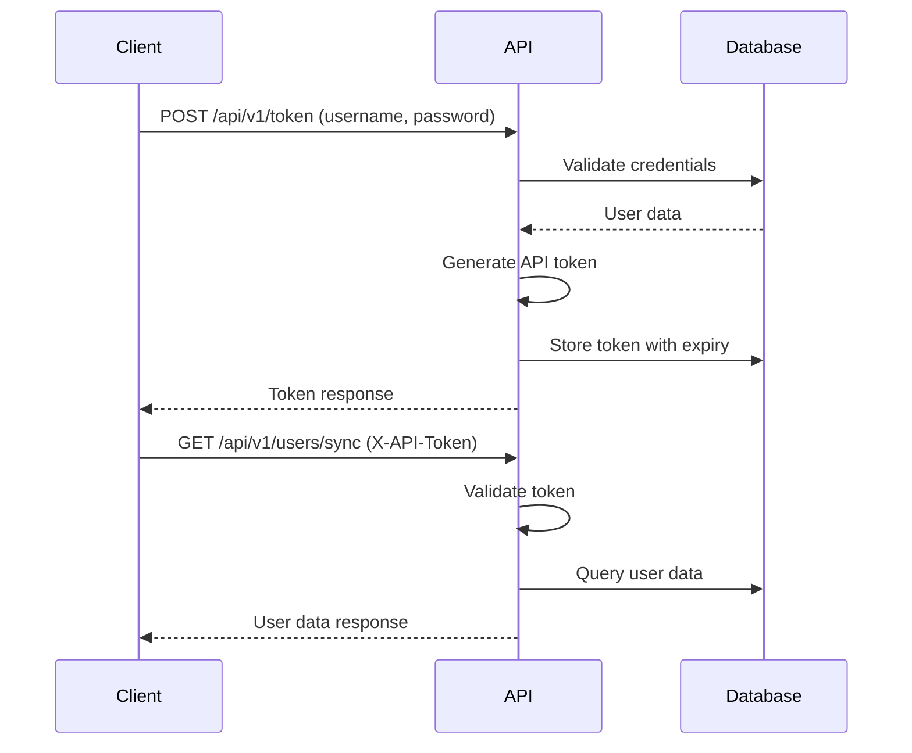

# VMS API Specification

## 🔐 Authentication

The VMS API uses **token-based authentication** for secure access to API endpoints. The system supports both session-based authentication for web interfaces and API token authentication for programmatic access.

### Authentication Flow



### Headers

All API requests must include the following headers:

```http
Content-Type: application/json
Accept: application/json
X-API-Token: <your_api_token>  # For authenticated endpoints
```

### Token Management

- **Token Generation**: Tokens are generated with expiration dates (default: 30 days)
- **Token Validation**: Each request validates token existence and expiration
- **Token Refresh**: Tokens can be refreshed before expiration
- **Token Revocation**: Tokens can be revoked immediately

## 📋 API Endpoints

### Authentication Endpoints

#### 1. Generate API Token

**POST** `/api/v1/token`

Generate a new API token for authentication.

**Request Body:**
```json
{
    "username": "user@example.com",
    "password": "secure_password"
}
```

**Response (200 OK):**
```json
{
    "success": true,
    "token": "abc123def456ghi789",
    "expires_at": "2024-12-31T23:59:59Z",
    "user": {
        "id": 1,
        "username": "user@example.com",
        "first_name": "John",
        "last_name": "Doe",
        "security_level": 2
    }
}
```

**Response (401 Unauthorized):**
```json
{
    "error": "Invalid credentials"
}
```

#### 2. Revoke API Token

**POST** `/api/v1/token/revoke`

Revoke the current API token.

**Headers:**
```http
X-API-Token: abc123def456ghi789
```

**Response (200 OK):**
```json
{
    "success": true,
    "message": "Token revoked successfully"
}
```

#### 3. Refresh API Token

**POST** `/api/v1/token/refresh`

Refresh the current API token with a new expiration date.

**Headers:**
```http
X-API-Token: abc123def456ghi789
```

**Request Body:**
```json
{
    "expiration_days": 30
}
```

**Response (200 OK):**
```json
{
    "success": true,
    "token": "new_token_here",
    "expires_at": "2025-01-30T23:59:59Z"
}
```

### User Management Endpoints

#### 4. Synchronize User Data

**GET** `/api/v1/users/sync`

Retrieve user data with optional incremental synchronization.

**Headers:**
```http
X-API-Token: abc123def456ghi789
```

**Query Parameters:**
- `since_date` (optional): Only return users updated since this date (ISO format)
- `limit` (optional): Maximum number of users to return (default: 100)
- `offset` (optional): Number of users to skip (default: 0)

**Response (200 OK):**
```json
{
    "success": true,
    "users": [
        {
            "id": 1,
            "username": "user@example.com",
            "email": "user@example.com",
            "first_name": "John",
            "last_name": "Doe",
            "security_level": 2,
            "created_at": "2024-01-01T00:00:00Z",
            "updated_at": "2024-01-15T10:30:00Z"
        }
    ],
    "total_count": 1,
    "has_more": false
}
```

#### 5. Get Specific User

**GET** `/api/v1/users/{user_id}`

Retrieve data for a specific user.

**Headers:**
```http
X-API-Token: abc123def456ghi789
```

**Response (200 OK):**
```json
{
    "success": true,
    "user": {
        "id": 1,
        "username": "user@example.com",
        "email": "user@example.com",
        "first_name": "John",
        "last_name": "Doe",
        "security_level": 2,
        "created_at": "2024-01-01T00:00:00Z",
        "updated_at": "2024-01-15T10:30:00Z"
    }
}
```

**Response (404 Not Found):**
```json
{
    "error": "User not found"
}
```

## 🌐 Web Application Routes

The VMS system primarily operates through web-based routes rather than a comprehensive REST API. Here are the main web routes:

### Authentication Routes

- **GET** `/login` - Login page
- **POST** `/login` - Process login
- **GET** `/logout` - Logout user

### Volunteer Management Routes

- **GET** `/volunteers` - List all volunteers
- **GET** `/volunteers/add` - Add volunteer form
- **POST** `/volunteers/add` - Create new volunteer
- **GET** `/volunteers/view/{id}` - View volunteer details
- **GET** `/volunteers/edit/{id}` - Edit volunteer form
- **POST** `/volunteers/edit/{id}` - Update volunteer
- **DELETE** `/volunteers/delete/{id}` - Delete volunteer
- **POST** `/volunteers/import-from-salesforce` - Import volunteers from Salesforce
- **POST** `/volunteers/toggle-exclude-reports/{id}` - Toggle report exclusion
- **POST** `/volunteers/update-local-statuses` - Update local statuses

### Organization Management Routes

- **GET** `/organizations` - List all organizations
- **GET** `/organizations/view/{id}` - View organization details
- **GET** `/organizations/add` - Add organization form
- **POST** `/organizations/add` - Create new organization
- **GET** `/organizations/edit/{id}` - Edit organization form
- **POST** `/organizations/edit/{id}` - Update organization
- **DELETE** `/organizations/delete/{id}` - Delete organization
- **POST** `/organizations/import-from-salesforce` - Import organizations from Salesforce
- **POST** `/organizations/import-affiliations-from-salesforce` - Import affiliations

### Event Management Routes

- **GET** `/events` - List all events
- **GET** `/events/add` - Add event form
- **POST** `/events/add` - Create new event
- **GET** `/events/view/{id}` - View event details
- **GET** `/events/edit/{id}` - Edit event form
- **POST** `/events/edit/{id}` - Update event
- **DELETE** `/events/delete/{id}` - Delete event

### Report Routes

- **GET** `/reports` - Main reports page
- **GET** `/reports/attendance` - Attendance reports
### Management/Admin Routes

- **GET** `/admin` - Admin dashboard
- **GET** `/admin/audit-logs` - View audit logs (admin-only)
  - Filters: `action`, `resource_type`, `user_id`, `start_date`, `end_date`
  - Pagination: `page` (default: 1), `per_page` (default: 50; supports 25/50/100/200)
  - Responses: 200 OK with list and pagination, 302/403 when not authorized
- **POST** `/management/refresh-all-caches` - Refresh caches (query: `scope=all|virtual|org|district|first_time_volunteer`, optional `school_year`, optional `host_filter`)

### Audit Logging

Audit entries are recorded for destructive actions (delete/purge) across volunteers, events, organizations, attendance, bug reports, Google Sheets, schools, and districts. Destructive endpoints are protected by RBAC; non-admins receive 403.

Schema (AuditLog):
- id, created_at (UTC), user_id, action, resource_type, resource_id, method, path, ip, meta (JSON)

Notes:
- Tables are auto-created on startup; `AuditLog` appears as `audit_log` in the DB.
- **GET** `/reports/contact` - Contact reports
- **GET** `/reports/first-time-volunteer` - First-time volunteer reports
- **GET** `/reports/organization/report` - Organization reports
- **GET** `/reports/district/year-end` - District year-end reports
- **GET** `/reports/virtual/usage` - Virtual session usage reports
- **GET** `/reports/volunteer/thankyou` - Volunteer thank you reports

### Management Routes

- **GET** `/admin` - Admin dashboard
- **POST** `/admin/import` - Import data
- **GET** `/google-sheets` - Google Sheets management
- **POST** `/google-sheets` - Create Google Sheet
- **PUT** `/google-sheets/{id}` - Update Google Sheet
- **DELETE** `/google-sheets/{id}` - Delete Google Sheet
- **GET** `/bug-reports` - Bug reports list
- **POST** `/bug-reports/{id}/resolve` - Resolve bug report

### Teacher Management Routes

- **GET** `/teachers` - List all teachers
- **GET** `/teachers/view/{id}` - View teacher details
- **GET** `/teachers/edit/{id}` - Edit teacher form
- **POST** `/teachers/edit/{id}` - Update teacher
- **POST** `/teachers/import-from-salesforce` - Import teachers from Salesforce
- **POST** `/teachers/toggle-exclude-reports/{id}` - Toggle report exclusion

### Student Management Routes

- **GET** `/students` - List all students
- **GET** `/students/view/{id}` - View student details
- **POST** `/students/import-from-salesforce` - Import students from Salesforce

### History Routes

- **GET** `/history_table` - History table view
- **GET** `/history/view/{id}` - View history entry
- **POST** `/history/add` - Add history entry
- **POST** `/history/delete/{id}` - Delete history entry
- **POST** `/history/import-from-salesforce` - Import history from Salesforce

### Virtual Session Routes

- **GET** `/virtual` - Virtual sessions page
- **POST** `/virtual/purge` - Purge virtual data
- **GET** `/virtual/events` - Virtual events list
- **GET** `/virtual/event/{id}` - Virtual event details
- **POST** `/virtual/import-sheet` - Import virtual sheet

### Calendar Routes

- **GET** `/calendar` - Calendar view

### Bug Report Routes

- **GET** `/bug-reports` - Bug reports list
- **POST** `/bug-reports` - Create bug report
- **GET** `/bug-reports/{id}` - View bug report
- **POST** `/bug-reports/{id}/resolve` - Resolve bug report
- **DELETE** `/bug-reports/{id}` - Delete bug report

### Client Projects Routes

- **GET** `/client-projects` - Client projects list
- **GET** `/client-projects/add` - Add client project form
- **POST** `/client-projects/add` - Create client project
- **GET** `/client-projects/edit/{id}` - Edit client project form
- **POST** `/client-projects/edit/{id}` - Update client project
- **DELETE** `/client-projects/delete/{id}` - Delete client project

### Pathways Routes

- **GET** `/pathways` - Pathways list
- **POST** `/pathways/import-from-salesforce` - Import pathways from Salesforce
- **POST** `/pathways/import-participants-from-salesforce` - Import pathway participants

## ⚠️ Error Handling

### Error Response Format

All API errors follow a consistent format:

```json
{
    "error": "Error message description",
    "code": "ERROR_CODE",
    "details": {
        "field": "Additional error details"
    }
}
```

### HTTP Status Codes

- **200 OK**: Request successful
- **201 Created**: Resource created successfully
- **400 Bad Request**: Invalid request data
- **401 Unauthorized**: Authentication required or failed
- **403 Forbidden**: Insufficient permissions
- **404 Not Found**: Resource not found
- **405 Method Not Allowed**: HTTP method not supported
- **422 Unprocessable Entity**: Validation errors
- **500 Internal Server Error**: Server error

### Common Error Codes

- `AUTH_REQUIRED`: Authentication token missing
- `INVALID_TOKEN`: Invalid or expired token
- `INSUFFICIENT_PERMISSIONS`: User lacks required permissions
- `VALIDATION_ERROR`: Request data validation failed
- `RESOURCE_NOT_FOUND`: Requested resource not found
- `DUPLICATE_ENTRY`: Resource already exists
- `SYNC_ERROR`: Data synchronization error

## 🔒 Security Considerations

### Authentication Security

- **Token Expiration**: All tokens have expiration dates
- **Secure Storage**: Tokens are hashed in the database
- **Token Rotation**: Tokens can be refreshed and revoked
- **Permission Levels**: Different security levels for different operations

### Data Protection

- **Input Validation**: All input is validated and sanitized
- **SQL Injection Prevention**: Parameterized queries used
- **XSS Prevention**: Output is properly escaped
- **CSRF Protection**: CSRF tokens for web forms

### Rate Limiting

- **API Rate Limits**: 100 requests per minute per token
- **Web Route Limits**: 1000 requests per minute per IP
- **Burst Protection**: Temporary blocks for excessive requests

## 📊 Data Formats

### Date/Time Format

All dates and times are in ISO 8601 format with UTC timezone:

```json
{
    "created_at": "2024-01-15T10:30:00Z",
    "updated_at": "2024-01-15T14:45:30Z"
}
```

### Enum Values

Enum values are represented as strings:

```json
{
    "status": "active",
    "security_level": 2,
    "event_type": "career_fair"
}
```

### Pagination

List endpoints support pagination:

```json
{
    "data": [...],
    "pagination": {
        "page": 1,
        "per_page": 20,
        "total": 150,
        "pages": 8
    }
}
```

## 🔧 Integration Examples

### Python Client Example

```python
import requests
import json

class VMSClient:
    def __init__(self, base_url, username, password):
        self.base_url = base_url
        self.token = self._authenticate(username, password)

    def _authenticate(self, username, password):
        response = requests.post(
            f"{self.base_url}/api/v1/token",
            json={"username": username, "password": password}
        )
        response.raise_for_status()
        return response.json()["token"]

    def get_users(self, since_date=None, limit=100, offset=0):
        headers = {"X-API-Token": self.token}
        params = {"limit": limit, "offset": offset}
        if since_date:
            params["since_date"] = since_date

        response = requests.get(
            f"{self.base_url}/api/v1/users/sync",
            headers=headers,
            params=params
        )
        response.raise_for_status()
        return response.json()

    def revoke_token(self):
        headers = {"X-API-Token": self.token}
        response = requests.post(
            f"{self.base_url}/api/v1/token/revoke",
            headers=headers
        )
        response.raise_for_status()
        return response.json()

# Usage
client = VMSClient("https://vms.example.com", "user@example.com", "password")
users = client.get_users(since_date="2024-01-01")
print(f"Found {len(users['users'])} users")
```

### JavaScript Client Example

```javascript
class VMSClient {
    constructor(baseUrl, username, password) {
        this.baseUrl = baseUrl;
        this.token = null;
        this.authenticate(username, password);
    }

    async authenticate(username, password) {
        const response = await fetch(`${this.baseUrl}/api/v1/token`, {
            method: 'POST',
            headers: {
                'Content-Type': 'application/json'
            },
            body: JSON.stringify({ username, password })
        });

        if (!response.ok) {
            throw new Error('Authentication failed');
        }

        const data = await response.json();
        this.token = data.token;
    }

    async getUsers(sinceDate = null, limit = 100, offset = 0) {
        const headers = {
            'X-API-Token': this.token,
            'Accept': 'application/json'
        };

        const params = new URLSearchParams({
            limit: limit.toString(),
            offset: offset.toString()
        });

        if (sinceDate) {
            params.append('since_date', sinceDate);
        }

        const response = await fetch(
            `${this.baseUrl}/api/v1/users/sync?${params}`,
            { headers }
        );

        if (!response.ok) {
            throw new Error('Failed to fetch users');
        }

        return await response.json();
    }

    async revokeToken() {
        const response = await fetch(`${this.baseUrl}/api/v1/token/revoke`, {
            method: 'POST',
            headers: {
                'X-API-Token': this.token
            }
        });

        if (!response.ok) {
            throw new Error('Failed to revoke token');
        }

        return await response.json();
    }
}

// Usage
const client = new VMSClient('https://vms.example.com', 'user@example.com', 'password');
client.getUsers('2024-01-01').then(users => {
    console.log(`Found ${users.users.length} users`);
});
```

## 📚 Related Documentation

- [System Overview](01-overview.md)
- [Architecture](02-architecture.md)
- [Data Model](03-data-model.md)
- [Development Guide](05-dev-guide.md)
- [Operations Guide](06-ops-guide.md)

---

*Last updated: January 2025*
