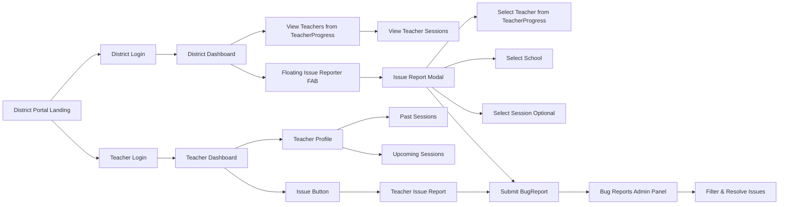

# Data Tracker Feature Documentation

## Overview

The **Data Tracker** is a new feature within the Virtual Management System (VMS) that allows districts and teachers to view, track, and validate participation and session data related to virtual learning offerings. The design separates **district-level access** from **teacher-level access** while maintaining a unified login experience.

The primary goals of the Data Tracker are to:

- Provide districts visibility into teacher-related sessions
- Allow teachers to view their own past and upcoming sessions
- Flag missing or incorrect data for follow-up
- Support both district and teacher login pathways from a single entry point
- Enable district users to report data issues with specific context (teacher, school, session)

## User Roles

### District User

- Authenticates via **District Login**
- Can view session data associated with teachers in their district
- Has read-only or review-level access (no session creation)
- Can flag issues related to missing or incorrect data
- Access is restricted to teachers in the **TeacherProgress** tracking list (special imported list)
- Can report issues with specific context:
  - Teacher selection (filtered to tracked teachers only)
  - School information (auto-filled from teacher, editable)
  - Optional session selection
  - Issue category (Missing/Incorrect)
  - Additional notes

### Teacher User

- Authenticates via **Teacher Login**
- Can view their own profile
- Can see **past sessions** and **upcoming sessions**
- Can flag issues related to their session data

## Authentication & Login Flow

1. Users arrive at the **District Portal Landing Page** (e.g., `/virtual/kck`)
2. They choose one of two login options:
   - **District Login** → Redirects to standard login page
   - **Teacher Login** → Redirects to teacher selection/dashboard
3. Authentication is handled through the existing identity provider (e.g., Clever / district SSO).
4. After authentication, users are routed to a role-appropriate dashboard.

## Data Visibility Rules

- District users can see:
  - All sessions associated with teachers in their district
  - Teacher names linked to each session
  - Only teachers from the **TeacherProgress** tracking list (special imported list)
- Teachers can see:
  - Their own name and profile
  - Past sessions
  - Upcoming sessions

No cross-district data visibility is allowed.

## Data Tracker Dashboard

### Teacher Dashboard

**Route**: `/virtual/kck/teacher/<teacher_id>`

Displays:

- Teacher name
- List of **Past Sessions** (completed virtual sessions)
- List of **Upcoming Sessions** (scheduled virtual sessions)
- **Issue Button** for reporting problems

### District Dashboard

**Routes**:
- `/virtual/usage/usage/district/<district_name>/teacher-progress` - Teacher progress tracking
- `/virtual/usage/district/<district_name>/teacher-breakdown` - Teacher breakdown by school
- `/virtual/usage/district/<district_name>` - District usage overview

Displays:

- Filterable list of teachers (from TeacherProgress tracking list)
- Sessions associated with selected teachers
- Status indicators for missing or flagged data
- **Floating Issue Reporter Button** (always visible)

## Issue Reporting

### Teacher Dashboard Issue Reporting

An **Issue Button** is available within the Teacher Dashboard interface.

When clicked, the user can:

- Indicate the issue category:
  - **Missing Data**
  - **Incorrect Data**
- Provide additional details about the issue
- Submit the issue for admin review

### District Dashboard Issue Reporting

A **Floating Action Button (FAB)** is available on all district virtual views, positioned in the bottom-right corner of the screen.

When clicked, a modal form opens allowing district users to:

1. **Select Issue Category** (required):
   - Missing Data
   - Incorrect Data

2. **Select Teacher** (required):
   - Autocomplete search field
   - Results filtered to only teachers in the **TeacherProgress** tracking list for the current virtual year
   - Shows teacher name, school, and district

3. **School Information**:
   - Auto-filled from selected teacher
   - Editable if correction is needed

4. **Select Session** (optional):
   - Dropdown populated after teacher selection
   - Shows sessions for the selected teacher within the current date range
   - Includes "No specific session" option

5. **Additional Notes** (optional):
   - Free-text field for additional context

6. **Submit**:
   - Creates a `BugReport` entry with type `DATA_ERROR`
   - Includes structured description with:
     - Source: District
     - District name
     - Teacher (ID + name)
     - School
     - Session (if selected)
     - Category
     - Notes (if provided)
   - Page URL and title are automatically captured

### Issue Review & Resolution

All reported issues appear in the **Bug Reports Admin Panel** at `/management/bug-reports`:

- District issues are clearly marked with structured descriptions
- Admins can filter by:
  - Status (open/resolved/all)
  - Type (bug/data_error/other/all)
  - Search query (description, page title, page URL)
- Admins can resolve issues with resolution notes
- Issues from teacher dashboard are distinguished from district issues

## Technical Implementation

### Teacher Search Filtering

The district issue reporter uses a specialized search endpoint (`/virtual/issues/api/search-teachers`) that:

- Filters teachers to only those in the `TeacherProgress` table for the selected virtual year
- If `teacher_id` is set in `TeacherProgress`, searches the `Teacher` table filtered by those IDs
- If no `teacher_id` is set, searches `TeacherProgress` entries by name and attempts to match to `Teacher` records
- Ensures district users can only report issues for teachers they're tracking

### API Endpoints

#### District Issue Reporting

- `GET /virtual/issues/api/search-teachers`
  - Search teachers filtered by TeacherProgress entries
  - Parameters: `q` (search query), `virtual_year` (required), `district_name` (required)
  - Returns: Array of teacher objects with id, name, school, district

- `GET /virtual/issues/api/teacher-sessions`
  - Get virtual sessions for a specific teacher within date range
  - Parameters: `teacher_id` (required), `district_name` (required), `date_from`, `date_to`
  - Returns: Array of session objects with id, title, date, time, status

- `POST /virtual/issues/report`
  - Submit district issue report
  - Requires: `district_name`, `teacher_id`, `category`, `page_url`
  - Optional: `school_name`, `session_id`, `description`
  - Returns: Success/error response

### Security & Access Control

- All endpoints require `@login_required`
- District endpoints require `@district_scoped_required`
- District access is validated against `current_user.allowed_districts`
- Teacher search is restricted to TeacherProgress entries for the virtual year
- Session queries are filtered by district access

## System Diagram

## File Structure

### Routes
- `routes/virtual/district_portal.py` - District portal landing pages
- `routes/virtual/teacher_dashboard.py` - Teacher dashboard routes
- `routes/virtual/issues.py` - District issue reporting routes
- `routes/virtual/usage.py` - Virtual usage and teacher progress tracking

### Templates
- `templates/virtual/district_portal/landing.html` - District portal landing page
- `templates/virtual/teacher_dashboard.html` - Teacher dashboard
- `templates/virtual/_district_issue_fab.html` - Floating issue reporter partial
- `templates/virtual/virtual_teacher_progress.html` - District teacher progress view
- `templates/virtual/virtual_teacher_breakdown.html` - District teacher breakdown view
- `templates/virtual/virtual_usage_district.html` - District usage overview

### Styles
- `static/css/district_portal.css` - District portal styling
- `static/css/teacher_dashboard.css` - Teacher dashboard styling
- `static/css/issue_report_fab.css` - Floating issue reporter styling

### Models
- `models/teacher_progress.py` - TeacherProgress tracking model
- `models/bug_report.py` - BugReport model for issue tracking

## Future Considerations

- Role-based permissions for editing vs. viewing data
- Exporting session data for reporting
- Automated alerts when data is missing or inconsistent
- Integration with attendance or completion validation
- Email notifications for issue submissions
- Issue assignment and workflow management
- Dashboard analytics for issue trends

## Summary

The Data Tracker enhances transparency and accountability within the Virtual Management System by clearly separating district and teacher views while maintaining a simple, shared login experience. The combination of dashboards, session visibility, and issue reporting provides a scalable foundation for improved data quality and reporting.

The district issue reporting feature specifically enables district users to flag data problems with rich context (teacher, school, session), ensuring that issues are properly documented and can be efficiently resolved by administrators. The integration with the TeacherProgress tracking list ensures that district users can only report issues for teachers they're actively monitoring, maintaining data integrity and relevance.
