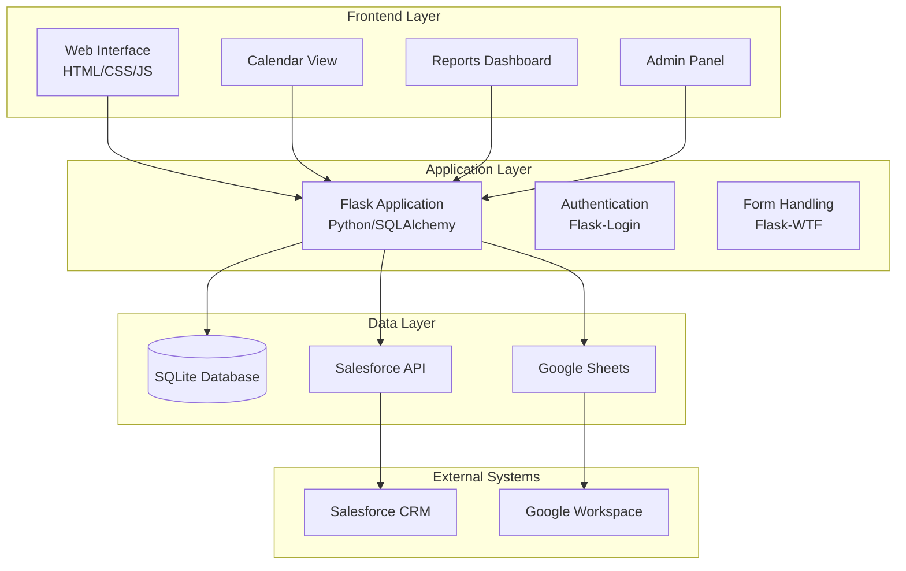

# Volunteer Management System (VMS) - System Overview

## 🎯 Project Purpose

The Volunteer Management System (VMS) is a centralized web-based application designed to streamline volunteer data management, event tracking, and reporting for educational organizations.

The system serves as a single source of truth for volunteer activities while integrating with external systems like Salesforce.

### Primary Goals
- **Centralize volunteer data** from multiple sources (Salesforce, internal datasets, attendance logs)
- **Track events and attendance** with comprehensive reporting capabilities
- **Provide actionable insights** through detailed analytics and reports
- **Support district coordinators** and internal teams in volunteer management
- **Enable data-driven decisions** through comprehensive reporting

## 🏗️ System Architecture

## 🔧 Technology Stack

### Backend
- **Framework**: Flask (Python)
- **ORM**: SQLAlchemy
- **Database**: SQLite (with Salesforce sync capability)
- **Authentication**: Flask-Login
- **Forms**: Flask-WTF

### Frontend
- **Markup**: HTML5
- **Styling**: CSS3 with custom design system
- **Interactivity**: Vanilla JavaScript
- **Responsive**: Mobile-first design approach

### Data Integration
- **Primary Source**: Salesforce CRM
- **Secondary Sources**: Internal datasets, attendance logs
- **File Handling**: Google Sheets integration
- **Data Sync**: Automated import processes

## 📊 Core Modules

### 1. Event Management
- **Purpose**: Track and manage volunteer events
- **Features**:
  - Interactive calendar with color-coded status
  - Event lifecycle management (Draft → Published → Confirmed → Completed → Cancelled)
  - Attendance tracking and reporting
  - Event type categorization

### 2. Organization Management
- **Purpose**: Manage partner organizations and their relationships
- **Features**:
  - Complete organization profiles
  - Directory system with search and filtering
  - Interaction tracking and history
  - Salesforce integration

### 3. Volunteer Management
- **Purpose**: Comprehensive volunteer tracking and management
- **Features**:
  - Volunteer profiles and history
  - Skills and interests tracking
  - Attendance and participation metrics
  - Salesforce synchronization

### 4. Reporting & Analytics
- **Purpose**: Data-driven insights and decision support
- **Features**:
  - Comprehensive reporting dashboard
  - District and organization-specific views
  - Trend analysis and metrics
  - Export capabilities

### 5. Data Validation System
- **Purpose**: Ensure data quality and integrity
- **Features**:
  - Automated validation across multiple dimensions
  - Business rule enforcement
  - Data quality scoring and trends
  - Salesforce sync validation

## 🗄️ **Data Model Architecture**

### **Core Design Pattern**
The VMS system uses **polymorphic inheritance** where `Contact` is the base class, and `Volunteer`, `Teacher`, and `Student` inherit from it. This allows for shared contact information while maintaining specialized data for each type.

### **Key Entities & Relationships**
- **Contact Base**: Shared fields (name, email, phone, demographics)
- **Volunteer**: Organization details, volunteer history, interests
- **Teacher**: School association, subject areas, grade levels
- **Student**: School enrollment, grade progression, participation
- **Organization**: Partner relationships, contact management
- **Event**: Volunteer activities, attendance tracking
- **School/District**: Local entity management and validation

### **Database Design Principles**
- **Normalization**: Follows relational database best practices
- **Performance**: Optimized for complex volunteer and event queries
- **Integrity**: Comprehensive foreign key relationships and constraints
- **Audit Trail**: Full change tracking and history maintenance

## 🔍 **Data Quality & Validation**

### **Validation Coverage**
- **Volunteer**: 1,816 validation checks across all types
- **Event**: 1,075 validation checks across all types
- **Student**: 15 validation checks across all types
- **Teacher**: 325 validation checks across all types
- **Organization**: 49 validation checks across all types
- **School**: 28 validation checks (Local Entity)
- **District**: 21 validation checks (Local Entity)

### **Validation Types**
1. **Count Validation** - Record synchronization accuracy
2. **Field Completeness** - Required field population
3. **Data Type Validation** - Format and type consistency
4. **Relationship Validation** - Referential integrity
5. **Business Rules** - Workflow and logic compliance

## 🌐 System Access

- **Production**: Hosted on PythonAnywhere
- **Development**: Local Flask server on port 5050
- **API Endpoints**: RESTful API for data operations
- **Authentication**: Role-based access control

## 📈 Current Status

- **Phase**: 3.4 Complete (Data Quality Scoring & Trends)
- **Next Phase**: 3.5 (Performance & Scalability)
- **System Health**: All systems operational
- **Recent Updates**: Enhanced business rule validation, quality scoring engine

## 🔗 Key Links

- **Quality Dashboard**: `/data_quality/quality_dashboard`
- **Business Rules**: `/data_quality/business_rules`
- **Admin Panel**: `/management/admin`
- **API Documentation**: See API spec in `/docs/old/04-api-spec.md`

## 🔒 Session Cookie Security

The application enforces hardened cookie flags:

- Session cookies: HttpOnly, SameSite=Lax; Secure in production, not required in local dev.
- Remember-me cookies: HttpOnly, SameSite=Lax; Secure in production, not required in local dev.

Environment variables:

- `SESSION_COOKIE_NAME` (default `vms_session`)
- `REMEMBER_COOKIE_NAME` (default `vms_remember`)
- `SESSION_LIFETIME_SECONDS` (default 28800, i.e., 8 hours)

## 📝 Ask me (examples)

- "What is the current system architecture and technology stack?"
- "How does the VMS integrate with Salesforce?"
- "What are the core modules and their purposes?"
- "What phase is the project currently in?"
- "How do I access the quality dashboard and admin panel?"
