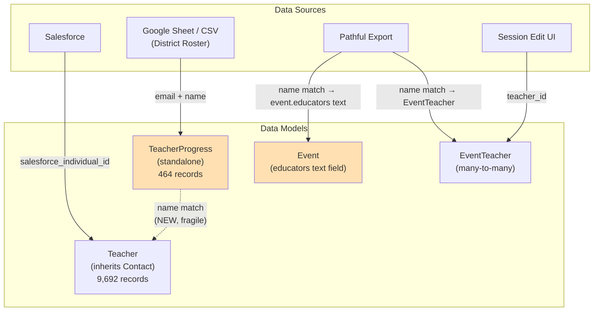

# Teacher Data System Architecture Analysis

**Date:** 2026-02-27
**Goal:** Identify structural issues, risks, and improvements for robustness, reliability, and scalability.

---

## Data Flow Overview



---

## Issue 1: `event.educators` vs `EventTeacher` — Dual Storage of the Same Data

**Severity: HIGH** | **Impact: Data integrity, dashboard accuracy**

The system stores teacher-session links in **two places** that *don't stay in sync*:

| Storage | Type | Set By | Used By |
|---------|------|--------|---------|
| `event.educators` | Text (`;`-separated names) | Pathful import only | Dashboard counting, teacher matching |
| `event_teacher` | Relational FK table | Session edit UI, Salesforce import | Teacher detail view (now), session pages |

**Problems:**
- Manual session creation sets `EventTeacher` but **NOT** `event.educators` → invisible in dashboards
- Pathful import sets `event.educators` but **sometimes** not `EventTeacher`
- `event.educators` is unsearchable, cannot be joined, and is prone to name drift
- Just fixed this for the `teacher_detail` view, but the pattern is systemic

**Recommendation:**

> [!IMPORTANT]
> **Make `EventTeacher` the single source of truth.** Treat `event.educators` as a **denormalized cache field**. Whenever `EventTeacher` changes (add/remove teacher), regenerate `event.educators` from the linked Teacher names. Add a backfill to populate `EventTeacher` from existing `event.educators` data.

Priority: **HIGH** — this is the root cause of the dashboard bug we just fixed.

---

## Issue 2: Teacher Records Created in 6+ Places with Inconsistent Logic

**Severity: HIGH** | **Impact: Duplicate records, data quality**

| Code Path | File | Find-or-Create Logic |
|-----------|------|---------------------|
| CSV/Sheet import | `routes/virtual/routes.py:267` | `first_name + last_name` (case-insensitive) |
| CSV event import | `routes/virtual/routes.py:538` | `first_name + last_name` (case-insensitive) |
| Pathful import | `routes/virtual/pathful_import.py` | `pathful_user_id` or `first+last` |
| Usage report processing | `routes/virtual/usage.py:2861` | `first_name + last_name` |
| Usage report processing | `routes/virtual/usage.py:3172` | `first_name + last_name` |
| Salesforce import | `routes/salesforce/teacher_import.py` | `salesforce_individual_id` |
| Session edit UI | `routes/virtual/pathful_import.py:1862` | By Teacher ID (no creation) |

**Problems:**
- **No centralized `find_or_create_teacher()` function** — each path reimplements the same logic with subtle differences
- Name-only matching creates duplicates when casing/formatting differs
- `fix_duplicate_teachers.py` already exists as evidence this is a known problem
- Some paths set `school_id`, others don't
- Some paths create `EventTeacher`, others only set `event.educators`

**Recommendation:**

> [!IMPORTANT]
> **Extract a single `find_or_create_teacher()` service function.** Should use a priority chain: `salesforce_individual_id` → `pathful_user_id` → email → normalized name. All code paths should call this instead of inline queries.

Priority: **HIGH** — directly causes duplicate records.

---

## Issue 3: `Teacher` Has No Email Field

**Severity: MEDIUM** | **Impact: Matching reliability, merge capability**

`Teacher` inherits from `Contact`, which stores emails in a separate `Email` model (one-to-many). But:
- `TeacherProgress` stores email as a simple `String(255)` column
- All teacher matching is done by **name** because there's no convenient email column to join on
- Salesforce import has email access, but spreadsheet import → Teacher linking uses name-only

**Recommendation:**

Cache a `primary_email` field on the `Teacher` model (denormalized from the Email table). Use it as the preferred matching key when available. Fall back to name matching only when email isn't present.

Priority: **MEDIUM** — improves matching accuracy significantly.

---

## Issue 4: `TeacherProgress` is a Parallel Data Silo

**Severity: MEDIUM** | **Impact: Architectural complexity, maintenance burden**

`TeacherProgress` duplicates several Teacher fields and has its own lifecycle:

| Field | TeacherProgress | Teacher |
|-------|----------------|---------|
| Name | `name` (single field) | `first_name` + `last_name` |
| Email | `email` (direct) | Via `Email` model |
| School | `building` (free text) | `school_id` (FK to School) |
| Status tracking | `is_active`, `target_sessions` | `status` enum |
| Multi-tenant | `tenant_id` | None (global) |

**The newly-added `_link_progress_to_teachers()` is a bridge, not a fix.** The root problem is that two separate models represent the same real-world entity.

**Recommendation:**

Long-term, consider merging `TeacherProgress` into `Teacher` by adding these fields to Teacher:

```
Teacher (extended):
  + tenant_id → FK to Tenant
  + target_sessions → Integer (per-year, possibly in a join table)
  + building → from school relationship
  + academic_year tracking → in a TeacherYearGoal table
```

Short-term, strengthen the linking bridge:
- Match by email (primary) then name (fallback)
- Add a unique constraint on `(tenant_id, email, academic_year)` in TeacherProgress
- Run linking on teacher creation (not just import)

Priority: **MEDIUM** — the bridge works for now, but technical debt accumulates.

---

## Issue 5: `usage.py` is a 7,474-Line Monolith

**Severity: MEDIUM** | **Impact: Maintainability, testability**

`routes/virtual/usage.py` contains:
- Cache management functions
- Data processing helpers
- Report computation (1,200 lines)
- Teacher creation logic (buried inside reporting code)
- Virtual session CRUD operations
- Export functionality

This file creates Teacher records in at least 3 places, mixed in with reporting logic.

**Recommendation:**

Decompose into focused modules:
- `services/virtual_session_cache.py` — cache management
- `services/teacher_service.py` — centralized teacher find/create/link
- `routes/virtual/reports.py` — reporting routes
- `routes/virtual/sessions.py` — session CRUD

Priority: **MEDIUM** — improves development velocity, reduces merge conflicts.

---

## Issue 6: Name Matching is Fragile

**Severity: MEDIUM** | **Impact: Silent data errors**

Current matching in `teacher_matching_service.py` uses:
1. Case-insensitive exact match
2. Substring partial match (dangerous — "Ann" matches "Joanne")

Known edge cases:
- **Same name, different teacher** → `first()` picks one arbitrarily
- **Middle names** → "Mary Ann Smith" vs "Mary Smith" won't match
- **Name changes** → Married names, corrections
- **Partial matches** → min_name_length=3 means short names can false-match

The `_link_progress_to_teachers()` function in `roster_import.py` also uses first/last name matching, which is a separate implementation from `teacher_matching_service.py`.

**Recommendation:**

- Add a **confidence score** to matches (exact email > exact name > fuzzy name)
- Flag low-confidence matches for human review instead of auto-linking
- Consolidate all matching into `teacher_matching_service.py`
- Consider adding `pathful_user_id` to TeacherProgress for cross-system matching

Priority: **MEDIUM** — false matches cause incorrect dashboards.

---

## Issue 7: No `tenant_id` on `Teacher`

**Severity: LOW** | **Impact: Multi-tenant scaling**

`Teacher` is globally scoped — no `tenant_id` column. `TeacherProgress` has `tenant_id`, but the linked Teacher record is shared across all tenants. If two districts import the same teacher, they share one Teacher entity.

This works for now (single district), but will break with:
- Multiple districts importing different rosters
- Teachers who move between districts
- Per-district permission scoping

**Recommendation:**

Add `tenant_id` to `Teacher` or create a `TeacherTenantAssignment` linking table. This isn't urgent today but should be planned before onboarding additional districts.

Priority: **LOW** — single-tenant right now.

---

## Issue 8: Missing School Records

**Severity: LOW** | **Impact: 3 unlinked buildings**

Three buildings (Douglass, Grant, JFK) have no `School` record in the database. This means teachers from these buildings won't get a `school_id` set.

**Recommendation:**

Either:
- Create School records for these 3 buildings
- Add them to the Salesforce school import
- Accept that these are non-standard buildings (maybe closed schools?)

Priority: **LOW** — affects 3 buildings only.

---

## Prioritized Recommendations

| # | Issue | Priority | Effort | Impact |
|---|-------|----------|--------|--------|
| 1 | Make `EventTeacher` the single source of truth | 🔴 HIGH | Medium | Fixes root cause of dashboard bugs |
| 2 | Extract `find_or_create_teacher()` service | 🔴 HIGH | Medium | Eliminates duplicate teacher creation |
| 3 | Add `primary_email` to Teacher model | 🟡 MEDIUM | Small | Improves matching accuracy |
| 4 | Strengthen TeacherProgress ↔ Teacher bridge | 🟡 MEDIUM | Small | More reliable linking |
| 5 | Decompose `usage.py` monolith | 🟡 MEDIUM | Large | Improves maintainability |
| 6 | Improve name matching with confidence scoring | 🟡 MEDIUM | Medium | Fewer false matches |
| 7 | Plan multi-tenant Teacher support | 🟢 LOW | Medium | Future-proofing |
| 8 | Create missing School records | 🟢 LOW | Tiny | 3 buildings fixed |

---

## Quick Wins (Can Do Now)

1. **Backfill `EventTeacher` from `event.educators`** — Script to parse all `event.educators` text fields and create missing `EventTeacher` records
2. **Sync `event.educators` on session save** — When teachers are added/removed via the edit page, regenerate `event.educators` from the linked EventTeacher records
3. **Add unique constraint** on `TeacherProgress(tenant_id, email, academic_year)` to prevent duplication at the DB level
4. **Log teacher creation source** — Add an `import_source` field to Teacher to trace where each record came from (Salesforce, Pathful, manual, CSV)
