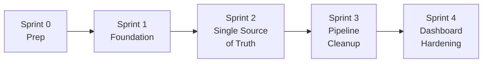

# Teacher Data System Refactor — Sprint Plan

**Created:** 2026-02-27
**Status:** Approved
**Goal:** Systematically fix all 8 architectural issues in the teacher data pipeline, making the system robust, reliable, and future-proof.

**Related Docs:**
- [Architecture Analysis](../technical/teacher_data_architecture_analysis.md) — 8 issues identified
- [Pre-Refactor System Analysis](../technical/pre_refactor_system_analysis.md) — Broader system perspective
- [Retrospective](../operations/retro_teacher_data_linking.md) — Original bug investigation

> [!NOTE]
> **Database resets are acceptable** during this refactor since teacher data can be re-imported from source systems (Salesforce, spreadsheets, Pathful). We will note where a DB reset is the cleanest path.

---

## Dependency Graph

---

## Sprint 0: Pre-Refactor Preparation

**Goal:** Establish baselines and clean existing data before any code changes.
**DB Reset:** Not required

### Tasks

- [ ] **0.1 — Run existing tests → establish green baseline**
  - Run full test suite: `pytest tests/`
  - Fix any failures before starting refactor
  - Relevant test files: `test_teacher.py`, `test_teacher_progress_tracking.py`, `test_teacher_matching.py`, `test_roster_import.py`

- [ ] **0.2 — Run `fix_duplicate_teachers.py`** to clean existing TeacherProgress duplicates

- [ ] **0.3 — Back up the database** — Snapshot before any schema changes

- [ ] **0.4 — Document current dashboard numbers** for post-refactor verification
  - Teacher count per district
  - Session counts for key teachers (e.g., Michelle Michalski)
  - TeacherProgress linked vs unlinked counts

---

## Sprint 1: Foundation — Teacher Service Layer + Model Hardening

**Goal:** Centralize teacher operations and add the structural fields needed by later sprints.
**DB Reset:** Not required (additive changes only)

### Tasks

- [ ] **1.1 — Create `services/teacher_service.py`** with centralized `find_or_create_teacher()`
  - Match priority chain: `salesforce_individual_id` → `pathful_user_id` → email → normalized name
  - Returns `(teacher, is_new, confidence_score)`
  - Logs match method used (for debugging)
  - Accept optional `tenant_id` param for future multi-tenant filtering
  - Unit testable (no route dependencies)
  - Write tests: SF match, email match, name match, new creation, duplicate prevention

- [ ] **1.2 — Add `primary_email` field to `Teacher` model**
  - New column: `primary_email = Column(String(255), nullable=True, index=True)`
  - Populated from the `Email` model's primary email on save/import
  - Add migration script
  - Backfill from existing Email records: `UPDATE teacher SET primary_email = (SELECT email FROM emails WHERE contact_id = teacher.id AND is_primary = 1 LIMIT 1)`

- [ ] **1.3 — Add `import_source` field to `Teacher` model**
  - New column: `import_source = Column(String(50), nullable=True)` — values: `salesforce`, `pathful`, `csv_import`, `manual`, `session_edit`
  - Helps trace where each Teacher record originated (debugging duplicates)

- [ ] **1.4 — Add unique constraint to `TeacherProgress`**
  - `UniqueConstraint('tenant_id', 'email', 'academic_year', name='uq_tp_tenant_email_year')`
  - Prevents duplicate TeacherProgress at the DB level
  - Run `fix_duplicate_teachers.py` first to clean existing duplicates

- [ ] **1.5 — Consolidate name normalization**
  - Move all name matching to `teacher_matching_service.py`
  - Remove duplicate `_link_progress_to_teachers()` matching logic from `roster_import.py` — call the service instead
  - Single `normalize_name()` and `match_teacher_by_name()` used everywhere

### Files Changed

| File | Action |
|------|--------|
| `services/teacher_service.py` | **NEW** |
| `models/teacher.py` | MODIFY — add `primary_email`, `import_source` |
| `models/teacher_progress.py` | MODIFY — add unique constraint |
| `services/teacher_matching_service.py` | MODIFY — consolidate matching |
| `utils/roster_import.py` | MODIFY — use service |

### Verification
- [ ] All existing tests pass
- [ ] `find_or_create_teacher()` has unit tests covering: SF match, email match, name match, new creation
- [ ] No duplicate TeacherProgress records can be created
- [ ] Backfill populates `primary_email` for existing teachers

---

## Sprint 2: Single Source of Truth — `EventTeacher` as the Authority

**Goal:** Make `EventTeacher` the canonical teacher-session relationship. `event.educators` becomes a derived cache.
**DB Reset:** Recommended after this sprint (re-import from Salesforce + Pathful to get clean data)

### Tasks

- [ ] **2.1 — Backfill `EventTeacher` from `event.educators`**
  - Script: parse all `event.educators` text fields
  - For each name, call `find_or_create_teacher()` from Sprint 1
  - Create `EventTeacher` records where they don't already exist
  - Log stats: how many created, how many already existed, how many unmatched

- [ ] **2.2 — Create `sync_event_participant_fields(event)` helper**
  - Regenerates ALL four denormalized text fields from FK tables:
    - `event.educators` + `event.educator_ids` ← from `EventTeacher`
    - `event.professionals` + `event.professional_ids` ← from `event_volunteers`
  - Call it in:
    - Session edit save handler
    - Teacher/volunteer add/remove handlers
    - Pathful import (after EventTeacher is set)
  - This ensures cache fields stay in sync

- [ ] **2.3 — Update Pathful import to create `EventTeacher` records**
  - Currently Pathful import ONLY sets `event.educators` text
  - Add: after matching a teacher, also create/update an `EventTeacher` record
  - Use `find_or_create_teacher()` from Sprint 1
  - Then call `sync_event_participant_fields(event)` to regenerate cache

- [ ] **2.4 — Update session edit/create to sync cache fields**
  - When teachers are added/removed via UI, call `sync_event_participant_fields(event)`
  - Manual session creation should also call this after linking teachers

- [ ] **2.5 — Update `count_sessions_for_teachers()` to use `EventTeacher`**
  - Refactor `teacher_matching_service.py` to count via `EventTeacher` joins instead of parsing text
  - Fall back to educators text for events that haven't been backfilled yet
  - Write integration test comparing old vs new counting results

### Files Changed

| File | Action |
|------|--------|
| `scripts/utilities/backfill_event_teachers.py` | **NEW** |
| `services/teacher_service.py` | MODIFY — add `sync_event_participant_fields()` |
| `routes/virtual/pathful_import.py` | MODIFY — create EventTeacher |
| `routes/virtual/pathful_import.py` (manual create) | MODIFY — sync cache |
| `services/teacher_matching_service.py` | MODIFY — EventTeacher-based counting |
| `routes/district/tenant_teacher_usage.py` | MODIFY — simplify counting |

### Verification
- [ ] All `EventTeacher` records exist for every teacher listed in `event.educators`
- [ ] Adding a teacher via session edit creates `EventTeacher` AND updates `event.educators`
- [ ] Pathful import creates both `EventTeacher` and `event.educators`
- [ ] Dashboard counts match before and after refactor
- [ ] Manually-created sessions show in dashboard without the dual-path workaround

---

## Sprint 3: Pipeline Cleanup — Eliminate Redundant Teacher Creation

**Goal:** All Teacher creation flows through the service layer. Decompose the `usage.py` monolith.
**DB Reset:** Optional (clean start recommended if Sprint 2 reset was done)

### Tasks

- [ ] **3.1 — Replace all inline Teacher creation with `find_or_create_teacher()`**
  - `routes/virtual/routes.py` (2 locations: `process_teacher_data`, `process_teacher_for_event`)
  - `routes/virtual/usage.py` (3+ locations)
  - `routes/virtual/pathful_import.py` (`match_teacher` function)
  - Each call passes `import_source` for tracking

- [ ] **3.2 — Extract teacher logic from `usage.py` into service layer**
  - Extract only the teacher find/create/link logic into `teacher_service.py`
  - Leave route handlers, cache management, and report computation in `usage.py`
  - Full `usage.py` monolith decomposition is a **separate future project** — don't scope-creep

- [ ] **3.3 — Strengthen `_link_progress_to_teachers()` to use email matching**
  - Primary match: `TeacherProgress.email` → `Teacher.primary_email` (exact, case-insensitive)
  - Secondary match: name-based (existing logic)
  - Log confidence level for each match

- [ ] **3.4 — Clean up `match_teacher` in pathful_import.py**
  - Currently 100+ lines of inline find-or-create logic
  - Replace with call to `find_or_create_teacher()` from service layer
  - Maintain `pathful_user_id` matching (move into the service)

- [ ] **3.5 — Delete `fix_duplicate_teachers.py`**
  - No longer needed after Sprint 1's unique constraint prevents duplicates
  - Archive the script in git history

### Files Changed

| File | Action |
|------|--------|
| `services/teacher_service.py` | MODIFY — absorb teacher logic from routes |
| `routes/virtual/usage.py` | MODIFY — delegate teacher ops to service |
| `routes/virtual/routes.py` | MODIFY — use service |
| `routes/virtual/pathful_import.py` | MODIFY — use service |
| `utils/roster_import.py` | MODIFY — email-first matching |
| `scripts/utilities/fix_duplicate_teachers.py` | **DELETE** |

### Verification
- [ ] `grep -r "Teacher(" routes/` returns 0 results (no inline Teacher creation)
- [ ] All imports work: Salesforce, Pathful, spreadsheet
- [ ] Dashboard numbers unchanged
- [ ] `usage.py` < 3,500 lines

---

## Sprint 4: Dashboard Hardening + Future-Proofing

**Goal:** Remove all remaining workarounds, add multi-tenant teacher support, and ensure data integrity going forward.
**DB Reset:** Not required

### Tasks

- [ ] **4.1 — Simplify `teacher_detail` to use `EventTeacher` only**
  - Remove the dual-path (Path 1 + Path 2) workaround we just added
  - After Sprint 2, all sessions are in `EventTeacher`, so just query that
  - Much simpler code, no name matching needed for session display

- [ ] **4.2 — Simplify `compute_teacher_progress` counting**
  - Remove the EventTeacher fallback code we just added
  - After Sprint 2, `count_sessions_for_teachers()` uses EventTeacher directly
  - Remove the `educators_event_ids` dedup logic

- [ ] **4.3 — Add `tenant_id` to `Teacher` model (future-proofing)**
  - New column: `tenant_id = Column(Integer, ForeignKey('tenant.id'), nullable=True, index=True)`
  - Populate from `TeacherProgress.tenant_id` during linking
  - Teachers can belong to multiple tenants (many-to-many may be needed long-term)

- [ ] **4.4 — Create missing School records**
  - Add School records for Douglass, Grant, JFK
  - Or verify they're in Salesforce and will come through on next school import

- [ ] **4.5 — Add data integrity monitoring**
  - Script: `scripts/utilities/teacher_data_health_check.py`
  - Checks:
    - Teachers without `primary_email`
    - TeacherProgress without `teacher_id` (unlinked)
    - EventTeacher records without matching `event.educators` entry
    - `event.educators` entries without matching EventTeacher
    - Duplicate Teacher records (same name, same school)
  - Can be run as a scheduled job or manual audit

- [ ] **4.6 — Update documentation**
  - Update data dictionary with new fields (`primary_email`, `import_source`, `tenant_id`)
  - Update import playbook with new service layer references
  - Update architecture doc with new data flow diagram
  - Archive the analysis doc (issues now resolved)

### Files Changed

| File | Action |
|------|--------|
| `routes/district/tenant_teacher_usage.py` | MODIFY — simplify |
| `models/teacher.py` | MODIFY — add `tenant_id` |
| `scripts/utilities/teacher_data_health_check.py` | **NEW** |
| `documentation/` | MODIFY — updates |

### Verification
- [ ] All dashboard views produce correct data
- [ ] Health check script returns 0 issues
- [ ] Multi-tenant teacher queries work correctly
- [ ] All documentation reflects current architecture

---

## Migration Strategy

### Option A: Incremental (No DB Reset)
- Apply migrations as additive `ALTER TABLE` statements
- Run backfill scripts between sprints
- Data stays live throughout

### Option B: Clean Slate (Recommended after Sprint 2)
1. Complete Sprints 1-2 (code changes)
2. Reset the teacher-related tables: `teacher`, `teacher_progress`, `event_teacher`
3. Re-import from sources in order:
   - Salesforce schools → Salesforce teachers
   - Spreadsheet roster (auto-links via new service)
   - Pathful sessions (creates EventTeacher + educators cache)
4. Run health check to verify

> [!WARNING]
> **Reset scope:** Only teacher-related tables. Events, volunteers, students, and other data are preserved. The `event.educators` field would be regenerated from fresh EventTeacher records.

---

## Definition of Done (All Sprints)

- [ ] No inline `Teacher()` construction outside of `teacher_service.py`
- [ ] `EventTeacher` is the single source of truth for teacher-session links
- [ ] `event.educators` is regenerated automatically (never manually maintained)
- [ ] All teacher matching goes through `teacher_matching_service.py`
- [ ] `TeacherProgress` → `Teacher` linking uses email-first matching
- [ ] Dashboard numbers are correct for all teacher views
- [ ] Health check script reports 0 issues
- [ ] `usage.py` is decomposed into focused modules
- [ ] All changes documented in ADR + import playbook
