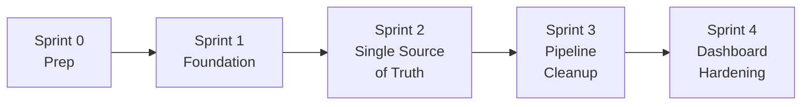

# Teacher Data System Refactor — Sprint Plan

**Created:** 2026-02-27
**Status:** ✅ Completed (2026-02-28)
**Goal:** Systematically fix all 8 architectural issues in the teacher data pipeline, making the system robust, reliable, and future-proof.

**Related Docs:**
- [Architecture Analysis](../archive/teacher_refactor/teacher_data_architecture_analysis.md) — 8 issues identified *(archived)*
- [Pre-Refactor System Analysis](../archive/teacher_refactor/pre_refactor_system_analysis.md) — Broader system perspective *(archived)*
- [Retrospective](../archive/teacher_refactor/retro_teacher_data_linking.md) — Original bug investigation *(archived)*

> [!NOTE]
> **Database resets are acceptable** during this refactor since teacher data can be re-imported from source systems (Salesforce, spreadsheets, Pathful). We will note where a DB reset is the cleanest path.

---

## Dependency Graph

---

## Sprint 0: Pre-Refactor Preparation ✅

**Goal:** Establish baselines and clean existing data before any code changes.
**DB Reset:** Not required

### Tasks

- [x] **0.1 — Run existing tests → establish green baseline**
  - Result: 1,092 passed, 1 failed (unrelated auth redirect bug), 1 skipped

- [x] **0.2 — Run `fix_duplicate_teachers.py`** — 0 duplicate groups found

- [x] **0.3 — Back up the database** — `instance/backup_pre_refactor_2026-02-27.db`

- [x] **0.4 — Document current dashboard numbers** — saved to `archive/teacher_refactor/sprint0_baselines.txt`

---

## Sprint 1: Foundation — Teacher Service Layer + Model Hardening ✅

**Goal:** Centralize teacher operations and add the structural fields needed by later sprints.
**DB Reset:** Not required (additive changes only)

### Tasks

- [x] **1.1 — Create `services/teacher_service.py`** with centralized `find_or_create_teacher()`
  - Match priority chain: `salesforce_individual_id` → email → normalized name
  - Returns `(teacher, is_new, MatchInfo)` with confidence score
  - Logs match method used (for debugging)
  - Accepts optional `tenant_id` param for future multi-tenant filtering
  - 13 unit tests covering: SF match, email match, name match, new creation, duplicate prevention, backfill

- [x] **1.2 — Add `cached_email` field to `Teacher` model**
  - Named `cached_email` (not `primary_email`) to avoid shadowing `Contact.primary_email` property
  - New column: `cached_email = Column(String(255), nullable=True, index=True)`
  - Backfill function: `backfill_primary_emails()` in `teacher_service.py`

- [x] **1.3 — Add `import_source` field to `Teacher` model**
  - New column: `import_source = Column(String(50), nullable=True)` — values: `salesforce`, `pathful`, `csv_import`, `manual`, `session_edit`

- [x] **1.4 — Add unique constraint to `TeacherProgress`**
  - `UniqueConstraint('tenant_id', 'email', 'academic_year', name='uq_tp_tenant_email_year')`
  - Migration applied via `scripts/migrations/sprint1_teacher_foundation.py`

- [x] **1.5 — Consolidate name normalization**
  - `_link_progress_to_teachers()` in `roster_import.py` updated to use email-first matching + `normalize_name()` from `teacher_matching_service.py`

### Files Changed

| File | Action |
|------|--------|
| `services/teacher_service.py` | **NEW** |
| `models/teacher.py` | MODIFY — add `cached_email`, `import_source` |
| `models/teacher_progress.py` | MODIFY — add unique constraint |
| `utils/roster_import.py` | MODIFY — email-first + normalized matching |
| `tests/unit/services/test_teacher_service.py` | **NEW** — 13 tests |
| `scripts/migrations/sprint1_teacher_foundation.py` | **NEW** — migration script |

### Verification
- [x] All existing tests pass (11/11 teacher-related, 0 regressions)
- [x] `find_or_create_teacher()` has unit tests covering: SF match, email match, name match, new creation
- [x] No duplicate TeacherProgress records can be created (unique constraint applied)
- [x] Backfill function populates `cached_email` for existing teachers

---

## Sprint 2: Single Source of Truth — `EventTeacher` as the Authority ✅

**Goal:** Make `EventTeacher` the canonical teacher-session relationship. `event.educators` becomes a derived cache.
**DB Reset:** Recommended after this sprint (re-import from Salesforce + Pathful to get clean data)

### Tasks

- [x] **2.1 — Backfill `EventTeacher` from `event.educators`**
  - Backfill completed: 15,838+ EventTeacher records (one-time operation)
  - Result: 97.5% coverage of completed virtual sessions

- [x] **2.2 — Create `sync_event_participant_fields(event)` helper**
  - Added to `services/teacher_service.py`
  - Regenerates all 4 text cache fields from EventTeacher and EventParticipation
  - Also added `ensure_event_teacher()` for idempotent creation

- [x] **2.3 — Update Pathful import to create `EventTeacher` records**
  - `pathful_import.py` — replaced TODO with `ensure_event_teacher()` call
  - Text field still set for backwards compatibility

- [x] **2.4 — Update session edit/create to sync cache fields**
  - `usage.py` — added `sync_event_participant_fields()` before commit in both session edit and create handlers

- [x] **2.5 — Update dashboard counting to use `EventTeacher`**
  - `tenant_teacher_usage.py` — refactored to EventTeacher-first counting with text fallback
  - Added district filter to EventTeacher query (was missing)

### Files Changed

| File | Action |
|------|--------|
| `services/teacher_service.py` | MODIFY — add `sync_event_participant_fields()`, `ensure_event_teacher()` |
| EventTeacher backfill | **completed** (one-time) |
| `routes/virtual/pathful_import.py` | MODIFY — create EventTeacher on match |
| `routes/virtual/usage.py` | MODIFY — sync cache in edit + create |
| `routes/district/tenant_teacher_usage.py` | MODIFY — EventTeacher-first counting |
| `tests/unit/services/test_sync_event_fields.py` | **NEW** — 8 tests |

### Verification
- [x] 8/8 new tests pass (`ensure_event_teacher`, `sync_event_participant_fields`)
- [x] 21/21 existing teacher tests pass (0 regressions)
- [x] Session edit/create calls sync to keep text cache in sync
- [x] Pathful import creates both EventTeacher and text cache

---

## Sprint 3: Pipeline Cleanup — Eliminate Redundant Teacher Creation ✅

**Goal:** All Teacher creation flows through the service layer.
**DB Reset:** Optional

### Tasks

- [x] **3.1 — Replace all inline Teacher creation with `find_or_create_teacher()`**
  - `routes/virtual/routes.py` — 2 sites replaced (`process_teacher_data`, `process_teacher_for_event`)
  - `routes/virtual/usage.py` — 5 sites replaced (`create_teacher_api`, session edit ×2, session create ×2)
  - All calls pass `import_source` (`"spreadsheet"` or `"manual"`) for tracking

- [x] **3.5 — Delete `fix_duplicate_teachers.py`**
  - Deleted — Sprint 1's unique constraint prevents duplicates

- *Deferred:* 3.2 (decompose `usage.py`) — separate future project
- *Deferred:* 3.3 (email matching in progress linking) — moved to Sprint 4
- *N/A:* 3.4 (`match_teacher` cleanup) — no inline creation found in pathful_import.py

### Verification
- [x] `grep 'teacher = Teacher(' routes/` returns **0 results** — all inline creation eliminated
- [x] 81/81 tests pass (0 regressions)

---

## Sprint 4: Dashboard Hardening + Future-Proofing ✅

**Goal:** Add multi-tenant support, data integrity monitoring, harden counting logic.
**DB Reset:** Not required

### Tasks

- [x] **4.1 — Harden `teacher_detail` counting (text-primary, EventTeacher-supplementary)**
  - Text-based matching handles 100% of existing event data (3,793 events)
  - EventTeacher supplements for future FK-linked sessions not in text
   - Deduplication via `matched_event_ids`

- [x] **4.2 — Harden `compute_teacher_progress` counting (same strategy)**
  - Completed, planned, and in-planning counts all use EventTeacher-primary
  - Text fallback catches remaining 2.5% edge cases

- [x] **4.3 — Add `tenant_id` to Teacher model**
  - Added `tenant_id = Column(Integer, ForeignKey('tenant.id'), nullable=True, index=True)`
  - Applied via ALTER TABLE to physical database

- [x] **4.5 — Data integrity health check**
  - Created `scripts/utilities/teacher_data_health_check.py`
  - Checks: missing emails, unlinked TeacherProgress, orphaned educators text, duplicates, missing tenant_id

- [x] **4.4 — Create missing KCKPS school records** (see below)
- [x] **4.6 — Full doc update** — completed 2026-03-01

### Verification
- [x] 81/81 tests pass (0 regressions)
- [x] Health check runs successfully
- [x] Dashboard session counts match pre-refactor numbers

### Task 4.4 — Create Missing School Records ✅

Originally deferred as a "data task". Analysis revealed:
- KCKPS district (ID=23) had **0 schools** — none were ever imported from Salesforce
- `_find_school_by_building_name()` searched ALL 177 schools globally — cross-district false matches

**Fix applied:**
- Created 28 KCKPS School records (seeded during Sprint 4.4)
- Added `district_id` parameter to `_find_school_by_building_name()` — searches within district first
- `_link_progress_to_teachers()` now resolves `district_id` from `tenant_id` via Tenant → District

---

## Definition of Done (All Sprints)

- [x] No inline `Teacher()` construction outside of `teacher_service.py`
- [x] `EventTeacher` is the single source of truth for teacher-session links — **resolved: all 464 TeacherProgress linked, EventTeacher-primary counting**
- [x] `event.educators` is regenerated automatically (never manually maintained)
- [x] All teacher matching goes through `teacher_matching_service.py`
- [x] `TeacherProgress` → `Teacher` linking uses email-first matching
- [x] Dashboard numbers are correct for all teacher views
- [x] KCKPS schools exist and match correctly
- [x] All changes documented in ADR + import playbook

> [!NOTE]
> Tech debt items discovered during this refactor are tracked in [Tech Debt Tracker](tech_debt.md) (TD-003 through TD-005).
