# Functional Requirements

This document defines **what the system must do**. Each requirement is:
- ✅ **Testable** - Verified by test cases in Test Packs 1-6
- 🔗 **Traceable** - Linked to User Stories and Use Cases
- 🎯 **Specific** - Clear acceptance criteria

## Quick Navigation

Jump to requirements by domain:

- 🏢 [In-Person Events](#in-person-event-management) (FR-INPERSON-xxx)
- ✍️ [Volunteer Signup](#public-volunteer-signup) (FR-SIGNUP-xxx)
- 💻 [Virtual Events](#virtual-events) (FR-VIRTUAL-xxx)
- 🔍 [Recruitment & Matching](#volunteer-search-recruitment--communication-history) (FR-RECRUIT-xxx)
- 📊 [Reporting](#reporting-and-dashboards) (FR-REPORTING-xxx)
- 🏫 [District Progress](#district-and-teacher-progress) (FR-DISTRICT-xxx)
- 🎓 [Student Attendance](#student-roster-and-attendance) (FR-STUDENT-xxx)
- 📧 [Email System](#email-system-management) (FR-EMAIL-xxx)
- 🛡️ [Data & Operations](#data-integrity--operations) (FR-DATA-xxx, Sync & Imports)
- 🏛️ [Tenant Infrastructure](#tenant-infrastructure) (FR-TENANT-xxx) *District Suite*
- 🔧 [District Self-Service](#district-self-service) (FR-SELFSERV-xxx) *District Suite*
- 🌐 [Public Event API](#public-event-api) (FR-API-xxx) *District Suite*

<strong>📋 Requirement ID Format & Conventions</strong> (for contributors)

### ID Structure
Functional requirements use stable IDs: `FR-{DOMAIN}-{NNN}`
- **Domain**: Category prefix (e.g., `INPERSON`, `VIRTUAL`)
- **Number**: 3-digit sequence (001-999)
- **Anchors**: Lowercase with hyphens (e.g., `fr-inperson-101`)

### Stability Rules
- IDs never change once assigned
- Gaps in numbering are allowed
- Never reuse deleted requirement IDs

### Domain Prefixes
- `INPERSON` - In-person event management
- `SIGNUP` - Public volunteer signup
- `VIRTUAL` - Virtual events
- `RECRUIT` - Volunteer search and recruitment
- `REPORTING` - Reporting and dashboards
- `DISTRICT` - District and teacher progress
- `STUDENT` - Student roster and attendance
- `EMAIL` - Email system management
- `TENANT` - Multi-tenant infrastructure *(District Suite)*
- `SELFSERV` - District self-service features *(District Suite)*
- `API` - Public event API *(District Suite)*

## How Requirements Connect

```mermaid
graph LR
    FR[📋 Functional Requirement] --> TC[🧪 Test Cases]
    FR --> US[📖 User Stories]
    FR --> UC[🔄 Use Cases]
    US --> AC[✅ Acceptance Criteria]
    TC --> TP[📦 Test Packs 1-6]

    style FR fill:#e1f5fe,stroke:#01579b,stroke-width:2px
    style TC fill:#f3e5f5,stroke:#4a148c,stroke-width:2px
    style US fill:#e8f5e9,stroke:#1b5e20,stroke-width:2px
    style UC fill:#fff3e0,stroke:#e65100,stroke-width:2px
```

Each requirement links to:
- **Test Cases** - Verification in [Test Packs](test_packs/index)
- **User Stories** - Business value in [User Stories](user_stories)
- **Use Cases** - Workflows in [Use Cases](use_cases)

## 7.1 In-Person Event Management

**Salesforce + VolunTeach + Website**

> [!INFO]
> **System Locations**
> - **Salesforce**: [https://prep-kc.my.salesforce.com/](https://prep-kc.my.salesforce.com/) (core CRM system for data entry and event management)
> - **VolunTeach**: [https://voluntold-prepkc.pythonanywhere.com/dashboard](https://voluntold-prepkc.pythonanywhere.com/dashboard) (admin interface for event management and sync controls)
> - **Public Website**: [https://prepkc.org/volunteer.html](https://prepkc.org/volunteer.html) (volunteer hub with in-person events signup page)

| ID | Requirement | Test Coverage | Related User Stories |
|----|-------------|---------------|----------------------|
| **FR-INPERSON-101** | Staff shall create and maintain in-person event records in Salesforce. | [TC-100](test-pack-2#tc-100) | [US-101](user_stories#us-101) |
| **FR-INPERSON-102** | VolunTeach shall sync in-person events from Salesforce at least once per hour via automated scheduled sync. The system also supports scheduled daily batch imports that process events, volunteer participations, and student participations. | [TC-101](test-pack-2#tc-101), [TC-103](test-pack-2#tc-103) | [US-102](user_stories#us-102) |
| **FR-INPERSON-103** | VolunTeach shall provide a manual "sync now" action for immediate synchronization. Manual sync operations shall support large datasets with configurable batch sizes and progress indicators for use cases such as reports and historical data imports. | [TC-100](test-pack-2#tc-100), [TC-102](test-pack-2#tc-102) | [US-102](user_stories#us-102) |
| **FR-INPERSON-104** | VolunTeach shall allow staff to control whether an event appears on the public in-person events page via a visibility toggle. | [TC-110](test-pack-2#tc-110), [TC-111](test-pack-2#tc-111) | [US-103](user_stories#us-103) |
| **FR-INPERSON-105** | The system shall support events that are not displayed on the public in-person page (e.g., orientations). | [TC-112](test-pack-2#tc-112) | [US-103](user_stories#us-103) |
| **FR-INPERSON-106** | The website shall display for each event at minimum: volunteer slots needed, slots filled, date/time, district (if linked), and event description/type. | [TC-120](test-pack-2#tc-120), [TC-121](test-pack-2#tc-121) | [US-105](user_stories#us-105) |
| **FR-INPERSON-107** | VolunTeach shall allow staff to link events to one or more districts for district-specific website pages. | [TC-113](test-pack-2#tc-113), [TC-114](test-pack-2#tc-114) | [US-104](user_stories#us-104) |
| **FR-INPERSON-109** | Any event linked to a district shall appear on that district's website page regardless of the in-person-page visibility toggle. | [TC-113](test-pack-2#tc-113), [TC-115](test-pack-2#tc-115) | [US-104](user_stories#us-104) |
| **FR-INPERSON-128** | The system shall automatically display Data in Action (DIA) events (matched by "DIA" in session type) on the website regardless of the visibility toggle, provided they have a future start date and available slots. | Context only | [US-103](user_stories#us-103) |

### Reporting Integration

| ID | Requirement | Test Coverage | Related User Stories |
|----|-------------|---------------|----------------------|
| **FR-INPERSON-132** | Event sync operations shall trigger cache invalidation for reports that depend on event data. | [TC-221](test-pack-2#tc-221) | *Technical requirement* |
| **FR-INPERSON-133** | Manual cache refresh for event-based reports shall be available when automated sync is insufficient for large datasets. | [TC-222](test-pack-2#tc-222) | *Technical requirement* |

## 7.2 Public Volunteer Signup

**Website**

> [!INFO]
> **System Location**
> - **Public Website Volunteer Hub**: [https://prepkc.org/volunteer.html](https://prepkc.org/volunteer.html)
>
> The volunteer hub provides access to signup pages for:
> - In-person events
> - Data in Action (DIA) events: [https://prepkc.org/dia.html](https://prepkc.org/dia.html)
> - Virtual events
> - Other volunteer opportunities

| ID | Requirement | Test Coverage | Related User Stories |
|----|-------------|---------------|----------------------|
| **FR-SIGNUP-121** | The website shall allow volunteers to sign up for an event via a public form **(Form Assembly integration)** without authentication. | [TC-130](#tc-130)–[TC-140](#tc-140) | [US-201](user_stories#us-201) |
| **FR-SIGNUP-122** | Each signup shall create a participation record **(in Salesforce)** associated with the event and the volunteer identity. | [TC-140](#tc-140), [TC-142](#tc-142) | [US-201](user_stories#us-201) |
| **FR-SIGNUP-123** | The system **(Salesforce)** shall send a confirmation email upon successful signup. | [TC-150](#tc-150) | [US-203](user_stories#us-203) |
| **FR-SIGNUP-124** | The system **(Salesforce)** shall send a calendar invite upon successful signup. | [TC-151](#tc-151) | [US-203](user_stories#us-203) |
| **FR-SIGNUP-125** | The calendar invite shall include event details and location/map information derived from the Salesforce event record. | [TC-152](#tc-152) | [US-203](user_stories#us-203) |
| **FR-SIGNUP-126** | The signup form **(Form Assembly)** shall collect: First Name, Last Name, Email, Organization, Title, Volunteer Skills (dropdown), Age Group (dropdown), Highest Education Attainment (dropdown), Gender (dropdown), Race/Ethnicity (dropdown). | [TC-130](#tc-130)–[TC-132](#tc-132) | [US-202](user_stories#us-202) |
| **FR-SIGNUP-127** | The system shall store the submitted signup attributes for use in reporting, recruitment search, and volunteer profiles. | [TC-141](#tc-141) | [US-201](user_stories#us-201), [US-202](user_stories#us-202) |

## 7.3 Virtual Events

**Polaris + Pathful**

| ID | Requirement | Test Coverage | Related User Stories |
|----|-------------|---------------|----------------------|
| **FR-VIRTUAL-201** | Polaris shall allow staff to create and maintain virtual event records. | [TC-200](test-pack-3#tc-200), [TC-201](test-pack-3#tc-201) | [US-301](user_stories#us-301) |
| **FR-VIRTUAL-202** | Polaris shall allow staff to search for and tag teachers using locally synced Salesforce-linked teacher records. | [TC-202](test-pack-3#tc-202), [TC-204](test-pack-3#tc-204) | [US-302](user_stories#us-302) |
| **FR-VIRTUAL-203** | Polaris shall allow staff to search for and tag presenters/volunteers using locally synced Salesforce-linked records. | [TC-203](test-pack-3#tc-203), [TC-204](test-pack-3#tc-204) | [US-303](user_stories#us-303) |
| **FR-VIRTUAL-204** | The system shall support importing 2–4 years of historical virtual event data from Google Sheets, preserving event–teacher relationships and multi-line mapping. *(Note: Implemented via Pathful direct import per US-304 consolidation)* | [TC-270](#tc-270)–[TC-275](#tc-275) | [US-306](user_stories#us-306) |
| **FR-VIRTUAL-206** | Polaris shall ingest Pathful export data to update virtual attendance and participation tracking. | [TC-250](#tc-250)–[TC-260](#tc-260) | [US-304](user_stories#us-304) |
| **FR-VIRTUAL-207** | The system should support automation to pull Pathful exports and load them into Polaris. *Near-term* | [TC-280](#tc-280) | *Near-term* |
| **FR-VIRTUAL-208** | The system shall track whether a virtual volunteer is local vs non-local. | [TC-230](#tc-230)–[TC-232](#tc-232) | [US-305](user_stories#us-305) |
| **FR-VIRTUAL-209** | The system should support sending automated communications that connect local volunteers. *Near-term* | [TC-281](#tc-281) | *Near-term* |
| **FR-VIRTUAL-210** | Polaris shall provide a view listing upcoming virtual events that do not have a presenter assigned. | [TC-290](#tc-290)–[TC-299](#tc-299) | [US-307](user_stories#us-307) |
| **FR-VIRTUAL-211** | The presenter recruitment view shall filter to show only future events (start_datetime > current date/time). | [TC-291](#tc-291) | [US-307](user_stories#us-307) |
| **FR-VIRTUAL-212** | The presenter recruitment view shall support filtering by date range, school, district, and event type. | [TC-292](#tc-292)–[TC-295](#tc-295) | [US-307](user_stories#us-307) |
| **FR-VIRTUAL-213** | The presenter recruitment view shall display for each event: title, date/time, school/district, teacher count, and days until event. | [TC-298](#tc-298) | [US-307](user_stories#us-307) |
| **FR-VIRTUAL-214** | Staff shall be able to navigate directly from a presenter-needed event to the volunteer search/recruitment workflow. | [TC-299](#tc-299) | [US-307](user_stories#us-307) |
| **FR-VIRTUAL-215** | Once a presenter is tagged to an event, that event shall no longer appear in the presenter recruitment view. | [TC-296](#tc-296), [TC-297](#tc-297) | [US-307](user_stories#us-307) |
| **FR-VIRTUAL-216** | The presenter recruitment view shall support filtering by academic year (Aug 1 – Jul 31 cycle). | [TC-292](#tc-292) | [US-307](user_stories#us-307) |
| **FR-VIRTUAL-217** | The presenter recruitment view shall display urgency indicators: red (≤7 days), yellow (8-14 days), blue (>14 days). | [TC-298](#tc-298) | [US-307](user_stories#us-307) |
| **FR-VIRTUAL-218** | The presenter recruitment view shall support text search across event title and teacher names. | [TC-292](#tc-292) | [US-307](user_stories#us-307) |
| **FR-VIRTUAL-219** | The presenter recruitment view shall display a success message when all upcoming virtual sessions have presenters assigned. | Context only | [US-307](user_stories#us-307) |
| **FR-VIRTUAL-220** | The system shall support importing historical virtual event data from Salesforce (e.g., 2–4 years of past events). | [TC-210](test-pack-2#tc-210) | *Technical requirement* |
| **FR-VIRTUAL-221** | Historical virtual import shall preserve event-participant relationships and maintain data integrity. | [TC-211](test-pack-2#tc-211) | *Technical requirement* |
| **FR-VIRTUAL-222** | The system shall allow creation of new **teacher records** locally in Polaris during virtual session creation if the teacher is not found in search. | [TC-206](test-pack-3#tc-206) | [US-308](user_stories#us-308) |
| **FR-VIRTUAL-223** | The system shall allow creation of new **presenter/volunteer records** locally in Polaris during virtual session creation if the presenter is not found in search. | [TC-207](test-pack-3#tc-207) | [US-309](user_stories#us-309) |

## 7.4 Volunteer Search, Recruitment & Communication History

**Polaris + Salesforce Email Logging**

| ID | Requirement | Test Coverage | Related User Stories |
|----|-------------|---------------|----------------------|
| **FR-RECRUIT-301** | Polaris shall provide a searchable list of volunteers. | [TC-300](#tc-300) | [US-401](user_stories#us-401) |
| **FR-RECRUIT-302** | Polaris shall support filtering/search by volunteer name, organization, role, skills, and career type. | [TC-301](#tc-301)–[TC-308](#tc-308) | [US-401](user_stories#us-401) |
| **FR-RECRUIT-303** | Polaris shall support identifying volunteers who have participated in virtual activities (including virtual-only). | [TC-320](#tc-320)–[TC-322](#tc-322) | [US-401](user_stories#us-401) |
| **FR-RECRUIT-304** | Polaris shall display volunteer participation history including most recent volunteer date. | [TC-340](#tc-340)–[TC-343](#tc-343) | [US-402](user_stories#us-402) |
| **FR-RECRUIT-305** | Polaris shall display communication history sourced from Salesforce email logging (Gmail add-on), including most recent contact date. | [TC-360](#tc-360)–[TC-361](#tc-361) | [US-404](user_stories#us-404) |
| **FR-RECRUIT-306** | Polaris shall allow staff to record recruitment notes and outcomes where Polaris provides that UI. | [TC-380](#tc-380)–[TC-381](#tc-381) | [US-403](user_stories#us-403) |
| **FR-RECRUIT-308** | Polaris shall import/sync logged email communication records from Salesforce and associate them to the correct volunteer/person. | [TC-360](#tc-360)–[TC-366](#tc-366) | [US-404](user_stories#us-404) |
| **FR-RECRUIT-309** | Polaris shall distinguish "no communication logged" from "communication sync failure" (visibility into data completeness). | [TC-363](#tc-363), [TC-364](#tc-364) | [US-405](user_stories#us-405) |
| **FR-RECRUIT-310** | **Intelligent Matching**: The system shall rank volunteer candidates using a multi-dimensional scoring algorithm (history, location, keywords) to identify best matches. | *TBD* | [US-406](user_stories#us-406) |
| **FR-RECRUIT-311** | The system shall support user-defined **custom keywords** that override or boost automatic matching for specific events. | *TBD* | [US-406](user_stories#us-406) |

## 7.5 Reporting and Dashboards

**Polaris**

| ID | Requirement | Test Coverage | Related User Stories |
|----|-------------|---------------|----------------------|
| **FR-REPORTING-401** | Polaris shall provide a volunteer thank-you dashboard/report showing top volunteers by hours and/or events. | [TC-700](#tc-700)–[TC-703](#tc-703) | [US-701](user_stories#us-701) |
| **FR-REPORTING-402** | Polaris shall provide an organization participation dashboard/report. | [TC-720](#tc-720)–[TC-722](#tc-722) | [US-702](user_stories#us-702) |
| **FR-REPORTING-403** | Polaris shall provide district/school impact dashboards. | [TC-740](#tc-740)–[TC-744](#tc-744) | [US-703](user_stories#us-703) |
| **FR-REPORTING-404** | Polaris shall report at minimum: unique students reached, unique volunteers reached, total volunteer hours, and unique organizations engaged. | [TC-740](#tc-740), [TC-741](#tc-741) | [US-703](user_stories#us-703) |
| **FR-REPORTING-405** | Polaris shall support ad hoc querying/reporting for one-off participation questions (e.g., counts for a specific org). | [TC-760](#tc-760)–[TC-762](#tc-762) | [US-704](user_stories#us-704) |
| **FR-REPORTING-406** | Polaris shall provide export outputs (e.g., CSV) suitable for grant and district reporting workflows. | [TC-780](#tc-780)–[TC-783](#tc-783) | [US-701](user_stories#us-701), [US-702](user_stories#us-702), [US-703](user_stories#us-703), [US-704](user_stories#us-704) |
| **FR-REPORTING-407** | The system shall generate **partner reconciliation reports** (e.g., KCTAA) matching external lists against internal volunteer data. | *TBD* | [US-705](user_stories#us-705) |
| **FR-REPORTING-408** | The system shall support **fuzzy name matching** for partner reconciliation to identify near-matches across systems. | *TBD* | [US-705](user_stories#us-705) |

## 7.6 District and Teacher Progress

**Polaris**

| ID | Requirement | Test Coverage | Related User Stories |
|----|-------------|---------------|----------------------|
| **FR-DISTRICT-501** | The system shall allow District Viewer users to authenticate and access district dashboards. | [TC-001](#tc-001) | [US-501](user_stories#us-501) |
| **FR-DISTRICT-502** | District dashboards shall display: number of schools, number of teachers, and progress breakdown. | [TC-010](#tc-010) | [US-501](user_stories#us-501), [US-503](user_stories#us-503) |
| **FR-DISTRICT-503** | District dashboards shall support drilldown by school to teacher-level completion detail. | [TC-011](#tc-011)–[TC-014](#tc-014) | [US-502](user_stories#us-502) |
| **FR-DISTRICT-504** | The system should send automated reminder emails to teachers based on progress status. *Near-term* | Placeholder | *Near-term* |
| **FR-DISTRICT-505** | The system shall provide a teacher self-service flow to request a magic link by entering their email address. | [TC-020](#tc-020), [TC-021](#tc-021) | [US-505](user_stories#us-505) |
| **FR-DISTRICT-506** | A teacher magic link shall grant access only to that teacher's progress/data. | [TC-022](#tc-022) | [US-505](user_stories#us-505) |
| **FR-DISTRICT-507** | The teacher view shall provide a mechanism to flag incorrect data and submit a note to internal staff. | [TC-023](#tc-023) | [US-505](user_stories#us-505) |
| **FR-DISTRICT-508** | The system shall compute teacher progress status using definitions: Achieved (completed), In Progress (future signup exists), Not Started (no signups). | [TC-010](#tc-010)–[TC-014](#tc-014), [TC-022](#tc-022) | [US-503](user_stories#us-503) |
| **FR-DISTRICT-521** | The system shall enforce role-based access for Admin, User, District Viewer, and Teacher. | [TC-002](#tc-002) | [US-501](user_stories#us-501), [US-505](user_stories#us-505) |
| **FR-DISTRICT-522** | District Viewer users shall only access data scoped to their district. | [TC-002](#tc-002) | [US-501](user_stories#us-501) |
| **FR-DISTRICT-523** | Teacher magic-link access shall be scoped to a single teacher identity matched by email from the imported district roster. | [TC-003](#tc-003), [TC-024](#tc-024) | [US-505](user_stories#us-505) |
| **FR-DISTRICT-524** | The system shall support importing a district-provided teacher roster (minimum: teacher name, email, grade; school if available) using merge/upsert strategy. Removed teachers are soft-deleted. | [TC-030](#tc-030), [TC-031](#tc-031) | [US-504](user_stories#us-504) |
| **FR-DISTRICT-531** | The system shall provide automatic and manual matching of imported TeacherProgress entries to Teacher database records using email (primary) and fuzzy name matching (secondary). | *TBD* | [US-508](user_stories#us-508) |
| **FR-DISTRICT-532** | The system shall allow Google Sheets for teacher progress tracking to be scoped to a specific district. | *TBD* | *Technical requirement* |
| **FR-DISTRICT-540** | The system shall automatically reset teacher progress status to "Not Started" at the start of each semester (January 1 and June 30). | [TC-040](#tc-040), [TC-041](#tc-041) | [US-509](user_stories#us-509) |
| **FR-DISTRICT-541** | Before resetting progress, the system shall archive the previous semester's progress data including teacher status, session counts, and completion dates. | [TC-042](#tc-042) | [US-509](user_stories#us-509) |
| **FR-DISTRICT-542** | Archived semester data shall be retained and viewable for historical reporting purposes. | [TC-043](#tc-043) | [US-509](user_stories#us-509) |
| **FR-DISTRICT-543** | The system shall log semester reset operations with timestamps and affected record counts. | [TC-044](#tc-044) | *Technical requirement* |
| **FR-DISTRICT-544** | The system shall provide a manual "Archive Semester" action for admins to force-archive current progress data at any time (e.g., for mid-semester implementation). | *TBD* | [US-509](user_stories#us-509) |

## 7.7 Student Roster and Attendance

**Salesforce (Source) → Polaris (Reporting)**

> [!NOTE]
> **Current Implementation:** Student rostering and attendance is managed in **Salesforce** and synced to Polaris via periodic manual imports. Future enhancements may add additional attendance capture methods directly in Polaris.

| ID | Requirement | Test Coverage | Related User Stories |
|----|-------------|---------------|----------------------|
| **FR-STUDENT-601** | The system shall support associating students with events (student roster). **Source: Salesforce → Synced to Polaris.** | [TC-600](#tc-600)–[TC-603](#tc-603) | [US-601](user_stories#us-601) |
| **FR-STUDENT-602** | The system shall support recording student attendance status per student-event participation. **Source: Salesforce → Synced to Polaris.** | [TC-610](#tc-610)–[TC-613](#tc-613) | [US-602](user_stories#us-602) |
| **FR-STUDENT-603** | Polaris reporting shall use student attendance to compute unique students reached and other impact metrics by school and district. | [TC-620](#tc-620)–[TC-624](#tc-624) | [US-603](user_stories#us-603) |
| **FR-STUDENT-604** | Reporting users shall be able to view student reach metrics by district, school, event type, and date range. | | [US-603](user_stories#us-603) |
| **FR-STUDENT-605** | For virtual events, the system shall estimate student reach at **25 students per session** for reporting purposes (individual students are not tracked). | *Implicit in reporting* | *Technical requirement* |

## 7.8 Email System Management

**Polaris Admin Panel**

> [!INFO]
> **System Location**
> - **Admin Email Panel**: `/management/email` (overview, templates, outbox, attempts, settings)
>
> The email system provides safe-by-default email delivery with comprehensive tracking, quality checks, and safety gates. See [Email System Guide](../docs/guides/email_system.md) for detailed documentation.

| ID | Requirement | Test Coverage | Related User Stories |
|----|-------------|---------------|----------------------|
| **FR-EMAIL-801** | Polaris shall allow Admin users to create and manage email templates with versioning support. Templates shall include HTML and text versions, required/optional placeholders, and purpose keys. | *TBD* | [US-801](user_stories#us-801) |
| **FR-EMAIL-802** | Polaris shall provide an admin interface to monitor email delivery status, view delivery attempts, and track delivery metrics (sent, failed, blocked, queued). | *TBD* | [US-802](user_stories#us-802) |
| **FR-EMAIL-803** | Polaris shall allow Admin users to send emails via the admin panel with safety controls including environment-based delivery gates, non-production allowlist enforcement, and two-phase sending (draft → queued → sent). | *TBD* | [US-803](user_stories#us-803) |
| **FR-EMAIL-804** | The email system shall enforce environment-based safety gates: delivery disabled unless `EMAIL_DELIVERY_ENABLED=true`, and non-production allowlist enforcement. | *TBD* | *Technical requirement* |
| **FR-EMAIL-805** | The email system shall support dry-run mode for testing email sending without actual delivery. | *TBD* | *Technical requirement* |
| **FR-EMAIL-806** | The email system shall perform quality checks on email messages including recipient validation, template rendering validation, and context completeness checks. | *TBD* | *Technical requirement* |
| **FR-EMAIL-807** | The email system shall track all delivery attempts with Mailjet response data, error details, and provider payload summaries (excluding secrets). | *TBD* | *Technical requirement* |
| **FR-EMAIL-808** | Failed email deliveries that require human action shall automatically create system-generated BugReport entries. | *TBD* | *Technical requirement* |

## 7.9 Data Tracker Features

**Polaris District Portal + Teacher Dashboard**

> [!INFO]
> **System Locations**
> - **District Portal**: `/virtual/<district_name>` (district landing page with login options)
> - **District Dashboard**: `/virtual/usage/district/<district_name>` (district usage and teacher progress)
> - **Teacher Dashboard**: `/virtual/<district_name>/teacher/<teacher_id>` (teacher session history)
>
> The data tracker provides district and teacher visibility into virtual session data with issue reporting capabilities. See [Data Tracker Guide](../docs/guides/data_tracker.md) for detailed documentation.

| ID | Requirement | Test Coverage | Related User Stories |
|----|-------------|---------------|----------------------|
| **FR-DISTRICT-525** | District users shall be able to flag data issues (missing or incorrect data) related to teachers and sessions in their district, with structured issue reports including teacher selection, school information, optional session selection, issue category, and notes. | *TBD* | [US-506](user_stories#us-506) |
| **FR-DISTRICT-526** | Teachers shall be able to view their own session history including past sessions (completed virtual sessions) and upcoming sessions (scheduled virtual sessions) via the teacher dashboard. | *TBD* | [US-507](user_stories#us-507) |
| **FR-DISTRICT-527** | Teachers shall be able to flag incorrect data related to their own session data via the teacher dashboard. | *TBD* | [US-507](user_stories#us-507) |
| **FR-DISTRICT-528** | District issue reports shall create BugReport entries with type `DATA_ERROR` and structured descriptions including source, district name, teacher information, school, session (if selected), category, and notes. | *TBD* | *Technical requirement* |
| **FR-DISTRICT-529** | District users shall only be able to report issues for teachers in the TeacherProgress tracking list for their district. | *TBD* | *Technical requirement* |
| **FR-DISTRICT-530** | The district portal landing page shall provide separate login options for District Login and Teacher Login, routing users to appropriate dashboards after authentication. | *TBD* | *Technical requirement* |

## 7.10 Data Integrity & Operations

**Core System Logic**

| ID | Requirement | Test Coverage | Related User Stories |
|----|-------------|---------------|----------------------|
| **FR-DATA-901** | **Duplicate Management**: The system shall provide automated logic to identify and merge duplicate event or participant records based on unique identifiers (Salesforce ID, email), prioritizing valid status data (e.g., 'Attended' > 'Registered'). | [TC-901](test-pack-7#tc-901) | *Technical requirement* |
| **FR-DATA-902** | **Dynamic Profile Creation**: When importing participants, if a profile (Volunteer/Organization) does not exist, the system shall automatically create a draft profile using provided details to ensure data completeness. | [TC-902](test-pack-7#tc-902) | *Technical requirement* |
| **FR-DATA-903** | **Sync Dependencies**: Data synchronization shall enforce dependency order (Orgs -> Volunteers -> Events) and support "Partial Success" states to prevent entire batches from failing due to single record errors. | [TC-903](test-pack-7#tc-903), [TC-904](test-pack-7#tc-904) | *Technical requirement* |
| **FR-OPS-904** | **Attendance Workflow**: The system shall track the *status of attendance taking* (Not Taken, In Progress, Completed) separately from the event status itself. | [TC-910](test-pack-7#tc-910) | *Operational requirement* |
| **FR-OPS-905** | **Admin Safety (Purge)**: The system shall provide a restricted 'Purge' capability for Administrators to bulk-delete event data, requiring high-level privileges and generating an audit log. | [TC-911](test-pack-7#tc-911) | *Operational requirement* |
| **FR-OPS-906** | **Granular Categorization**: The system shall support detailed event categorization (e.g., Career Fair, Classroom Speaker, Ignite) beyond simple Virtual/In-Person types for specialized reporting. | [TC-913](test-pack-7#tc-913) | *Operational requirement* |
| **FR-OPS-907** | **Auto-Admin Provisioning**: On initialization, if no administrator exists, the system shall securely provision a default admin account to ensure access recovery. | [TC-912](test-pack-7#tc-912) | *Technical requirement* |

### Data Synchronization (In-Person)

| ID | Requirement | Test Coverage | Related User Stories |
|----|-------------|---------------|----------------------|
| **FR-INPERSON-108** | The system shall support scheduled daily imports of in-person events from Salesforce, including events, volunteer participations, and student participations. | [TC-160](test-pack-7#tc-160) | *Technical requirement* |
| **FR-INPERSON-110** | Daily imports shall process events in batches to handle large datasets without exceeding API limits. | [TC-161](test-pack-7#tc-161) | *Technical requirement* |
| **FR-INPERSON-111** | The system shall provide visibility into daily import status, success/failure counts, and error details. | [TC-162](test-pack-7#tc-162) | *Technical requirement* |
| **FR-INPERSON-112** | The system shall sync student participation data from Salesforce for in-person events, creating EventStudentParticipation records. | [TC-170](test-pack-7#tc-170) | *Technical requirement* |
| **FR-INPERSON-113** | Student participation sync shall update attendance status and delivery hours from Salesforce. | [TC-171](test-pack-7#tc-171) | *Technical requirement* |
| **FR-INPERSON-114** | The system shall sync volunteer participation data from Salesforce for in-person events, including status, delivery hours, and participant attributes. | [TC-172](test-pack-7#tc-172) | *Technical requirement* |
| **FR-INPERSON-115** | Volunteer participation sync shall handle batch processing for large event sets (e.g., 50 events per batch). | [TC-173](test-pack-7#tc-173) | *Technical requirement* |
| **FR-INPERSON-116** | The system shall identify and sync events from Salesforce that are missing School, District, or Parent Account associations. | [TC-180](test-pack-7#tc-180) | *Technical requirement* |
| **FR-INPERSON-117** | For unaffiliated events, the system shall attempt to associate events with districts based on participating students. | [TC-181](test-pack-7#tc-181) | *Technical requirement* |
| **FR-INPERSON-118** | Unaffiliated event sync shall update both event data and associated volunteer/student participation records. | [TC-182](test-pack-7#tc-182) | *Technical requirement* |
| **FR-INPERSON-119** | When syncing events, the system shall update event status (Draft, Requested, Confirmed, Published, Completed, Cancelled) from Salesforce. | [TC-190](test-pack-7#tc-190) | *Technical requirement* |
| **FR-INPERSON-120** | The system shall preserve cancellation reasons when events are cancelled in Salesforce. | [TC-191](test-pack-7#tc-191) | *Technical requirement* |
| **FR-INPERSON-121** | Status changes shall be reflected in VolunTeach and on public website within the sync cycle. | [TC-192](test-pack-7#tc-192) | *Technical requirement* |

### Sync Error Monitoring

| ID | Requirement | Test Coverage | Related User Stories |
|----|-------------|---------------|----------------------|
| **FR-INPERSON-122** | The system shall detect and report sync failures with detailed error messages (not silent failures). | [TC-104](test-pack-2#tc-104) | *Technical requirement* |
| **FR-INPERSON-123** | Sync operations shall be idempotent (no duplicates on re-sync). | [TC-102](test-pack-2#tc-102) | [US-102](user_stories#us-102) |
| **FR-INPERSON-124** | The system shall distinguish between "no events to sync" and "sync failure" for monitoring purposes. | [TC-200](test-pack-7#tc-200) | *Technical requirement* |
| **FR-INPERSON-125** | Failed sync operations shall be logged with timestamps, error details, and affected record counts. | [TC-201](test-pack-7#tc-201) | *Technical requirement* |
| **FR-INPERSON-130** | The system shall distinguish "no events to sync" from "event sync failure" (visibility into data completeness). | [TC-200](test-pack-7#tc-200) | *Technical requirement* |
| **FR-INPERSON-131** | Sync status indicators shall show last successful sync time, record counts, and any pending errors. | [TC-220](test-pack-7#tc-220) | *Technical requirement* |

## 7.10 Tenant Infrastructure

**Multi-Tenant Platform (District Suite)**

> [!NOTE]
> **District Suite** extends Polaris from a single-tenant system to a multi-tenant platform. Each district operates in an isolated environment with its own database, users, and data.

### Tenant Management

| ID | Requirement | Test Coverage | Related User Stories |
|----|-------------|---------------|----------------------|
| **FR-TENANT-101** | PrepKC administrators shall be able to create new district tenants, provisioning isolated databases with schema and reference data. | [TC-801](test-pack-8#tc-801), [TC-806](test-pack-8#tc-806) | [US-1001](user_stories#us-1001) |
| **FR-TENANT-102** | PrepKC administrators shall be able to view, edit, and deactivate tenants via a tenant management interface. | [TC-810](test-pack-8#tc-810), [TC-811](test-pack-8#tc-811), [TC-820](test-pack-8#tc-820), [TC-830](test-pack-8#tc-830) | [US-1001](user_stories#us-1001) |
| **FR-TENANT-103** | The system shall route authenticated users to their tenant's database and enforce tenant-scoped access for all operations. | [TC-890](test-pack-8#tc-890)–[TC-892](test-pack-8#tc-892) | *Technical requirement* |
| **FR-TENANT-104** | Reference data (schools, districts, skills, career types) shall be duplicated to each tenant database during provisioning. | [TC-870](test-pack-8#tc-870)–[TC-875](test-pack-8#tc-875) | *Technical requirement* |
| **FR-TENANT-105** | PrepKC administrators shall be able to switch tenant context to support any tenant while maintaining audit trails. | [TC-893](test-pack-8#tc-893) | [US-1002](user_stories#us-1002) |
| **FR-TENANT-106** | Tenant databases shall use separate SQLite files with tenant identifier in filename (e.g., `polaris_kckps.db`). | [TC-860](test-pack-8#tc-860)–[TC-865](test-pack-8#tc-865) | *Technical requirement* |
| **FR-TENANT-107** | The system shall support feature flags per tenant to enable/disable specific capabilities during phased rollout. | [TC-806](test-pack-8#tc-806), [TC-822](test-pack-8#tc-822), [TC-880](test-pack-8#tc-880)–[TC-882](test-pack-8#tc-882) | *Technical requirement* |

### Tenant User Management

| ID | Requirement | Test Coverage | Related User Stories |
|----|-------------|---------------|----------------------|
| **FR-TENANT-108** | Polaris administrators shall be able to create, edit, and deactivate user accounts for any tenant via the tenant management interface. | [TC-1200](test-pack-8#tc-1200)–[TC-1205](test-pack-8#tc-1205) | [US-1003](user_stories#us-1003) |
| **FR-TENANT-109** | Tenant administrators shall be able to create, edit, and deactivate user accounts within their own tenant. | [TC-1210](test-pack-8#tc-1210)–[TC-1215](test-pack-8#tc-1215) | [US-1004](user_stories#us-1004) |
| **FR-TENANT-110** | The system shall support a tenant role hierarchy: Tenant Admin (full tenant access), Tenant Coordinator (event/volunteer management), and Tenant User (read-only dashboard access). | [TC-1201](test-pack-8#tc-1201), [TC-1215](test-pack-8#tc-1215) | [US-1004](user_stories#us-1004) |
| **FR-TENANT-111** | Tenant user passwords shall be securely hashed using the same mechanism as Polaris users, with support for password reset via email. | [TC-1202](test-pack-8#tc-1202) | *Technical requirement* |
| **FR-TENANT-112** | Tenant users shall see a navigation menu scoped to their tenant's enabled features, without access to Polaris administrative functions. | [TC-1216](test-pack-8#tc-1216)–[TC-1218](test-pack-8#tc-1218) | [US-1004](user_stories#us-1004) |

---

## 7.11 District Self-Service

**District Event & Volunteer Management (District Suite)**

> [!NOTE]
> District Self-Service enables partner districts to manage their own events and volunteers without PrepKC staff involvement, while maintaining strict data isolation.

### District Event Management

| ID | Requirement | Test Coverage | Related User Stories |
|----|-------------|---------------|----------------------|
| **FR-SELFSERV-201** | District administrators/coordinators shall be able to create events with title, date, time, location, description, and volunteer needs. | [TC-901](test-pack-8#tc-901)–[TC-904](test-pack-8#tc-904) | [US-1101](user_stories#us-1101) |
| **FR-SELFSERV-202** | District administrators/coordinators shall be able to edit event details up until event completion. | [TC-910](test-pack-8#tc-910)–[TC-912](test-pack-8#tc-912) | [US-1101](user_stories#us-1101) |
| **FR-SELFSERV-203** | District administrators/coordinators shall be able to cancel events with optional reason; notifications sent to signed-up volunteers. | [TC-920](test-pack-8#tc-920), [TC-921](test-pack-8#tc-921) | [US-1101](user_stories#us-1101) |
| **FR-SELFSERV-204** | The system shall provide a calendar view of district events with month/week/day navigation. | [TC-940](test-pack-8#tc-940)–[TC-944](test-pack-8#tc-944) | [US-1102](user_stories#us-1102) |
| **FR-SELFSERV-205** | The system shall provide a searchable, sortable list view of district events with filtering by status and date range. | [TC-930](test-pack-8#tc-930), [TC-931](test-pack-8#tc-931) | [US-1102](user_stories#us-1102) |
| **FR-SELFSERV-206** | District events shall track lifecycle status: Draft, Confirmed, Published, Completed, Cancelled. | [TC-903](test-pack-8#tc-903), [TC-904](test-pack-8#tc-904) | *Technical requirement* |

### District Volunteer Management

| ID | Requirement | Test Coverage | Related User Stories |
|----|-------------|---------------|----------------------|
| **FR-SELFSERV-301** | District administrators shall be able to add, edit, and view volunteer profiles within their tenant. | [TC-1001](test-pack-8#tc-1001)–[TC-1008](test-pack-8#tc-1008) | [US-1103](user_stories#us-1103) |
| **FR-SELFSERV-302** | District administrators shall be able to import volunteers via CSV or Excel with field mapping and validation. | [TC-1010](test-pack-8#tc-1010)–[TC-1014](test-pack-8#tc-1014) | [US-1103](user_stories#us-1103) |
| **FR-SELFSERV-303** | District staff shall be able to search and filter volunteers by name, organization, skills, and career type within their tenant. | [TC-1020](test-pack-8#tc-1020)–[TC-1024](test-pack-8#tc-1024) | [US-1103](user_stories#us-1103) |
| **FR-SELFSERV-304** | District staff shall be able to assign volunteers to events with participation type and confirmation status tracking. | [TC-1030](test-pack-8#tc-1030)–[TC-1033](test-pack-8#tc-1033) | [US-1104](user_stories#us-1104) |
| **FR-SELFSERV-305** | Volunteer data shall be strictly isolated to the owning tenant with no cross-tenant visibility. | [TC-1040](test-pack-8#tc-1040)–[TC-1043](test-pack-8#tc-1043) | *Technical requirement* |

### District Recruitment Tools

| ID | Requirement | Test Coverage | Related User Stories |
|----|-------------|---------------|----------------------|
| **FR-SELFSERV-401** | The system shall provide a recruitment dashboard showing events needing volunteers with urgency indicators. | [TC-1101](test-pack-8#tc-1101)–[TC-1104](test-pack-8#tc-1104) | [US-1105](user_stories#us-1105) |
| **FR-SELFSERV-402** | The system shall rank volunteer candidates using scoring based on participation history, skills match, and location. | [TC-1110](test-pack-8#tc-1110)–[TC-1113](test-pack-8#tc-1113) | [US-1105](user_stories#us-1105) |
| **FR-SELFSERV-403** | District staff shall be able to log outreach attempts and track outcomes (No Response, Interested, Declined, Confirmed). | [TC-1120](test-pack-8#tc-1120)–[TC-1123](test-pack-8#tc-1123) | [US-1105](user_stories#us-1105) |
| **FR-SELFSERV-404** | The system shall provide public signup forms for district events that create volunteer records and send confirmation emails. | [TC-1130](test-pack-8#tc-1130)–[TC-1132](test-pack-8#tc-1132) | [US-1106](user_stories#us-1106) |
| **FR-SELFSERV-405** | Public signup shall attach calendar invites to confirmation emails with event details. | [TC-1133](test-pack-8#tc-1133), [TC-1134](test-pack-8#tc-1134) | [US-1106](user_stories#us-1106) |

### PrepKC Event Visibility

| ID | Requirement | Test Coverage | Related User Stories |
|----|-------------|---------------|----------------------|
| **FR-SELFSERV-501** | District users shall be able to view PrepKC events occurring at their schools (read-only). | *Phase 5* | [US-1107](user_stories#us-1107) |
| **FR-SELFSERV-502** | PrepKC events shall appear on the district calendar with distinct styling indicating PrepKC ownership. | *Phase 5* | [US-1107](user_stories#us-1107) |
| **FR-SELFSERV-503** | The system shall provide aggregate statistics for PrepKC events at district schools (events count, students reached, volunteer hours). | *Phase 5* | [US-1107](user_stories#us-1107) |

---

## 7.12 Public Event API

**District Website Integration (District Suite)**

> [!NOTE]
> The Public Event API enables districts to embed their event listings on their own websites. The API is read-only and authenticated via tenant-specific API keys.

| ID | Requirement | Test Coverage | Related User Stories |
|----|-------------|---------------|----------------------|
| **FR-API-101** | The system shall provide a REST endpoint `GET /api/v1/district/{tenant}/events` returning published events for the tenant. | [TC-950](test-pack-8#tc-950)–[TC-952](test-pack-8#tc-952) | [US-1201](user_stories#us-1201) |
| **FR-API-102** | The system shall provide a REST endpoint `GET /api/v1/district/{tenant}/events/{slug}` returning single event details. | [TC-951](test-pack-8#tc-951) | [US-1201](user_stories#us-1201) |
| **FR-API-103** | API requests shall be authenticated via tenant-specific API keys passed in the `X-API-Key` header. | [TC-960](test-pack-8#tc-960)–[TC-962](test-pack-8#tc-962) | *Technical requirement* |
| **FR-API-104** | The API shall enforce rate limits: 60 requests/minute, 1000 requests/hour, 10000 requests/day per API key. | [TC-970](test-pack-8#tc-970), [TC-971](test-pack-8#tc-971) | *Technical requirement* |
| **FR-API-105** | The API shall support CORS to allow embedding on district websites. | ✅ Implemented | *Technical requirement* |
| **FR-API-106** | District administrators shall be able to rotate their API key via the tenant settings interface. | [TC-990](test-pack-8#tc-990), [TC-991](test-pack-8#tc-991) | [US-1202](user_stories#us-1202) |
| **FR-API-107** | API responses shall use JSON format with consistent envelope structure including success status, data payload, and pagination. | [TC-980](test-pack-8#tc-980), [TC-982](test-pack-8#tc-982) | *Technical requirement* |
| **FR-API-108** | Event objects in API responses shall include: id, title, description, event_type, date, times, location, volunteers_needed, signup_url. | [TC-981](test-pack-8#tc-981) | [US-1201](user_stories#us-1201) |

## Traceability Matrix

This section provides a comprehensive view of the relationships between Functional Requirements (FR) and User Stories (US).

### FR → US Mapping

| Functional Requirement | Related User Stories | Notes |
|------------------------|---------------------|-------|
| **In-Person Events** | | |
| FR-INPERSON-101 | [US-101](user_stories#us-101) | Event creation |
| FR-INPERSON-102, 103, 123 | [US-102](user_stories#us-102) | Sync operations |
| FR-INPERSON-104, 105, 128 | [US-103](user_stories#us-103) | Visibility control |
| FR-INPERSON-107, 109 | [US-104](user_stories#us-104) | District linking |
| FR-INPERSON-106 | [US-105](user_stories#us-105) | Website display |

| **Public Signup** | | |
| FR-SIGNUP-121, 122, 127 | [US-201](user_stories#us-201) | Signup without account |
| FR-SIGNUP-126, 127 | [US-202](user_stories#us-202) | Form fields |
| FR-SIGNUP-123, 124, 125 | [US-203](user_stories#us-203) | Email/calendar |
| **Virtual Events** | | |
| FR-VIRTUAL-201 | [US-301](user_stories#us-301) | Create virtual event |
| FR-VIRTUAL-202 | [US-302](user_stories#us-302) | Tag teachers |
| FR-VIRTUAL-203 | [US-303](user_stories#us-303) | Tag presenters |
| FR-VIRTUAL-204 | [US-306](user_stories#us-306) | Historical import |
| FR-VIRTUAL-206 | [US-304](user_stories#us-304) | Pathful import |
| FR-VIRTUAL-204 | [US-306](user_stories#us-306) | Historical import |
| FR-VIRTUAL-206 | [US-304](user_stories#us-304) | Pathful import |
| FR-VIRTUAL-208 | [US-305](user_stories#us-305) | Local vs non-local |
| FR-VIRTUAL-222 | [US-308](user_stories#us-308) | Quick Create Teacher |
| FR-VIRTUAL-223 | [US-309](user_stories#us-309) | Quick Create Presenter |
| FR-VIRTUAL-210-219 | [US-307](user_stories#us-307) | Presenter recruitment |
| FR-VIRTUAL-207, 209 | *Context/Near-term* | Future features |
| **Volunteer Recruitment** | | |
| FR-RECRUIT-301, 302, 303 | [US-401](user_stories#us-401) | Search/filter |
| FR-RECRUIT-304 | [US-402](user_stories#us-402) | Participation history |
| FR-RECRUIT-305, 308 | [US-404](user_stories#us-404) | Communication history |
| FR-RECRUIT-306 | [US-403](user_stories#us-403) | Recruitment notes |
| FR-RECRUIT-309 | [US-405](user_stories#us-405) | Sync health visibility |
| **Reporting** | | |
| FR-REPORTING-401, 406 | [US-701](user_stories#us-701) | Volunteer thank-you |
| FR-REPORTING-402, 406 | [US-702](user_stories#us-702) | Organization reporting |
| FR-REPORTING-403, 404, 406 | [US-703](user_stories#us-703) | District/school impact |
| FR-REPORTING-405, 406 | [US-704](user_stories#us-704) | Ad hoc queries |
| **District Progress** | | |
| FR-DISTRICT-501, 502, 521, 522 | [US-501](user_stories#us-501) | District dashboard |
| FR-DISTRICT-503 | [US-502](user_stories#us-502) | Drilldown |
| FR-DISTRICT-502, 508 | [US-503](user_stories#us-503) | Status computation |
| FR-DISTRICT-524 | [US-504](user_stories#us-504) | Roster import |
| FR-DISTRICT-531 | [US-508](user_stories#us-508) | Teacher matching |
| FR-DISTRICT-505, 506, 507, 508, 521, 523 | [US-505](user_stories#us-505) | Teacher magic link |
| FR-DISTRICT-525, 526 | [US-506](user_stories#us-506), [US-507](user_stories#us-507) | Data tracker features |
| FR-DISTRICT-504 | *Near-term* | Automated reminders |
| FR-DISTRICT-540–543 | [US-509](user_stories#us-509) | Semester progress reset |
| **Student Roster** | | |
| FR-STUDENT-601 | [US-601](user_stories#us-601) | Roster creation (Salesforce) |
| FR-STUDENT-602 | [US-602](user_stories#us-602) | Attendance recording (Salesforce) |
| FR-STUDENT-603, 604 | [US-603](user_stories#us-603) | Reporting metrics |
| FR-STUDENT-605 | *Technical requirement* | Virtual event student estimation (×25) |
| **Email System** | | |
| FR-EMAIL-801 | [US-801](user_stories#us-801) | Template management |
| FR-EMAIL-802 | [US-802](user_stories#us-802) | Delivery monitoring |
| FR-EMAIL-803 | [US-803](user_stories#us-803) | Admin email sending |
| FR-EMAIL-804-808 | *Technical requirements* | Safety gates, quality checks, tracking |
| **Data Tracker** | | |
| FR-DISTRICT-525 | [US-506](user_stories#us-506) | District issue flagging |
| FR-DISTRICT-526, 527 | [US-507](user_stories#us-507) | Teacher session history |
| FR-DISTRICT-528-530 | *Technical requirements* | Issue reporting, access control |
| **Data & Operations** | | |
| FR-DATA-901 | *Technical requirement* | Duplicate Management |
| FR-DATA-902 | *Technical requirement* | Dynamic Profile Creation |
| FR-DATA-903 | *Technical requirement* | Sync Dependencies |
| FR-OPS-904 | *Operational requirement* | Attendance Workflow |
| FR-OPS-905 | *Operational requirement* | Admin Safety (Purge) |
| FR-OPS-906 | *Operational requirement* | Granular Categorization |
| FR-OPS-907 | *Technical requirement* | Auto-Admin Provisioning |
| FR-INPERSON-108, 110-133 | *Technical requirements* | Infrastructure/sync operations (Moved from In-Person) |
| **Tenant Infrastructure (District Suite)** | | |
| FR-TENANT-101, 102 | [US-1001](user_stories#us-1001) | Tenant provisioning |
| FR-TENANT-105 | [US-1002](user_stories#us-1002) | Cross-tenant support access |
| FR-TENANT-108 | [US-1003](user_stories#us-1003) | PrepKC admin creates tenant users |
| FR-TENANT-109, 110, 112 | [US-1004](user_stories#us-1004) | Tenant admin manages users |
| FR-TENANT-103, 104, 106, 107, 111 | *Technical requirements* | Tenant isolation, feature flags, security |
| **District Self-Service (District Suite)** | | |
| FR-SELFSERV-201, 202, 203 | [US-1101](user_stories#us-1101) | District event management |
| FR-SELFSERV-204, 205 | [US-1102](user_stories#us-1102) | Event calendar and list views |
| FR-SELFSERV-301, 302, 303 | [US-1103](user_stories#us-1103) | Volunteer management |
| FR-SELFSERV-304 | [US-1104](user_stories#us-1104) | Event-volunteer assignment |
| FR-SELFSERV-401, 402, 403 | [US-1105](user_stories#us-1105) | Recruitment tools |
| FR-SELFSERV-404, 405 | [US-1106](user_stories#us-1106) | Public signup forms |
| FR-SELFSERV-501, 502, 503 | [US-1107](user_stories#us-1107) | PrepKC event visibility |
| FR-SELFSERV-206, 305 | *Technical requirements* | Lifecycle status, data isolation |
| **Public Event API (District Suite)** | | |
| FR-API-101, 102, 108 | [US-1201](user_stories#us-1201) | Event API endpoints |
| FR-API-106 | [US-1202](user_stories#us-1202) | API key rotation |
| FR-API-103, 104, 105, 107 | *Technical requirements* | Auth, rate limiting, CORS |

### Coverage Summary

- **Total FRs**: 134 (101 existing + 33 District Suite)
- **FRs with User Stories**: 66 (49%)
- **Technical/Infrastructure FRs** (appropriately without US): 68 (51%)
- **New Requirements Added (District Suite)**:
  - Tenant Infrastructure: FR-TENANT-101 through 112 (12 requirements)
  - District Self-Service: FR-SELFSERV-201 through 503 (15 requirements)
  - Public Event API: FR-API-101 through 108 (8 requirements)
- **All User Stories Now Have Requirements**: All 48 user stories (US-101 through US-1202) now have corresponding functional requirements

### US → FR Mapping

| User Story | Related Functional Requirements |
|------------|--------------------------------|
| US-101 | FR-INPERSON-101 |
| US-102 | FR-INPERSON-102, 103, 123 |
| US-103 | FR-INPERSON-104, 105, 128 |
| US-104 | FR-INPERSON-107, 109 |
| US-105 | FR-INPERSON-106 |
| US-201 | FR-SIGNUP-121, 122, 127 |
| US-202 | FR-SIGNUP-126, 127 |
| US-203 | FR-SIGNUP-123, 124, 125 |
| US-301 | FR-VIRTUAL-201 |
| US-302 | FR-VIRTUAL-202 |
| US-303 | FR-VIRTUAL-203 |
| US-304 | FR-VIRTUAL-206 |
| US-305 | FR-VIRTUAL-208 |
| US-306 | FR-VIRTUAL-204 |
| US-307 | FR-VIRTUAL-210 through 219 |
| US-308 | FR-VIRTUAL-222 |
| US-309 | FR-VIRTUAL-223 |
| US-401 | FR-RECRUIT-301, 302, 303 |
| US-402 | FR-RECRUIT-304 |
| US-403 | FR-RECRUIT-306 |
| US-404 | FR-RECRUIT-305, 308 |
| US-405 | FR-RECRUIT-309 |
| US-501 | FR-DISTRICT-501, 502, 521, 522 |
| US-502 | FR-DISTRICT-503 |
| US-503 | FR-DISTRICT-502, 508 |
| US-504 | FR-DISTRICT-524 |
| US-505 | FR-DISTRICT-505, 506, 507, 508, 521, 523 |
| US-506 | FR-DISTRICT-525 |
| US-507 | FR-DISTRICT-526, 527 |
| US-508 | FR-DISTRICT-531 |
| US-509 | FR-DISTRICT-540, FR-DISTRICT-541, FR-DISTRICT-542, FR-DISTRICT-543, FR-DISTRICT-544 |
| US-601 | FR-STUDENT-601 |
| US-602 | FR-STUDENT-602 |
| US-603 | FR-STUDENT-603, 604 |
| US-701 | FR-REPORTING-401, 406 |
| US-702 | FR-REPORTING-402, 406 |
| US-703 | FR-REPORTING-403, 404, 406 |
| US-704 | FR-REPORTING-405, 406 |
| US-801 | FR-EMAIL-801 |
| US-802 | FR-EMAIL-802 |
| US-803 | FR-EMAIL-803 |
| **District Suite** | |
| US-1001 | FR-TENANT-101, 102 |
| US-1002 | FR-TENANT-105 |
| US-1003 | FR-TENANT-108 |
| US-1004 | FR-TENANT-109, 110, 112 |
| US-1101 | FR-SELFSERV-201, 202, 203 |
| US-1102 | FR-SELFSERV-204, 205 |
| US-1103 | FR-SELFSERV-301, 302, 303 |
| US-1104 | FR-SELFSERV-304 |
| US-1105 | FR-SELFSERV-401, 402, 403 |
| US-1106 | FR-SELFSERV-404, 405 |
| US-1107 | FR-SELFSERV-501, 502, 503 |
| US-1201 | FR-API-101, 102, 108 |
| US-1202 | FR-API-106 |

---

*Last updated: January 2026*
*Version: 1.0*
