# Functional Requirements

This document defines **what the system must do**. Each requirement is:
- ✅ **Testable** - Verified by test cases in Test Packs 1-8
- 🔗 **Traceable** - Linked to User Stories and Use Cases
- 🎯 **Specific** - Clear acceptance criteria

---

## Requirements by Domain

| Domain | File | FR Prefix | Count |
|--------|------|-----------|-------|
| **In-Person Events** | [In-Person](requirements-in-person) | FR-INPERSON, FR-SIGNUP | ~18 |
| **Virtual Events** | [Virtual](requirements-virtual) | FR-VIRTUAL | ~33 |
| **Volunteer Recruitment** | [Recruitment](requirements-recruitment) | FR-RECRUIT | ~24 |
| **Reporting** | [Reporting](requirements-reporting) | FR-REPORTING | ~20 |
| **District & Teacher Progress** | [District](requirements-district) | FR-DISTRICT | ~25 |
| **Student Roster** | [Student](requirements-student) | FR-STUDENT | 5 |
| **Email System** | [Email](requirements-email) | FR-EMAIL | ~22 |
| **Data & Operations** | [Data/Ops](requirements-data-operations) | FR-DATA, FR-OPS | ~25 |
| **District Suite** | [District Suite](requirements-district-suite) | FR-TENANT, FR-SELFSERV, FR-API | ~40 |

**Total: ~178 functional requirements**

---

## How Requirements Connect

```mermaid
graph LR
    FR[📋 Functional Requirement] --> TC[🧪 Test Cases]
    FR --> US[📖 User Stories]
    FR --> UC[🔄 Use Cases]
    US --> AC[✅ Acceptance Criteria]
    TC --> TP[📦 Test Packs 1-8]

    style FR fill:#e1f5fe,stroke:#01579b,stroke-width:2px
    style TC fill:#f3e5f5,stroke:#4a148c,stroke-width:2px
    style US fill:#e8f5e9,stroke:#1b5e20,stroke-width:2px
    style UC fill:#fff3e0,stroke:#e65100,stroke-width:2px
```

Each requirement links to:
- **Test Cases** - Verification in [Test Packs](test-packs)
- **User Stories** - Business value in [User Stories](user-stories)
- **Use Cases** - Workflows in [Use Cases](use-cases)

---

<strong>📋 Requirement ID Format & Conventions</strong> (for contributors)

### ID Structure
Functional requirements use stable IDs: `FR-{DOMAIN}-{NNN}`
- **Domain**: Category prefix (e.g., `INPERSON`, `VIRTUAL`)
- **Number**: 3-digit sequence (001-999)
- **Anchors**: Lowercase with hyphens (e.g., `fr-inperson-101`)

### Stability Rules
- IDs never change once assigned
- Gaps in numbering are allowed
- Never reuse deleted requirement IDs

### Domain Prefixes
| Prefix | Domain |
|--------|--------|
| `INPERSON` | In-person event management |
| `SIGNUP` | Public volunteer signup |
| `VIRTUAL` | Virtual events |
| `RECRUIT` | Volunteer search and recruitment |
| `REPORTING` | Reporting and dashboards |
| `DISTRICT` | District and teacher progress |
| `STUDENT` | Student roster and attendance |
| `EMAIL` | Email system management |
| `DATA` | Data integrity |
| `OPS` | Operations |
| `TENANT` | Multi-tenant infrastructure *(District Suite)* |
| `SELFSERV` | District self-service *(District Suite)* |
| `API` | Public event API *(District Suite)* |

---

## Traceability Matrix

This section provides a comprehensive view of the relationships between Functional Requirements (FR) and User Stories (US).

### In-Person Events

| Functional Requirement | Related User Stories | Notes |
|------------------------|---------------------|-------|
| FR-INPERSON-101 | [US-101](user-stories#us-101) | Event creation |
| FR-INPERSON-102, 103, 123 | [US-102](user-stories#us-102) | Sync operations |
| FR-INPERSON-104, 105, 128 | [US-103](user-stories#us-103) | Visibility control |
| FR-INPERSON-107, 109 | [US-104](user-stories#us-104) | District linking |
| FR-INPERSON-106 | [US-105](user-stories#us-105) | Website display |

### Public Signup

| Functional Requirement | Related User Stories | Notes |
|------------------------|---------------------|-------|
| FR-SIGNUP-121, 122, 127 | [US-201](user-stories#us-201) | Signup without account |
| FR-SIGNUP-126, 127 | [US-202](user-stories#us-202) | Form fields |
| FR-SIGNUP-123, 124, 125 | [US-203](user-stories#us-203) | Email/calendar |

### Virtual Events

| Functional Requirement | Related User Stories | Notes |
|------------------------|---------------------|-------|
| FR-VIRTUAL-201 | [US-301](user-stories#us-301) | Create virtual event |
| FR-VIRTUAL-202 | [US-302](user-stories#us-302) | Tag teachers |
| FR-VIRTUAL-203 | [US-303](user-stories#us-303) | Tag presenters |
| FR-VIRTUAL-204 | [US-306](user-stories#us-306) | Historical import |
| FR-VIRTUAL-206 | [US-304](user-stories#us-304) | Pathful import |
| FR-VIRTUAL-208 | [US-305](user-stories#us-305) | Local vs non-local |
| FR-VIRTUAL-222 | [US-308](user-stories#us-308) | Quick Create Teacher |
| FR-VIRTUAL-223 | [US-309](user-stories#us-309) | Quick Create Presenter |
| FR-VIRTUAL-210-219 | [US-307](user-stories#us-307) | Presenter recruitment |

### Volunteer Recruitment

| Functional Requirement | Related User Stories | Notes |
|------------------------|---------------------|-------|
| FR-RECRUIT-301, 302, 303 | [US-401](user-stories#us-401) | Search/filter |
| FR-RECRUIT-304 | [US-402](user-stories#us-402) | Participation history |
| FR-RECRUIT-305, 308 | [US-404](user-stories#us-404) | Communication history |
| FR-RECRUIT-306 | [US-403](user-stories#us-403) | Recruitment notes |
| FR-RECRUIT-309 | [US-405](user-stories#us-405) | Sync health visibility |
| FR-RECRUIT-310–336 | [US-406](user-stories#us-406) | Intelligent matching (keyword, scoring) |

### Reporting

| Functional Requirement | Related User Stories | Notes |
|------------------------|---------------------|-------|
| FR-REPORTING-401, 406 | [US-701](user-stories#us-701) | Volunteer thank-you |
| FR-REPORTING-402, 406 | [US-702](user-stories#us-702) | Organization reporting |
| FR-REPORTING-403, 404, 406 | [US-703](user-stories#us-703) | District/school impact |
| FR-REPORTING-405, 406 | [US-704](user-stories#us-704) | Ad hoc queries |

### District Progress

| Functional Requirement | Related User Stories | Notes |
|------------------------|---------------------|-------|
| FR-DISTRICT-501, 502, 521, 522 | [US-501](user-stories#us-501) | District dashboard |
| FR-DISTRICT-503 | [US-502](user-stories#us-502) | Drilldown |
| FR-DISTRICT-502, 508 | [US-503](user-stories#us-503) | Status computation |
| FR-DISTRICT-524 | [US-504](user-stories#us-504) | Roster import |
| FR-DISTRICT-531 | [US-508](user-stories#us-508) | Teacher matching |
| FR-DISTRICT-505-523 | [US-505](user-stories#us-505) | Teacher magic link |
| FR-DISTRICT-525, 526 | [US-506](user-stories#us-506), [US-507](user-stories#us-507) | Data tracker |
| FR-DISTRICT-540–544 | [US-509](user-stories#us-509) | Semester reset |

### Student Roster

| Functional Requirement | Related User Stories | Notes |
|------------------------|---------------------|-------|
| FR-STUDENT-601 | [US-601](user-stories#us-601) | Roster creation |
| FR-STUDENT-602 | [US-602](user-stories#us-602) | Attendance recording |
| FR-STUDENT-603, 604 | [US-603](user-stories#us-603) | Reporting metrics |

### Email System

| Functional Requirement | Related User Stories | Notes |
|------------------------|---------------------|-------|
| FR-EMAIL-801 | [US-801](user-stories#us-801) | Template management |
| FR-EMAIL-802 | [US-802](user-stories#us-802) | Delivery monitoring |
| FR-EMAIL-803 | [US-803](user-stories#us-803) | Admin email sending |

### District Suite

| Functional Requirement | Related User Stories | Notes |
|------------------------|---------------------|-------|
| FR-TENANT-101, 102 | [US-1001](user-stories#us-1001) | Tenant provisioning |
| FR-TENANT-105 | [US-1002](user-stories#us-1002) | Cross-tenant support |
| FR-TENANT-108 | [US-1003](user-stories#us-1003) | PrepKC creates tenant users |
| FR-TENANT-109, 110, 112 | [US-1004](user-stories#us-1004) | Tenant admin manages users |
| FR-TENANT-113, 114 | [US-1005](user-stories#us-1005) | Tenant teacher roster |
| FR-TENANT-115-117 | [US-1006](user-stories#us-1006) | Teacher usage dashboard |
| FR-SELFSERV-201-203 | [US-1101](user-stories#us-1101) | District event management |
| FR-SELFSERV-204, 205 | [US-1102](user-stories#us-1102) | Event calendar/list |
| FR-SELFSERV-301-303 | [US-1103](user-stories#us-1103) | Volunteer management |
| FR-SELFSERV-304 | [US-1104](user-stories#us-1104) | Event-volunteer assignment |
| FR-SELFSERV-401-403 | [US-1105](user-stories#us-1105) | Recruitment tools |
| FR-SELFSERV-404, 405 | [US-1106](user-stories#us-1106) | Public signup forms |
| FR-SELFSERV-501-503 | [US-1107](user-stories#us-1107) | PrepKC event visibility |
| FR-API-101, 102, 108 | [US-1201](user-stories#us-1201) | Event API endpoints |
| FR-API-106 | [US-1202](user-stories#us-1202) | API key rotation |

---

### Coverage Summary

- **Total FRs**: 139
- **FRs with User Stories**: 71 (51%)
- **Technical/Infrastructure FRs**: 68 (49%)

---

## Related Documentation

- [User Stories](user-stories) — Business value and acceptance criteria
- [Use Cases](use-cases) — End-to-end workflows
- [Non-Functional Requirements](non-functional-requirements) — Quality attributes
- [Test Packs](test-packs) — Verification test cases

---

*Last updated: February 2026 · Version 2.1*
