# Non-Functional Requirements

**Quality attributes and system constraints**

---

## Quick Navigation

| Category | Description |
|----------|-------------|
| [Usability](#usability) | User experience and accessibility |
| [Reliability](#reliability) | Sync/import error handling and feedback |
| [Security](#security) | Access control and authorization |
| [Privacy](#privacy) | Data protection and compliance |
| [Auditability](#auditability) | Change tracking and logging |
| [Maintainability](#maintainability) | Modularity and diagnostics |
| [Data Integrity](#data-integrity) | Idempotency and consistency |
| [Performance](#performance) | Response times and scalability |
| [Constraints](#constraints) | System boundaries |
| [Dependencies](#dependencies) | External systems |

---

## Overview

Non-functional requirements (NFRs) define quality attributes, system constraints, and cross-cutting concerns that apply across functional requirements. These requirements ensure the system meets usability, reliability, security, privacy, and performance expectations.

```mermaid
graph LR
    subgraph "Quality Attributes"
        U[🎯 Usability]
        R[🔄 Reliability]
        S[🔒 Security]
        P[🛡️ Privacy]
        A[📋 Auditability]
        M[🔧 Maintainability]
        D[💾 Data Integrity]
        F[⚡ Performance]
    end

    FRs[Functional Requirements] --> U & R & S & P & A & M & D & F
```

**Related Documentation:**
- [Functional Requirements](requirements) — What the system must do
- [User Stories](user-stories) — Business intent and acceptance criteria
- [Use Cases](use-cases) — End-to-end workflows

---

## Usability

| ID | Requirement | Target | Related FRs |
|----|-------------|--------|-------------|
| **NFR-U1** | System shall be usable by non-technical users (staff, district admins, teachers) with minimal training | Users productive within 1 hour of first use | *All user-facing features* |
| **NFR-U2** | Forms shall provide clear validation feedback before submission | All validation errors visible without scrolling | [FR-SIGNUP-126](requirements-in-person#fr-signup-126), [FR-SIGNUP-127](requirements-in-person#fr-signup-127) |
| **NFR-U3** | System shall display loading indicators for operations exceeding 500ms | Spinner/progress shown within 500ms | *All async operations* |

[↑ Back to Navigation](#quick-navigation)

---

## Reliability

| ID | Requirement | Target | Related FRs |
|----|-------------|--------|-------------|
| **NFR-R1** | Sync/import workflows shall provide clear failure feedback (no silent drops) | 100% of failures surface error message | [FR-INPERSON-102](requirements-in-person#fr-inperson-102), [FR-INPERSON-103](requirements-in-person#fr-inperson-103), [FR-INPERSON-122](requirements-in-person#fr-inperson-122)–[FR-INPERSON-124](requirements-in-person#fr-inperson-124), [FR-VIRTUAL-206](requirements-virtual#fr-virtual-206) |
| **NFR-R2** | Communication sync failures shall be distinguishable from "no communications logged" | Distinct UI state for sync failure | [FR-RECRUIT-308](requirements-recruitment#fr-recruit-308), [FR-RECRUIT-309](requirements-recruitment#fr-recruit-309) |
| **NFR-R3** | System shall maintain uptime of 99% during business hours (8am–6pm CT) | ≤ 4.5 hours downtime per month | *All production systems* |

[↑ Back to Navigation](#quick-navigation)

---

## Security

| ID | Requirement | Target | Related FRs |
|----|-------------|--------|-------------|
| **NFR-S1** | Access shall be restricted by role and district scope | Zero cross-tenant data leakage | [FR-DISTRICT-501](requirements-district#fr-district-501), [FR-DISTRICT-521](requirements-district#fr-district-521)–[FR-DISTRICT-523](requirements-district#fr-district-523) |
| **NFR-S2** | Teacher magic links shall be strictly self-scoped (cannot view other teachers' data) | Token cryptographically bound to teacher ID | [FR-DISTRICT-505](requirements-district#fr-district-505), [FR-DISTRICT-506](requirements-district#fr-district-506) |
| **NFR-S3** | API keys shall use secure generation and support rotation without service disruption | 256-bit entropy, graceful rotation | [FR-API-106](requirements-district-suite#fr-api-106) |
| **NFR-S4** | Tenant data shall be isolated at the database level | Separate database per tenant | [FR-TENANT-102](requirements-district-suite#fr-tenant-102), [FR-TENANT-103](requirements-district-suite#fr-tenant-103) |

[↑ Back to Navigation](#quick-navigation)

---

## Privacy

| ID | Requirement | Target | Related FRs |
|----|-------------|--------|-------------|
| **NFR-P1** | Demographic fields (gender, race/ethnicity, education) shall be protected and visible only to authorized roles | Role-based visibility enforcement | [FR-SIGNUP-126](requirements-in-person#fr-signup-126), [FR-SIGNUP-127](requirements-in-person#fr-signup-127) |
| **NFR-P2** | PII shall not be exposed in URLs, logs, or error messages | Zero PII leakage | *All features handling personal data* |
| **NFR-P3** | System shall support data subject access requests (view own data) | Teachers can view own data via magic link | [FR-DISTRICT-505](requirements-district#fr-district-505)–[FR-DISTRICT-507](requirements-district#fr-district-507) |

[↑ Back to Navigation](#quick-navigation)

---

## Auditability

| ID | Requirement | Target | Related FRs |
|----|-------------|--------|-------------|
| **NFR-A1** | Key actions shall be logged with user identity, timestamp, and action type | All admin/edit actions captured | [FR-INPERSON-104](requirements-in-person#fr-inperson-104), [FR-INPERSON-107](requirements-in-person#fr-inperson-107) |
| **NFR-A2** | Virtual event changes shall capture user role, old/new values, and event context | Full change history available | [FR-VIRTUAL-232](requirements-virtual#fr-virtual-232), [FR-VIRTUAL-233](requirements-virtual#fr-virtual-233) |
| **NFR-A3** | Import operations shall log record counts, success/failure, and duration | Summary available post-import | [FR-VIRTUAL-206](requirements-virtual#fr-virtual-206), [FR-DISTRICT-507](requirements-district#fr-district-507) |
| **NFR-A4** | Teacher flags/issues shall be tracked with submission time and resolution status | Internal staff can view flag queue | [FR-DISTRICT-507](requirements-district#fr-district-507) |

[↑ Back to Navigation](#quick-navigation)

---

## Maintainability

| ID | Requirement | Target | Related FRs |
|----|-------------|--------|-------------|
| **NFR-M1** | Integrations (Salesforce, Pathful, Mailjet) shall be modular and diagnosable | Each integration isolated with separate error handling | *All integration-related FRs* |
| **NFR-M2** | System shall provide admin-accessible sync status and health checks | Dashboard shows last sync time and status | [FR-INPERSON-102](requirements-in-person#fr-inperson-102), [FR-RECRUIT-309](requirements-recruitment#fr-recruit-309) |
| **NFR-M3** | Configuration shall be externalized (not hardcoded) | Environment variables for all secrets and URLs | *System-wide* |

[↑ Back to Navigation](#quick-navigation)

---

## Data Integrity

| ID | Requirement | Target | Related FRs |
|----|-------------|--------|-------------|
| **NFR-D1** | Syncs/imports shall be idempotent (re-runs do not duplicate) | Zero duplicate records on re-import | [FR-INPERSON-123](requirements-in-person#fr-inperson-123), [FR-VIRTUAL-206](requirements-virtual#fr-virtual-206), [FR-VIRTUAL-204](requirements-virtual#fr-virtual-204) |
| **NFR-D2** | Foreign key relationships shall maintain referential integrity | Cascade deletes where appropriate | *All relational data* |
| **NFR-D3** | Archived data shall be preserved and accessible for historical reporting | No data loss on semester reset | [FR-DISTRICT-540](requirements-district#fr-district-540)–[FR-DISTRICT-543](requirements-district#fr-district-543) |

[↑ Back to Navigation](#quick-navigation)

---

## Performance

| ID | Requirement | Target | Related FRs |
|----|-------------|--------|-------------|
| **NFR-F1** | Search queries shall return results quickly for interactive use | ≤ 2 seconds for standard searches | [FR-RECRUIT-301](requirements-recruitment#fr-recruit-301), [FR-RECRUIT-302](requirements-recruitment#fr-recruit-302) |
| **NFR-F2** | Dashboards shall load within acceptable time | ≤ 3 seconds for dashboard render | [FR-DISTRICT-501](requirements-district#fr-district-501), [FR-DISTRICT-502](requirements-district#fr-district-502) |
| **NFR-F3** | Reporting queries shall complete within reasonable time | ≤ 10 seconds for complex reports | [FR-REPORTING-401](requirements-reporting#fr-reporting-401)–[FR-REPORTING-403](requirements-reporting#fr-reporting-403) |
| **NFR-F4** | Intelligent matching shall handle pools of 2000+ volunteers | ≤ 5 seconds for ranking calculation | [FR-RECRUIT-310](requirements-recruitment#fr-recruit-310)–[FR-RECRUIT-336](requirements-recruitment#fr-recruit-336) |
| **NFR-F5** | Public API shall support concurrent requests from district websites | ≤ 500ms response time, 100 req/min rate limit | [FR-API-107](requirements-district-suite#fr-api-107), [FR-API-108](requirements-district-suite#fr-api-108) |

[↑ Back to Navigation](#quick-navigation)

---

## Constraints

System boundaries and architectural constraints that shape design decisions:

| Constraint | Description |
|------------|-------------|
| **Salesforce = System of Record** | Salesforce remains the primary data entry system for events, volunteers, and attendance. Polaris syncs *from* Salesforce but does not replace it. |
| **Pathful = Virtual Signup Handler** | Pathful manages virtual session signups and reminders. Polaris imports attendance data but does not replace Pathful's registration flow. |
| **Unauthenticated Public Signup** | Volunteer signup forms do not require login or account creation, allowing quick registration with minimal friction. |
| **SQLite for Single-Instance** | Production uses SQLite for simplicity; not designed for horizontal scaling or concurrent write-heavy workloads. |

[↑ Back to Navigation](#quick-navigation)

---

## Dependencies

External systems and infrastructure dependencies:

| Dependency | Impact | Risk Mitigation |
|------------|--------|-----------------|
| **Salesforce API + Schema** | Event/volunteer data sync depends on Salesforce data model stability | Monitor API version; handle schema changes gracefully |
| **Salesforce Gmail Add-on** | Communication history depends on Gmail logging behavior | Show sync failure status vs "no comms" (NFR-R2) |
| **Pathful Export Format** | Virtual attendance imports depend on consistent export format | Validate columns on import; clear error on format change |
| **Mailjet Email Delivery** | Confirmations and calendar invites depend on Mailjet | Safety gates (kill-switch, allowlist), delivery monitoring |
| **PythonAnywhere Hosting** | Production runs on PythonAnywhere infrastructure | Daily backups, scheduled task monitoring |

[↑ Back to Navigation](#quick-navigation)

---

## Related Documentation

- [Requirements Overview](requirements) — Functional requirements hub
- [User Stories](user-stories) — Business value and acceptance criteria
- [Use Cases](use-cases) — End-to-end workflows

---

*Last updated: February 2026 · Version 2.0*
