# Use Cases

**End-to-end workflows for key system functions**

---

## Quick Navigation

| Core Workflows | District Suite |
|----------------|----------------|
| [UC-1: Create In-Person Event](#uc-1) | [UC-14: Onboard District Tenant](#uc-14) |
| [UC-2: Sync & Publish Event](#uc-2) | [UC-15: District Manages Events](#uc-15) |
| [UC-3: Volunteer Signs Up](#uc-3) | [UC-16: District Recruits Volunteers](#uc-16) |
| [UC-4: Create Virtual Event](#uc-4) | [UC-17: API Event Feed Integration](#uc-17) |
| [UC-5: Import Virtual Sessions](#uc-5) | [UC-18: View PrepKC Events](#uc-18) |
| [UC-6: Volunteer Recruitment](#uc-6) | [UC-19: Tenant User Management](#uc-19) |
| [UC-7: Reporting](#uc-7) | |
| [UC-8: District Dashboard](#uc-8) | |
| [UC-9: Teacher Magic Link](#uc-9) | |
| [UC-10: Student Attendance](#uc-10) | |
| [UC-11: Fill Presenter Gaps](#uc-11) | |
| [UC-12: Partner Reconciliation](#uc-12) | |
| [UC-13: Semester Rollover](#uc-13) | |
| [UC-20: District Admin Virtual Review](#uc-20) | |
| [UC-21: Virtual Admin Attendance Override](#uc-21) | |

---

## Overview

Use cases describe complete workflows that span multiple systems and features. They show **how** users accomplish tasks step-by-step, complementing user stories (which describe **what** users need and **why**).

```mermaid
graph LR
    UC[📋 Use Case] --> STEPS[🔄 Workflow Steps]
    UC --> FR[📝 Requirements]
    UC --> US[📖 User Stories]
    UC --> TC[🧪 Test Cases]

    style UC fill:#e1f5fe,stroke:#01579b,stroke-width:2px
    style STEPS fill:#fff3e0,stroke:#e65100,stroke-width:2px
```

**Reference:**
- [User Stories](user-stories) — What users need and why
- [Functional Requirements](requirements) — Detailed specifications
- [Test Packs](test-packs) — Verification test cases

---

## Use Case Index

| ID | Title | Related User Stories | Test Coverage |
|----|-------|---------------------|---------------|
| [UC-1](#uc-1) | Create In-Person Event | [US-101](user-stories#us-101) | [Test Pack 2](test-pack-2) |
| [UC-2](#uc-2) | Sync and Publish Event | [US-102](user-stories#us-102), [US-103](user-stories#us-103), [US-104](user-stories#us-104) | [Test Pack 2](test-pack-2) |
| [UC-3](#uc-3) | Volunteer Signs Up | [US-201](user-stories#us-201), [US-203](user-stories#us-203) | [Test Pack 2](test-pack-2) |
| [UC-4](#uc-4) | Create Virtual Event | [US-301](user-stories#us-301), [US-302](user-stories#us-302), [US-303](user-stories#us-303) | [Test Pack 3](test-pack-3) |
| [UC-5](#uc-5) | Import Virtual Session Data | [US-304](user-stories#us-304), [US-310](user-stories#us-310), [US-311](user-stories#us-311), [US-312](user-stories#us-312) | [Test Pack 3](test-pack-3) |
| [UC-6](#uc-6) | Volunteer Recruitment & Matching | [US-401](user-stories#us-401), [US-406](user-stories#us-406) | [Test Pack 4](test-pack-4) |
| [UC-7](#uc-7) | Reporting and Ad Hoc Queries | [US-701](user-stories#us-701)–[US-704](user-stories#us-704) | [Test Pack 6](test-pack-6) |
| [UC-8](#uc-8) | District Progress Dashboard | [US-501](user-stories#us-501), [US-502](user-stories#us-502), [US-503](user-stories#us-503) | [Test Pack 1](test-pack-1) |
| [UC-9](#uc-9) | Teacher Magic Link | [US-505](user-stories#us-505) | [Test Pack 1](test-pack-1) |
| [UC-10](#uc-10) | Student Roster and Attendance | [US-601](user-stories#us-601), [US-602](user-stories#us-602), [US-603](user-stories#us-603) | [Test Pack 5](test-pack-5) |
| [UC-11](#uc-11) | Identify and Fill Presenter Gaps | [US-307](user-stories#us-307), [US-303](user-stories#us-303) | [Test Pack 3](test-pack-3) |
| [UC-12](#uc-12) | Partner Reconciliation Report | [US-705](user-stories#us-705) | [Test Pack 6](test-pack-6) |
| [UC-13](#uc-13) | Semester Progress Rollover | [US-509](user-stories#us-509) | [Test Pack 1](test-pack-1) |
| [UC-20](#uc-20) | District Admin Virtual Review | [US-310](user-stories#us-310), [US-311](user-stories#us-311) | [Test Pack 3](test-pack-3) |
| [UC-21](#uc-21) | Virtual Admin Attendance Override | [US-313](user-stories#us-313), [US-314](user-stories#us-314), [US-315](user-stories#us-315) | *TBD* |
| **District Suite** | | | |
| [UC-14](#uc-14) | Onboard New District Tenant | [US-1001](user-stories#us-1001), [US-1002](user-stories#us-1002) | *Phase 1* |
| [UC-15](#uc-15) | District Creates/Manages Event | [US-1101](user-stories#us-1101), [US-1102](user-stories#us-1102), [US-1104](user-stories#us-1104) | *Phase 2* |
| [UC-16](#uc-16) | District Recruits Volunteers | [US-1103](user-stories#us-1103), [US-1105](user-stories#us-1105) | *Phase 3-4* |
| [UC-17](#uc-17) | District API Event Feed | [US-1201](user-stories#us-1201), [US-1202](user-stories#us-1202) | *Phase 2* |
| [UC-18](#uc-18) | District Views PrepKC Events | [US-1107](user-stories#us-1107) | *Phase 5* |
| [UC-19](#uc-19) | Tenant Admin Manages Users | [US-1004](user-stories#us-1004) | *Phase 1* |

---

## Core Workflows

---

### UC-1: Create In-Person Event (Salesforce)

| Actor | System | Outcome |
|-------|--------|---------|
| Staff | Salesforce | Event record created |

**Workflow:**
1. Staff logs into Salesforce
2. Creates event with details (date/time/location/volunteer needs)
3. Saves the event

**Requirements:** [FR-INPERSON-101](requirements-in-person#fr-inperson-101)
**User Stories:** [US-101](user-stories#us-101)

[↑ Back to Index](#use-case-index)

---

### UC-2: Sync and Publish Event to Website

| Actor | System | Outcome |
|-------|--------|---------|
| Staff | VolunTeach | Event visible on public website |

**Workflow:**
1. Staff opens VolunTeach
2. Syncs events manually OR waits for hourly sync
3. Sets visibility toggle for public page display
4. Links event to district for district-specific pages (optional)

> [!NOTE]
> **DIA Events** appear automatically on the website regardless of visibility toggle.

**Requirements:** [FR-INPERSON-102](requirements-in-person#fr-inperson-102)–[FR-INPERSON-109](requirements-in-person#fr-inperson-109)
**User Stories:** [US-102](user-stories#us-102), [US-103](user-stories#us-103), [US-104](user-stories#us-104)

[↑ Back to Index](#use-case-index)

---

### UC-3: Volunteer Signs Up (Public Website)

| Actor | System | Outcome |
|-------|--------|---------|
| Volunteer | Website → Salesforce | Participation recorded, confirmations sent |

**Workflow:**
1. Volunteer finds event on in-person page or district page
2. Submits signup form (no login required)
3. Receives confirmation email
4. Receives calendar invite with location/map details

**Requirements:** [FR-SIGNUP-121](requirements-in-person#fr-signup-121)–[FR-SIGNUP-127](requirements-in-person#fr-signup-127)
**User Stories:** [US-201](user-stories#us-201), [US-203](user-stories#us-203)

[↑ Back to Index](#use-case-index)

---

### UC-4: Create Virtual Event (Polaris)

| Actor | System | Outcome |
|-------|--------|---------|
| Staff | Polaris | Virtual event with tagged participants |

**Workflow:**
1. Staff logs into Polaris
2. Creates virtual event
3. Tags teachers (Salesforce-linked)
   - *Alternative*: Quick Create if not found
4. Tags presenters/volunteers (Salesforce-linked)
   - *Alternative*: Quick Create if not found
5. Saves event

**Requirements:** [FR-VIRTUAL-201](requirements-virtual#fr-virtual-201)–[FR-VIRTUAL-203](requirements-virtual#fr-virtual-203), [FR-VIRTUAL-222](requirements-virtual#fr-virtual-222), [FR-VIRTUAL-223](requirements-virtual#fr-virtual-223)
**User Stories:** [US-301](user-stories#us-301), [US-302](user-stories#us-302), [US-303](user-stories#us-303), [US-308](user-stories#us-308), [US-309](user-stories#us-309)

[↑ Back to Index](#use-case-index)

---

### UC-5: Import and Manage Virtual Session Data

| Actor | System | Outcome |
|-------|--------|---------|
| Staff/District Admin | Polaris (Pathful Import) | Sessions imported, issues flagged, data corrected |

```mermaid
flowchart TB
    subgraph "Phase 1: Import"
        EXPORT[📥 Pathful Export] --> UPLOAD[Upload to Polaris]
        UPLOAD --> VALIDATE[Validate & Parse]
        VALIDATE --> CREATE[Create/Update Sessions]
        VALIDATE --> FLAG_UNMATCHED[Flag Unmatched Records]
    end

    subgraph "Phase 2: Auto-Flagging"
        CREATE --> SCAN[🔍 Auto-Scan]
        SCAN --> DRAFT[NEEDS_ATTENTION<br/>Draft + Past Date]
        SCAN --> TEACHER[MISSING_TEACHER]
        SCAN --> PRESENTER[MISSING_PRESENTER]
        SCAN --> REASON[NEEDS_REASON<br/>Cancelled + No Reason]
    end

    subgraph "Phase 3: Resolution"
        DRAFT --> QUEUE[📋 Flag Queue]
        TEACHER --> QUEUE
        PRESENTER --> QUEUE
        REASON --> QUEUE
        QUEUE --> FIX[✏️ User Resolves]
        FIX --> AUDIT[📝 Audit Log]
    end
```

**Workflow:**

**Phase 1: Import**
1. Staff obtains export from Pathful
2. Uploads export to Polaris import interface
3. System validates and parses rows
4. Creates/updates sessions by composite key (idempotent)
5. Unmatched records flagged in `PathfulUnmatchedRecord` table

**Phase 2: Post-Import Review**
1. System auto-scans for issues (draft past dates, missing tags, etc.)
2. Staff/district admin accesses flag queue (`/virtual/flags`)
3. Resolves flags by tagging participants or setting cancellation reasons
4. All changes logged to audit trail

**Requirements:** [FR-VIRTUAL-206](requirements-virtual#fr-virtual-206), [FR-VIRTUAL-224](requirements-virtual#fr-virtual-224)–[FR-VIRTUAL-233](requirements-virtual#fr-virtual-233)
**User Stories:** [US-304](user-stories#us-304), [US-310](user-stories#us-310), [US-311](user-stories#us-311), [US-312](user-stories#us-312)

[↑ Back to Index](#use-case-index)

---

### UC-6: Volunteer Recruitment & Intelligent Matching

| Actor | System | Outcome |
|-------|--------|---------|
| Staff | Polaris | Ranked candidates, outreach logged |

```mermaid
flowchart LR
    SEARCH[🔍 Search/Filter] --> RANK[📊 Auto-Rank by Score]
    RANK --> REVIEW[👀 Review Matches]
    REVIEW --> OUTREACH[📧 Email Outreach]
    OUTREACH --> LOG[📝 Log in Salesforce]
```

**Workflow:**
1. Staff searches volunteers by criteria (name/org/skills/career/local/virtual-only)
2. **Optional**: Adds custom keywords to boost ranking
3. System **auto-ranks** candidates by score (history, location, skills, recency)
4. Staff reviews volunteer profile with **score breakdown**
5. Views communication history (synced from Salesforce)
6. Conducts email outreach
7. Communications logged via Gmail add-on → Salesforce → Polaris

**Requirements:** [FR-RECRUIT-301](requirements-recruitment#fr-recruit-301)–[FR-RECRUIT-336](requirements-recruitment#fr-recruit-336)
**User Stories:** [US-401](user-stories#us-401), [US-402](user-stories#us-402), [US-404](user-stories#us-404), [US-406](user-stories#us-406)

[↑ Back to Index](#use-case-index)

---

### UC-7: Reporting and Ad Hoc Queries

| Actor | System | Outcome |
|-------|--------|---------|
| Leadership | Polaris | Reports generated, data exported |

**Workflow:**
1. Leadership accesses dashboard reports:
   - Volunteer thank-you
   - Organization participation
   - District/school impact
2. Exports data for grant/district reporting
3. Runs one-off queries (e.g., participation by org)

**Requirements:** [FR-REPORTING-401](requirements-reporting#fr-reporting-401)–[FR-REPORTING-406](requirements-reporting#fr-reporting-406)
**User Stories:** [US-701](user-stories#us-701)–[US-704](user-stories#us-704)

[↑ Back to Index](#use-case-index)

---

### UC-8: District Progress Dashboard

| Actor | System | Outcome |
|-------|--------|---------|
| District Viewer | Polaris | Progress visibility at district/school/teacher level |

**Workflow:**
1. District Viewer logs in
2. Views district summary (schools, teachers, goal progress)
3. Sees breakdown: Achieved / In-Progress / Not Started
4. Drills into school → teacher-level detail

**Requirements:** [FR-DISTRICT-501](requirements-district#fr-district-501)–[FR-DISTRICT-503](requirements-district#fr-district-503)
**User Stories:** [US-501](user-stories#us-501), [US-502](user-stories#us-502), [US-503](user-stories#us-503)

[↑ Back to Index](#use-case-index)

---

### UC-9: Teacher Magic Link Self-Verification

| Actor | System | Outcome |
|-------|--------|---------|
| Teacher | Polaris | Teacher views/flags own data |

**Workflow:**
1. Teacher requests magic link by entering email
2. Receives email with secure link
3. Opens link and views their progress/data
4. Flags incorrect data with notes for staff review

**Requirements:** [FR-DISTRICT-505](requirements-district#fr-district-505)–[FR-DISTRICT-507](requirements-district#fr-district-507)
**User Stories:** [US-505](user-stories#us-505)

[↑ Back to Index](#use-case-index)

---

### UC-10: Student Roster and Attendance

| Actor | System | Outcome |
|-------|--------|---------|
| Staff | Salesforce → Polaris | Student data synced for reporting |

> [!NOTE]
> Student rostering is managed in **Salesforce** and synced to Polaris for reporting.
> Virtual events estimate **25 students per session** (no individual tracking).

**Workflow:**
1. Staff associates students to events in Salesforce
2. Staff updates attendance after event in Salesforce
3. Periodic manual import syncs to Polaris
4. Polaris reports use synced data for impact metrics

**Requirements:** [FR-STUDENT-601](requirements-student#fr-student-601)–[FR-STUDENT-605](requirements-student#fr-student-605)
**User Stories:** [US-601](user-stories#us-601), [US-602](user-stories#us-602), [US-603](user-stories#us-603)

[↑ Back to Index](#use-case-index)

---

### UC-11: Identify and Fill Presenter Gaps

| Actor | System | Outcome |
|-------|--------|---------|
| Staff | Polaris | All virtual sessions have presenters |

**Workflow:**
1. Staff accesses Virtual Usage Report → Presenter Recruitment
2. Reviews upcoming events without presenters (sorted by urgency)
3. Applies filters: academic year, date range, district, school
4. Identifies urgent events (🔴 red = ≤7 days)
5. Clicks "Find Volunteers" to search
6. Assigns volunteer as presenter
7. Event removed from recruitment list

**Requirements:** [FR-VIRTUAL-210](requirements-virtual#fr-virtual-210)–[FR-VIRTUAL-219](requirements-virtual#fr-virtual-219)
**User Stories:** [US-307](user-stories#us-307), [US-303](user-stories#us-303)

[↑ Back to Index](#use-case-index)

---

### UC-12: Partner Reconciliation Report (KCTAA)

| Actor | System | Outcome |
|-------|--------|---------|
| Staff | Polaris | Matched volunteer list for partner |

**Workflow:**
1. Staff navigates to Reports → KCTAA Match Report
2. System loads partner name list
3. System performs **fuzzy matching** against volunteer database
4. Staff reviews matches (Exact / Fuzzy / None)
5. Exports results to CSV for partner

**Requirements:** [FR-REPORTING-407](requirements-reporting#fr-reporting-407), [FR-REPORTING-408](requirements-reporting#fr-reporting-408)
**User Stories:** [US-705](user-stories#us-705)

[↑ Back to Index](#use-case-index)

---

### UC-13: Semester Progress Rollover

| Actor | System | Outcome |
|-------|--------|---------|
| System (Automated) | Polaris | Fresh semester, historical data preserved |

**Workflow:**
1. System detects semester boundary (Jan 1 or Jun 30)
2. Archives current semester's progress data
3. Resets all teacher progress to "Not Started"
4. Logs operation with timestamp and affected counts
5. Dashboards show fresh semester data

**Requirements:** [FR-DISTRICT-540](requirements-district#fr-district-540)–[FR-DISTRICT-543](requirements-district#fr-district-543)
**User Stories:** [US-509](user-stories#us-509)

[↑ Back to Index](#use-case-index)

---

### UC-20: District Admin Reviews Virtual Session Data

| Actor | System | Outcome |
|-------|--------|---------|
| District Admin | Polaris | Scoped data corrected, audit logged |

**Preconditions:**
- User has `district_admin` role
- User assigned to one or more districts

**Workflow:**
1. District admin logs in
2. Views virtual events scoped to their district's schools
3. Reviews flag queue for issues
4. For each flag:
   - Tags missing teacher/presenter (or Quick Create)
   - Sets cancellation reason if cancelled
5. Flags auto-resolve when issues addressed
6. All changes logged with user identity and role

**Postconditions:**
- Event data corrected
- Audit trail complete
- Dashboards reflect updates

**Requirements:** [FR-VIRTUAL-229](requirements-virtual#fr-virtual-229)–[FR-VIRTUAL-231](requirements-virtual#fr-virtual-231)
**User Stories:** [US-310](user-stories#us-310), [US-311](user-stories#us-311)

[↑ Back to Index](#use-case-index)

---

### UC-21: Virtual Admin Attendance Override

| Actor | System | Outcome |
|-------|--------|---------|
| Virtual Admin | Polaris (Teacher Usage Dashboard) | Teacher attendance corrected, audit logged |

**Preconditions:**
- User has `virtual_admin` or higher tenant role
- Virtual session exists with `Completed` status

```mermaid
flowchart TB
    subgraph "Phase 1: Add Attendance"
        NAV[📊 Teacher Usage Dashboard] --> SELECT[👤 Select Teacher]
        SELECT --> HISTORY[📋 View Session History]
        HISTORY --> SEARCH[🔍 Search Completed Sessions]
        SEARCH --> ADD[➕ Add to Session]
        ADD --> REASON[📝 Enter Required Reason]
    end

    subgraph "Phase 2: Data Update"
        REASON --> OVERRIDE[💾 Create Override Record]
        OVERRIDE --> RECALC[🔄 Recalculate Progress]
        RECALC --> AUDIT[📝 Audit Log Entry]
    end

    subgraph "Phase 3: Propagation"
        AUDIT --> DASH[📊 Dashboard Updated]
        AUDIT --> EXPORT[📥 Exports Updated]
        AUDIT --> MAIN[🏢 Main App Tracking Updated]
    end
```

**Workflow:**

**Add Teacher to Session:**
1. Virtual Admin navigates to Teacher Usage dashboard
2. Selects a teacher from the progress table
3. Views teacher's session history (completed + upcoming)
4. Clicks "Add to Session" for a completed session the teacher attended but isn't credited for
5. Searches for the session by date/title/topic
6. Confirms the override with a required reason/note
7. System creates attendance override record (separate from original import data)
8. Teacher's progress recalculates to include the override
9. All changes logged in audit trail with admin identity, timestamp, and reason

**Alternative: Remove Attendance**
1. Admin views a teacher's session where they were incorrectly credited
2. Clicks "Remove from Session"
3. Confirms with required reason/note
4. System records a removal override (original data preserved)
5. Teacher progress recalculates excluding the overridden session

**Postconditions:**
- Override stored separately from imported data (enables rollback)
- Teacher progress updated across all views (district dashboards, exports, main app)
- Full audit trail with admin identity, role, timestamp, action, and reason
- Overridden sessions visually distinguished in teacher detail view

**Requirements:** [FR-VIRTUAL-234](requirements-virtual#fr-virtual-234)–[FR-VIRTUAL-243](requirements-virtual#fr-virtual-243), [FR-DISTRICT-550](requirements-district#fr-district-550)–[FR-DISTRICT-553](requirements-district#fr-district-553)
**User Stories:** [US-313](user-stories#us-313), [US-314](user-stories#us-314), [US-315](user-stories#us-315)

[↑ Back to Index](#use-case-index)

---

## District Suite Use Cases

> [!NOTE]
> The following use cases are part of the **District Suite** multi-tenancy expansion (phased implementation).

---

### UC-14: Onboard New District Tenant

| Actor | System | Outcome |
|-------|--------|---------|
| PrepKC Admin | Polaris | New tenant provisioned with users |

```mermaid
flowchart LR
    CREATE[🏢 Create Tenant] --> PROVISION[📦 Provision DB]
    PROVISION --> COPY[📋 Copy Reference Data]
    COPY --> USER[👤 Create Admin User]
    USER --> CONFIG[⚙️ Configure Features]
    CONFIG --> NOTIFY[📧 Send Welcome Email]
```

**Workflow:**
1. PrepKC admin creates tenant with district name/settings
2. System provisions isolated database with schema
3. System copies reference data (schools, skills, career types)
4. Admin creates initial district admin user
5. Optionally creates additional users (Admin/Coordinator/User)
6. Generates API key for district
7. Configures feature flags for phased rollout
8. District admin receives welcome email

**Requirements:** [FR-TENANT-101](requirements-district-suite#fr-tenant-101)–[FR-TENANT-112](requirements-district-suite#fr-tenant-112)
**User Stories:** [US-1001](user-stories#us-1001), [US-1002](user-stories#us-1002), [US-1003](user-stories#us-1003)

[↑ Back to Index](#use-case-index)

---

### UC-15: District Creates and Manages Event

| Actor | System | Outcome |
|-------|--------|---------|
| District Admin | Polaris (Tenant) | Event created and published |

**Workflow:**
1. District admin logs into tenant instance
2. Creates event with details (title, date, location, volunteer needs)
3. Saves as Draft
4. Assigns volunteers from pool
5. Publishes event (available on API)
6. After event, marks as Completed

**Alternative: Cancellation**
1. Selects event and clicks Cancel
2. Enters cancellation reason
3. System sends cancellation emails to volunteers

**Requirements:** [FR-SELFSERV-201](requirements-district-suite#fr-selfserv-201)–[FR-SELFSERV-206](requirements-district-suite#fr-selfserv-206)
**User Stories:** [US-1101](user-stories#us-1101), [US-1102](user-stories#us-1102), [US-1104](user-stories#us-1104)

[↑ Back to Index](#use-case-index)

---

### UC-16: District Recruits Volunteers

| Actor | System | Outcome |
|-------|--------|---------|
| District Admin | Polaris (Tenant) | Volunteers recruited and assigned |

**Workflow:**
1. Views recruitment dashboard with urgency indicators
2. Selects event to fill
3. Views ranked volunteer recommendations
4. Searches for additional volunteers
5. Initiates email outreach
6. Logs outreach attempt with notes
7. Updates outcome on response
8. Assigns confirmed volunteer to event

**Alternative: Import Volunteers**
1. Uploads CSV/Excel file
2. Maps columns to fields
3. Reviews validation results
4. Confirms import

**Requirements:** [FR-SELFSERV-301](requirements-district-suite#fr-selfserv-301)–[FR-SELFSERV-403](requirements-district-suite#fr-selfserv-403)
**User Stories:** [US-1103](user-stories#us-1103), [US-1105](user-stories#us-1105)

[↑ Back to Index](#use-case-index)

---

### UC-17: District Website Integrates Event Feed

| Actor | System | Outcome |
|-------|--------|---------|
| District IT | Polaris API → District Website | Events displayed on district site |

**Workflow:**
1. IT staff accesses tenant settings
2. Copies API key and endpoint URL
3. Implements JavaScript to call API
4. API returns published events (JSON)
5. Website renders event cards with signup links
6. Community members click to sign up
7. IT staff rotates API key periodically

**Requirements:** [FR-API-101](requirements-district-suite#fr-api-101)–[FR-API-108](requirements-district-suite#fr-api-108)
**User Stories:** [US-1201](user-stories#us-1201), [US-1202](user-stories#us-1202)

[↑ Back to Index](#use-case-index)

---

### UC-18: District Views PrepKC Events

| Actor | System | Outcome |
|-------|--------|---------|
| District User | Polaris (Tenant) | PrepKC impact visible |

**Workflow:**
1. District user logs into tenant
2. Views calendar showing district + PrepKC events (distinct styling)
3. Clicks PrepKC event to view details (read-only)
4. Accesses statistics for PrepKC impact at their schools

**Requirements:** [FR-SELFSERV-501](requirements-district-suite#fr-selfserv-501)–[FR-SELFSERV-503](requirements-district-suite#fr-selfserv-503)
**User Stories:** [US-1107](user-stories#us-1107)

[↑ Back to Index](#use-case-index)

---

### UC-19: Tenant Admin Manages Users

| Actor | System | Outcome |
|-------|--------|---------|
| Tenant Admin | Polaris (Tenant) | Users created/managed within tenant |

**Workflow:**
1. Tenant admin logs in
2. Navigates to Settings → User Management
3. Views list of tenant users
4. Creates new user (username, email, password, role)
5. Selects role: Tenant Admin / Coordinator / User
6. Saves; user receives welcome email
7. Can edit, change roles, or deactivate as needed

**Alternative: Deactivation**
1. Selects user and clicks Deactivate
2. User can no longer log in (data retained)
3. Can reactivate if needed

**Requirements:** [FR-TENANT-109](requirements-district-suite#fr-tenant-109), [FR-TENANT-110](requirements-district-suite#fr-tenant-110), [FR-TENANT-112](requirements-district-suite#fr-tenant-112)
**User Stories:** [US-1004](user-stories#us-1004)

[↑ Back to Index](#use-case-index)

---

## Related Documentation

- [Requirements Overview](requirements) — Functional requirements hub
- [User Stories](user-stories) — Business value and acceptance criteria
- [Test Packs](test-packs) — Verification test cases

---

*Last updated: February 2026 · Version 2.1*
