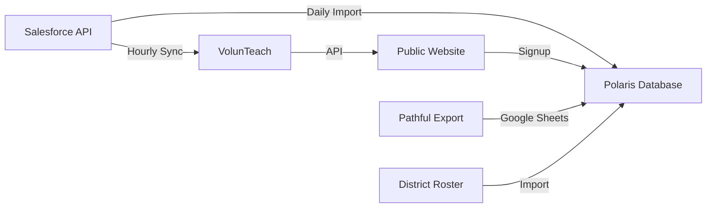
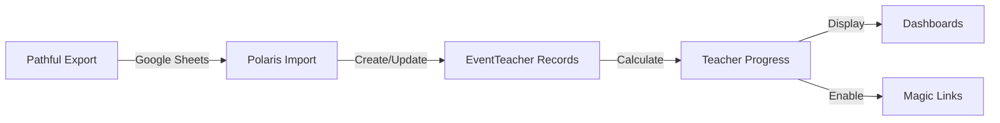
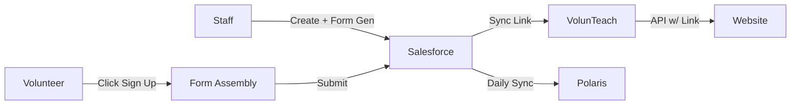
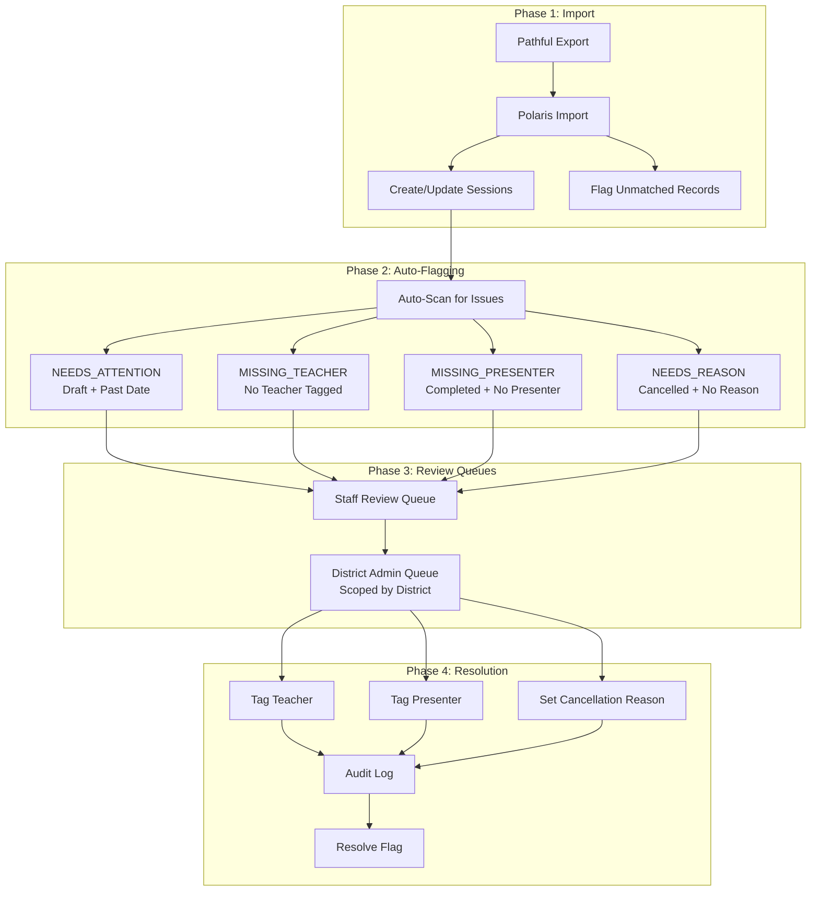
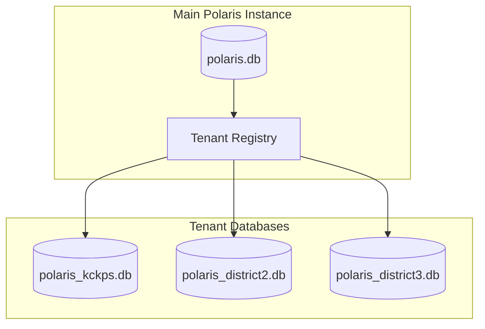
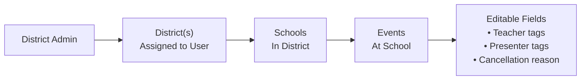

# System Architecture

**Integration flows and source-of-truth ownership**

## Source of Truth

This document is authoritative for all integration design decisions. Any deviation requires documented exception.

**Related Documentation:**
- [Field Mappings](field_mappings) - Cross-system data flow specifications
- [Integration Contracts](contracts) - Integration boundaries and behaviors
- [Data Dictionary](data_dictionary) - Entity and field definitions
- [Metrics Bible](metrics_bible) - Metric calculation definitions
- [RBAC Matrix](rbac_matrix) - Role-based access control (Security section)
- [Privacy & Data Handling](privacy_data_handling) - Data protection and retention policies (Security section)

## System Context

The VMS integrates five core systems:

| System | Purpose | Owns |
|--------|---------|------|
| **Salesforce (SF)** | Core data entry, CRM, in-person events, student attendance, email logging | Event details, student data, communication logs |
| **VolunTeach (VT)** | Event sync + website publishing controls | Publish toggle, district links |
| **Website (WEB)** | Public event display + volunteer signup | Signup capture (input only) |
| **Polaris (POL)** | Virtual events, recruitment, dashboards, reporting | Virtual events, teacher roster, metrics |
| **Pathful (PATH)** | Virtual signup + reminders + attendance | Session signups, attendance status |

**Reference:** [Getting Started - Core Systems](getting_started#core-systems)

## Integration Diagram

```
(staff create)                 (publish controls)
Salesforce Events  ───────sync──────►  VolunTeach  ───API──► Website listings
│   ▲                                  │               │
│   │                                  │               └──►Volunteer Signup (public)
│   │                                  │                          │
│   │                                  └────district links────────┘
│   │
│   └────Gmail add-on logs────► SF Email Logs ──sync──► Polaris Comms History
│
└────Student attendance────► SF Student Participation ─ETL─► Polaris Reporting

Pathful (virtual signup + attendance export)
└──────────export──────────► Polaris Import ──► Teacher progress

District Roster Import ──────────────────────► Polaris ──► Dashboards + Magic Links

Public Signup (Form Assembly) ──API──► Salesforce ──Sync──► Polaris
```

**Integration Details:**

- **SF → VolunTeach**: Event sync (idempotent on `salesforce_id`)
- **VolunTeach → Website**: API for event listings, volunteer signup
- **SF → Polaris**: Daily ETL imports (events, volunteers, students, organizations, history)
- **Pathful → Polaris**: Virtual session data via Google Sheets import
- **Website (Form Assembly) → Salesforce**: Volunteer signup creates Contact/Participation in SF
- **Salesforce → Polaris**: Daily sync imports new volunteer records

## Source of Truth Ownership

**Golden Rule:** Every field has exactly one owner. Downstream systems copy but never edit owned fields.

| Domain | Owner | Downstream Readers | Notes |
|--------|-------|-------------------|-------|
| In-person event core fields | Salesforce | VolunTeach, Website, Polaris | Title, dates, location, status, etc. |
| In-person page visibility | VolunTeach | Website | `Event.inperson_page_visible` field |
| District event linking | VolunTeach | Website | `Event.district_links[]` array |
| Virtual event definition | Polaris | — | Created/managed in Polaris |
| Virtual attendance/signup | Pathful | Polaris (derived) | Imported via Google Sheets. Pathful sends all reminder emails to prevent duplication. |
| Teacher roster (eligible set) | Polaris (import) | Dashboards, magic links | `TeacherProgress` table |
| Student attendance | Salesforce | Polaris (aggregates) | Row-level data in SF, aggregates in Polaris |
| Communication logs | Salesforce | Polaris | Email logs via Gmail add-on |
| Volunteer identity | Polaris | — | Normalized email is primary key |
| Volunteer demographics | Salesforce | Polaris | Race, gender, education, age |
| Organization data | Salesforce | Polaris | Account records |
| Virtual event session data | Pathful | Polaris (imported) | Title, session date, student counts, attendance status |
| Virtual event relationships | Polaris | — | Teacher/presenter tags, cancellation reasons, flags |
| Cancellation reasons | Polaris | — | Set by staff or district admin post-import |
| Virtual event audit logs | Polaris | — | Change history, user actions |
| District admin scope | Polaris | — | User-district assignments for access control |

**VT-Owned Fields (preserved during SF sync):**

- `Event.inperson_page_visible`: Boolean flag controlled by VolunTeach
- `Event.district_links[]`: Array of district links controlled by VolunTeach

**Implementation:**
- Reference: [Field Mappings](field_mappings) for detailed field mappings
- Reference: [Data Dictionary](data_dictionary) for entity definitions

## Conflict Resolution Rules

### R1 — In-person event: Salesforce wins

If SF and VT disagree on mapped fields, VT is overwritten on next sync.

**Exceptions:** VT-owned fields are preserved:
- `inperson_page_visible` (VT-controlled)
- `district_links[]` (VT-controlled)

**Implementation:**
- Sync behavior: Idempotent on `salesforce_id`
- SF edits overwrite VT on next sync
- VT-owned fields preserved during sync
- Reference: `routes/events/routes.py`, `routes/events/pathway_events.py`
- Reference: [Field Mappings - Salesforce → VolunTeach](field_mappings#1-salesforce--volunteach-in-person-sync)

### R2 — Volunteer identity: Polaris wins

Normalized email is the identity key. SF contact linkage is secondary.

**Implementation:**
- Primary key: `Email.email` (normalized lowercase)
- Deduplication: By normalized email
- SF linkage: `Volunteer.salesforce_individual_id` (optional, for sync)
- Reference: [Field Mappings - Canonical Join Keys](field_mappings#canonical-join-keys)

### R3 — Teacher roster: Import wins

Unmatched Pathful teachers are flagged, not auto-created. Roster name beats Pathful name.

**Implementation:**
- TeacherProgress is authoritative list
- Pathful imports match to TeacherProgress by email
- Unmatched teachers flagged, not auto-created
- Reference: [Field Mappings - Pathful Export](field_mappings#6-pathful-export--polaris)

### R4 — Teacher progress: Derived from Pathful

Achieved/In Progress/Not Started always computed from imported participation + current date.

**Implementation:**
- Calculated via `TeacherProgress.get_progress_status()`
- Uses `EventTeacher.attendance_confirmed_at` for completed sessions
- Uses `Event.start_date` for planned sessions
- Reference: [Metrics Bible - Teacher Progress Statuses](metrics_bible#teacher-progress-statuses)

### R5 — Student counts: Salesforce wins

Metrics derived from SF attendance. Polaris surfaces freshness timestamps.

**Implementation:**
- Student attendance data from Salesforce
- Polaris aggregates for reporting
- Data freshness timestamps shown in dashboards
- Reference: [Metrics Bible - Student Metrics](metrics_bible#student-metrics)

### R6 — Timezone normalization

All timestamps stored as ISO-8601 with timezone. Default: America/Chicago.

**Implementation:**
- All datetime fields: `DateTime(timezone=True)`
- Parsing: `parse_date()` function handles multiple formats
- Storage: UTC in database, displayed in America/Chicago
- Reference: [Field Mappings - Normalization Rules](field_mappings#normalization-rules-apply-everywhere)

### R7 — Virtual event: Ownership split

Pathful owns session data (title, date, student counts, attendance). Polaris owns relationship data (teacher/presenter tags, cancellation reasons).

**Implementation:**
- Pathful-owned fields: read-only in Polaris, updated only via import
  - `Event.title`, `Event.session_date`, `Event.student_count`
  - `EventTeacher.attendance_status`, `EventTeacher.signup_date`
- Polaris-owned fields: editable by staff and district admins with scope
  - `EventTeacher.teacher_id`, `EventVolunteer.volunteer_id` (tagging)
  - `Event.cancellation_reason`, `Event.cancellation_notes`
  - `VirtualEventAuditLog` entries
- District admins can only edit Polaris-owned fields for events in their districts
- All edits logged with user identity and role
- Reference: [DEC-009: District Admin Access](dev/pathful_import_recommendations#dec-009)

## Sync Cadences

**Automation:** All automated syncs are managed and triggered by PythonAnywhere scheduled tasks.

| Integration | Cadence | Manual Trigger | Implementation |
|-------------|---------|----------------|----------------|
| SF → VolunTeach | Hourly | Yes | VolunTeach sync process |
| SF Comms → Polaris | Daily | Yes | `routes/history/routes.py` `/history/import-from-salesforce` |
| SF In-Person Events → Polaris | Daily | Yes | `routes/events/routes.py` `/events/import-from-salesforce` |
| SF Volunteers → Polaris | Daily | Yes | `routes/volunteers/routes.py` `/volunteers/import-from-salesforce` |
| SF Students → Polaris | Daily | Yes | `routes/students/routes.py` `/students/import-from-salesforce` |
| SF Organizations → Polaris | Daily | Yes | `routes/organizations/routes.py` `/organizations/import-from-salesforce` |
| SF Schools/Classes → Polaris | Weekly | Yes | `routes/management/management.py` import routes |
| Pathful → Polaris | Daily | Yes | `routes/virtual/routes.py` `/virtual/import-sheet` |
| Roster → Polaris | Manual (2 week cadence) | Yes | `routes/virtual/usage.py` teacher progress import |
| API Health Monitor | Hourly | Yes (Script) | `scripts/monitor_api.py` checks signup API |

**Daily Import Script:**
- Script: `scripts/daily_imports/daily_imports.py`
- Schedule: Daily at 2:00 AM (PythonAnywhere)
- Command: `python scripts/daily_imports/daily_imports.py --daily`
- Sequence: Organizations → Volunteers → Affiliations → Events → History

**Weekly Import Script:**
- Same script with `--weekly` flag
- Includes: Daily imports + Schools + Classes + Teachers

**Virtual Session Import:**
- Script: `scripts/daily_imports/run_virtual_import_2025_26_standalone.py`
- Schedule: As needed (often daily or weekly)
- Source: Google Sheets (configured in admin panel)

**Reference:** [Import Playbook](import_playbook) for detailed procedures

## Integration Details

### Salesforce → VolunTeach

**Purpose:** Sync in-person events for website publishing

**Flow:**
1. Staff creates event in Salesforce
2. VolunTeach syncs event (hourly or manual)
3. Staff configures publish controls in VolunTeach
4. Event appears on website based on visibility settings

**Key Fields:**
- SF owns: Event core fields (title, dates, location, etc.)
- VT owns: `inperson_page_visible`, `district_links[]`

**Sync Behavior:**
- Idempotent on `salesforce_id`
- SF edits overwrite VT on next sync
- VT-owned fields preserved during sync

**Implementation:**
- Reference: [Field Mappings - Salesforce → VolunTeach](field_mappings#1-salesforce--volunteach-in-person-sync)
- Contract: [Contract A: Salesforce → VolunTeach](contract_a)

### VolunTeach → Website

**Purpose:** Display events and direct users to the Form Assembly signup form.

**Flow:**
1. VolunTeach API provides event listings (including `registration_link`)
2. Website displays events based on visibility settings
3. **"Sign Up" button** links directly to the Form Assembly URL provided by Salesforce
4. User submits form → Data goes to Salesforce → Polaris Syncs daily

**Visibility Rules:**
- `inperson_page_visible = True`: Event appears on public in-person page
- `district_links[]` contains district: Event appears on district-specific page
- Both can be true (event appears in both places)

**Implementation:**
- Website: [https://prepkc.org/volunteer.html](https://prepkc.org/volunteer.html)
- Contract: [Contract B: Website ↔ VolunTeach API](contract_b)
- Reference: [User Stories - Event Publishing](user_stories#us-102), [US-103](user_stories#us-103), [US-104](user_stories#us-104)

### Salesforce → Polaris

**Purpose:** Import core data for reporting and dashboards

**Flow:**
1. Daily import script runs at 2:00 AM
2. Connects to Salesforce API
3. Queries Contact, Event, Account records
4. Creates/updates Polaris records
5. Idempotent (safe to re-run)

**Import Types:**
- Volunteers, Teachers, Students (Contact records)
- Events (Session__c records)
- Organizations (Account records)
- History (Task and EmailMessage records)
- Schools, Classes (Account and Class records)

**Implementation:**
- Daily script: `scripts/daily_imports/daily_imports.py`
- Reference: [Import Playbook - Salesforce Imports](import_playbook#playbook-d-salesforce-imports)

### Pathful → Polaris

**Purpose:** Import virtual session attendance and update teacher progress

**Flow:**
1. Pathful exports session data
2. Data formatted in Google Sheet
3. Polaris imports via `/virtual/import-sheet`
4. Creates/updates EventTeacher records
5. Teacher progress statuses recalculated

**Implementation:**
- Route: `routes/virtual/routes.py` `/virtual/import-sheet`
- Contract: [Contract D: Pathful Export → Polaris](contract_d)
- Reference: [Field Mappings - Pathful Export](field_mappings#6-pathful-export--polaris)
- Reference: [Import Playbook - Pathful Import](import_playbook#playbook-a-pathful-export--polaris-via-virtual-session-import)

### Gmail Add-on → Salesforce → Polaris

**Purpose:** Track email communications with volunteers

**Flow:**
1. Staff sends email via Gmail
2. Gmail add-on logs email to Salesforce
3. Polaris imports email logs daily
4. Email appears in volunteer communication history

**Implementation:**
- Route: `routes/history/routes.py` `/history/import-from-salesforce`
- Source: Salesforce Task and EmailMessage records
- Contract: [Contract C: Gmail Logging → Polaris](contract_c)
- Reference: [User Stories - Communication History](user_stories#us-404)

### Website → Polaris

**Purpose:** Create volunteer records from public signups

**Flow:**
1. Volunteer signs up on website (Form Assembly form)
2. Form data creates Contact/Participation in Salesforce
3. Polaris daily sync imports the new record
4. Deduplication by normalized email

**Implementation:**
- Form: Form Assembly integration (managed externally)
- Import: `routes/volunteers/routes.py` (via Salesforce Sync)
- Reference: [Field Mappings - Website Signup](field_mappings#2-website-signup--sf--polaris)

### District Roster Import → Polaris

**Purpose:** Establish teacher list for progress tracking

**Flow:**
1. Staff imports teacher roster from Google Sheet
2. Creates TeacherProgress records
3. Teachers become eligible for magic links
4. Progress tracking enabled

**Implementation:**
- Route: `routes/virtual/usage.py` teacher progress import
- Model: `models/teacher_progress.py`
- Reference: [Field Mappings - Teacher Roster Import](field_mappings#4-teacher-roster-import)

## Data Flow Diagrams

### Salesforce to Polaris Integration



### Virtual Session Data Flow



### In-Person Event Publishing Flow



### Post-Import Data Management Flow



## System URLs

| System | URL | Purpose |
|--------|-----|---------|
| **Salesforce** | [https://prep-kc.my.salesforce.com/](https://prep-kc.my.salesforce.com/) | Core CRM system |
| **VolunTeach** | [https://voluntold-prepkc.pythonanywhere.com/dashboard](https://voluntold-prepkc.pythonanywhere.com/dashboard) | Admin interface for event management |
| **Public Website** | [https://prepkc.org/volunteer.html](https://prepkc.org/volunteer.html) | Volunteer hub with signup pages |
| **Polaris** | Internal system | Virtual events, dashboards, reporting |

**Reference:** [Getting Started - System URLs](getting_started#system-urls-and-locations)

---

## Multi-Tenancy Architecture (District Suite)

> [!NOTE]
> **District Suite** extends Polaris to support multiple district tenants, each with isolated data and users. This section documents the architectural decisions for the multi-tenant platform.

### Tenant Isolation Strategy

**Database-per-Tenant Model:**
- Each tenant has a dedicated SQLite database file
- Naming convention: `polaris_{tenant_slug}.db` (e.g., `polaris_kckps.db`)
- Main database (`polaris.db`) stores tenant registry and PrepKC-only data
- No cross-tenant data access at the database level



### Tenant-Aware Request Routing

| Step | Description |
|------|-------------|
| 1 | User authenticates (login or API key) |
| 2 | System identifies tenant from user or API key |
| 3 | `g.tenant` set in Flask context |
| 4 | Database connection routed to tenant's SQLite file |
| 5 | All queries scoped to tenant's database |

**Implementation:**
- Middleware: `before_request` handler sets tenant context
- Database binding: SQLAlchemy session uses tenant-specific connect string
- Logout/session end: Clears tenant context

### Shared vs. Tenant-Specific Data

| Data Type | Location | Shared? | Notes |
|-----------|----------|---------|-------|
| Schools, Districts | Both | Copied on provision | Reference data duplicated to tenant DB |
| Skills, Career Types | Both | Copied on provision | Reference data duplicated |
| Volunteers | Tenant DB | No | Strictly tenant-isolated |
| Events (district-created) | Tenant DB | No | Strictly tenant-isolated |
| Events (PrepKC) | Main DB | Read-only to tenants | Phase 5 visibility |
| Users | Both | No | Main DB for PrepKC users, tenant DB for district users |

### Tenant Provisioning

**Workflow:**
1. PrepKC admin creates tenant in main database
2. System creates new SQLite database file
3. System runs Alembic migrations on new database
4. System copies reference data (schools, skills, career types)
5. System creates initial admin user
6. System generates API key

**Reference:** [FR-TENANT-101](requirements#fr-tenant-101) through [FR-TENANT-107](requirements#fr-tenant-107)

---

## Public Event API Architecture (District Suite)

> [!NOTE]
> The Public Event API enables districts to embed their event listings on external websites. The API is read-only and tenant-scoped.

### API Overview

| Aspect | Specification |
|--------|---------------|
| Base URL | `/api/v1/district/{tenant_slug}` |
| Authentication | API Key in `X-API-Key` header |
| Format | JSON |
| Methods | GET only (read-only API) |

### Endpoints

| Endpoint | Description | Response |
|----------|-------------|----------|
| `GET /events` | List published events | Paginated event array |
| `GET /events/{slug}` | Single event details | Event object |

### Authentication & Security

**API Key Management:**
- Each tenant has one API key
- Key stored hashed in tenant record
- Key can be rotated by tenant admin
- Previous key immediately invalidated on rotation

**Request Flow:**
```
Request → Extract X-API-Key → Hash and lookup → Validate tenant → Return data
```

### Rate Limiting

| Limit Type | Threshold | Window |
|------------|-----------|--------|
| Per-minute | 60 requests | 1 minute |
| Per-hour | 1,000 requests | 1 hour |
| Per-day | 10,000 requests | 24 hours |

**Exceeded Response:**
```json
{
  "success": false,
  "error": "Rate limit exceeded",
  "retry_after": 60
}
```

### CORS Configuration

- Origins: Allowed origins configured per tenant (or `*` for public)
- Methods: `GET, OPTIONS`
- Headers: `X-API-Key, Content-Type`

### Response Envelope

All responses follow consistent structure:

```json
{
  "success": true,
  "data": { ... },
  "pagination": {
    "page": 1,
    "per_page": 20,
    "total": 45
  }
}
```

**Reference:** [FR-API-101](requirements#fr-api-101) through [FR-API-108](requirements#fr-api-108)

---

## District Admin Access Architecture (Virtual Events)

> [!NOTE]
> This section documents the access control architecture for district administrators to review and correct virtual session data within their district scope.

### Access Scoping

| User Role | Scope | Access Level |
|-----------|-------|-------------|
| PrepKC Staff | Global | Full read/write on all virtual events |
| PrepKC Admin | Global | Full read/write + audit log access |
| District Admin | District-scoped | Read/write only on events at schools in assigned districts |
| District Coordinator | District-scoped | Read-only access to events in assigned districts |

### District-Event Relationship



### Permission Table

| Field/Action | Staff | District Admin (scoped) | Notes |
|--------------|-------|-------------------------|-------|
| View event details | ✅ | ✅ (within district) | Title, date, students, status |
| Tag/untag teachers | ✅ | ✅ (within district) | Polaris-owned field |
| Tag/untag presenters | ✅ | ✅ (within district) | Polaris-owned field |
| Set cancellation reason | ✅ | ✅ (within district) | Polaris-owned field |
| Edit title/date | ✅ | ❌ | Pathful-owned fields |
| Edit student counts | ✅ | ❌ | Pathful-owned fields |
| View audit log | ✅ | ✅ (own entries only) | |
| Export audit log | ✅ | ❌ | Staff-only |

### Audit Logging

All changes to virtual events are logged with:

| Field | Description |
|-------|-------------|
| `user_id` | ID of user making change |
| `user_role` | Role at time of change (staff/district_admin) |
| `district_id` | District context (if district admin) |
| `event_id` | Event being modified |
| `action` | Action type (TAG_TEACHER, TAG_PRESENTER, SET_CANCELLATION_REASON, etc.) |
| `field_changed` | Field that was modified |
| `old_value` | Value before change |
| `new_value` | Value after change |
| `timestamp` | When change occurred |
| `ip_address` | Client IP (for security audits) |

**Reference:** [DEC-010: Audit Logging](dev/pathful_import_recommendations#dec-010)

---

## Related Requirements

- [FR-INPERSON-108](requirements#fr-inperson-108): Scheduled daily imports
- [FR-INPERSON-110](requirements#fr-inperson-110): Batch processing for large datasets
- [FR-RECRUIT-305](requirements#fr-recruit-305): Communication history from Salesforce
- [FR-DISTRICT-501](requirements#fr-district-501): District viewer access
- [FR-TENANT-101](requirements#fr-tenant-101) through [FR-TENANT-107](requirements#fr-tenant-107): Tenant infrastructure
- [FR-API-101](requirements#fr-api-101) through [FR-API-108](requirements#fr-api-108): Public API
- [FR-VIRTUAL-224](requirements#fr-virtual-224) through [FR-VIRTUAL-233](requirements#fr-virtual-233): Post-import data management (Phase D)

## Related User Stories

- [US-102](user_stories#us-102): Toggle publish visibility
- [US-104](user_stories#us-104): Link events to districts
- [US-404](user_stories#us-404): View communication history
- [US-1001](user_stories#us-1001): Create and configure district tenant
- [US-1201](user_stories#us-1201): District embeds events on website
- [US-310](user_stories#us-310): District admin reviews virtual session data
- [US-311](user_stories#us-311): Set cancellation reasons
- [US-312](user_stories#us-312): View audit trail

---

*Last updated: January 2026*
*Version: 1.1*
