# Test Packs

Comprehensive test cases for all major workflows

---

## Quick Navigation

| Pack | Focus Area | Test Cases |
|------|------------|------------|
| [Test Pack 1](#test-pack-1-district-progress-dashboard) | Teacher magic links + progress | TC-001–045 |
| [Test Pack 2](#test-pack-2-in-person-event-public-features) | Event creation + signup | TC-100–162 |
| [Test Pack 3](#test-pack-3-virtual-events) | Pathful import + presenter | TC-200–299 |
| [Test Pack 4](#test-pack-4-volunteer-recruitment) | Search + communication history | TC-300–381 |
| [Test Pack 5](#test-pack-5-student-attendance) | Roster + attendance | TC-600–691 |
| [Test Pack 6](#test-pack-6-reporting-dashboards) | Exports + ad hoc queries | TC-700–822 |
| [Test Pack 7](#test-pack-7-data-integrity--operations) | Sync + imports + data ops | TC-160–222, TC-901–913 |
| [Test Pack 8](#test-pack-8-tenant-management) | District Suite CRUD | TC-801–1135 |

---

## Overview

This documentation contains **8 test packs** that verify ~178 functional requirements are met across the entire VMS system. Each test pack focuses on specific workflows and includes detailed test cases with expected outcomes.

```mermaid
graph LR
    subgraph "Test Packs"
        TP1[TP1: District]
        TP2[TP2: In-Person]
        TP3[TP3: Virtual]
        TP4[TP4: Recruitment]
        TP5[TP5: Students]
        TP6[TP6: Reporting]
        TP7[TP7: Data Ops]
        TP8[TP8: Tenants]
    end

    FR[📝 Functional Requirements] --> TP1 & TP2 & TP3 & TP4 & TP5 & TP6 & TP7 & TP8
```

---

## Test Pack Summary

| Pack | Title | Focus Area | Requirements Covered |
|------|-------|------------|---------------------|
| [Test Pack 1](test-pack-1) | District Progress Dashboard | Teacher magic links + progress status validation | [FR-DISTRICT-501](requirements-district#fr-district-501)–[FR-DISTRICT-543](requirements-district#fr-district-543) |
| [Test Pack 2](test-pack-2) | In-Person Event Public Features | Event creation + website signup + email | [FR-INPERSON-101](requirements-in-person#fr-inperson-101)–[FR-INPERSON-133](requirements-in-person#fr-inperson-133), [FR-SIGNUP-121](requirements-in-person#fr-signup-121)–[FR-SIGNUP-127](requirements-in-person#fr-signup-127) |
| [Test Pack 3](test-pack-3) | Virtual Events | Polaris creation + Pathful import + historical data | [FR-VIRTUAL-201](requirements-virtual#fr-virtual-201)–[FR-VIRTUAL-233](requirements-virtual#fr-virtual-233) |
| [Test Pack 4](test-pack-4) | Volunteer Recruitment | Search + communication history + sync health | [FR-RECRUIT-301](requirements-recruitment#fr-recruit-301)–[FR-RECRUIT-336](requirements-recruitment#fr-recruit-336) |
| [Test Pack 5](test-pack-5) | Student Attendance | Roster + attendance + impact metrics | [FR-STUDENT-601](requirements-student#fr-student-601)–[FR-STUDENT-604](requirements-student#fr-student-604) |
| [Test Pack 6](test-pack-6) | Reporting Dashboards | Exports + ad hoc queries + access control | [FR-REPORTING-401](requirements-reporting#fr-reporting-401)–[FR-REPORTING-434](requirements-reporting#fr-reporting-434) |
| [Test Pack 7](test-pack-7) | Data Integrity & Operations | Duplicates + Sync + Admin Safety + Imports | [FR-DATA-901](requirements-data-operations#fr-data-901)–[FR-OPS-907](requirements-data-operations#fr-ops-907) |
| [Test Pack 8](test-pack-8) | Tenant Management | District Suite tenant CRUD + configuration | [FR-TENANT-101](requirements-district-suite#fr-tenant-101)–[FR-API-108](requirements-district-suite#fr-api-108) |

[↑ Back to Navigation](#quick-navigation)

---

## Test Pack Details

### Test Pack 1: District Progress Dashboard

**Focus:** Teacher magic links + progress status validation

**Coverage:**
- [FR-DISTRICT-501](requirements-district#fr-district-501)–[FR-DISTRICT-503](requirements-district#fr-district-503) (Dashboard)
- [FR-DISTRICT-508](requirements-district#fr-district-508) (Status definitions)
- [FR-DISTRICT-505](requirements-district#fr-district-505)–[FR-DISTRICT-507](requirements-district#fr-district-507) (Magic links)
- [FR-DISTRICT-521](requirements-district#fr-district-521)–[FR-DISTRICT-524](requirements-district#fr-district-524) (RBAC/Scoping)
- [FR-DISTRICT-540](requirements-district#fr-district-540)–[FR-DISTRICT-543](requirements-district#fr-district-543) (Semester Reset)

**Test Cases:** TC-001 through TC-045

[View Full Test Pack →](test-pack-1)

[↑ Back to Navigation](#quick-navigation)

---

### Test Pack 2: In-Person Event Public Features

**Focus:** Event creation + website signup + email

**Coverage:**
- [FR-INPERSON-101](requirements-in-person#fr-inperson-101)–[FR-INPERSON-109](requirements-in-person#fr-inperson-109) (Events + visibility)
- [FR-SIGNUP-121](requirements-in-person#fr-signup-121)–[FR-SIGNUP-127](requirements-in-person#fr-signup-127) (Signup + email)
- [FR-INPERSON-108](requirements-in-person#fr-inperson-108)–[FR-INPERSON-133](requirements-in-person#fr-inperson-133) (Scheduled imports, sync)

**Test Cases:** TC-100 through TC-162

[View Full Test Pack →](test-pack-2)

[↑ Back to Navigation](#quick-navigation)

---

### Test Pack 3: Virtual Events

**Focus:** Polaris creation + Pathful import + historical data

**Coverage:**
- [FR-VIRTUAL-201](requirements-virtual#fr-virtual-201)–[FR-VIRTUAL-206](requirements-virtual#fr-virtual-206) (Virtual events)
- [FR-VIRTUAL-208](requirements-virtual#fr-virtual-208) (Local/non-local)
- [FR-VIRTUAL-204](requirements-virtual#fr-virtual-204) (Historical import)
- [FR-VIRTUAL-210](requirements-virtual#fr-virtual-210)–[FR-VIRTUAL-219](requirements-virtual#fr-virtual-219) (Presenter recruitment)
- [FR-VIRTUAL-230](requirements-virtual#fr-virtual-230)–[FR-VIRTUAL-233](requirements-virtual#fr-virtual-233) (Auto-flagging, audit)

**Test Cases:** TC-200 through TC-299

[View Full Test Pack →](test-pack-3)

[↑ Back to Navigation](#quick-navigation)

---

### Test Pack 4: Volunteer Recruitment

**Focus:** Search + communication history + sync health

**Coverage:**
- [FR-RECRUIT-301](requirements-recruitment#fr-recruit-301)–[FR-RECRUIT-306](requirements-recruitment#fr-recruit-306) (Search + history)
- [FR-RECRUIT-308](requirements-recruitment#fr-recruit-308)–[FR-RECRUIT-309](requirements-recruitment#fr-recruit-309) (Comm sync + health UX)
- [FR-RECRUIT-310](requirements-recruitment#fr-recruit-310)–[FR-RECRUIT-336](requirements-recruitment#fr-recruit-336) (Intelligent matching)

**Test Cases:** TC-300 through TC-381

[View Full Test Pack →](test-pack-4)

[↑ Back to Navigation](#quick-navigation)

---

### Test Pack 5: Student Attendance

**Focus:** Roster + attendance + impact metrics

**Coverage:**
- [FR-STUDENT-601](requirements-student#fr-student-601)–[FR-STUDENT-604](requirements-student#fr-student-604) (Student roster + attendance + metrics)

**Test Cases:** TC-600 through TC-691

[View Full Test Pack →](test-pack-5)

[↑ Back to Navigation](#quick-navigation)

---

### Test Pack 6: Reporting Dashboards

**Focus:** Exports + ad hoc queries + access control

**Coverage:**
- [FR-REPORTING-401](requirements-reporting#fr-reporting-401)–[FR-REPORTING-409](requirements-reporting#fr-reporting-409) (Dashboards + partner reconciliation)
- [FR-REPORTING-420](requirements-reporting#fr-reporting-420)–[FR-REPORTING-425](requirements-reporting#fr-reporting-425) (Cache management)
- [FR-REPORTING-430](requirements-reporting#fr-reporting-430)–[FR-REPORTING-434](requirements-reporting#fr-reporting-434) (Year-end reporting)
- [FR-DISTRICT-521](requirements-district#fr-district-521)–[FR-DISTRICT-522](requirements-district#fr-district-522) (RBAC)

**Test Cases:** TC-700 through TC-822

[View Full Test Pack →](test-pack-6)

[↑ Back to Navigation](#quick-navigation)

---

### Test Pack 7: Data Integrity & Operations

**Focus:** Duplicates + Sync + Admin Safety + Import Logic

**Coverage:**
- [FR-DATA-901](requirements-data-operations#fr-data-901)–[FR-DATA-903](requirements-data-operations#fr-data-903) (Data Integrity)
- [FR-OPS-904](requirements-data-operations#fr-ops-904)–[FR-OPS-907](requirements-data-operations#fr-ops-907) (Operational Workflows)
- [FR-INPERSON-108](requirements-in-person#fr-inperson-108)–[FR-INPERSON-133](requirements-in-person#fr-inperson-133) (Scheduled Imports, Sync, Error Handling)

**Test Cases:** TC-901 through TC-913, TC-160 through TC-222

[View Full Test Pack →](test-pack-7)

[↑ Back to Navigation](#quick-navigation)

---

### Test Pack 8: Tenant Management

**Focus:** District Suite tenant CRUD + configuration

**Coverage:**
- [FR-TENANT-101](requirements-district-suite#fr-tenant-101)–[FR-TENANT-112](requirements-district-suite#fr-tenant-112) (Tenant lifecycle + users)
- [FR-SELFSERV-201](requirements-district-suite#fr-selfserv-201)–[FR-SELFSERV-405](requirements-district-suite#fr-selfserv-405) (Self-service features)
- [FR-API-101](requirements-district-suite#fr-api-101)–[FR-API-108](requirements-district-suite#fr-api-108) (Public Event API)

**Test Cases:** TC-801 through TC-1135

[View Full Test Pack →](test-pack-8)

[↑ Back to Navigation](#quick-navigation)

---

## Traceability

Each test case (TC-xxx) is linked to one or more functional requirements (FR-xxx). This bidirectional linking ensures:

- **Requirements → Tests:** Each requirement shows which test cases verify it
- **Tests → Requirements:** Each test case shows which requirements it covers

See the [Functional Requirements](requirements) page for complete requirement-to-test mapping.

---

## Test Case Numbering

Test cases are organized by test pack:

| Range | Test Pack |
|-------|-----------|
| TC-001–TC-045 | Test Pack 1 (District Progress) |
| TC-100–TC-162 | Test Pack 2 (In-Person Public Features) |
| TC-200–TC-299 | Test Pack 3 (Virtual Events) |
| TC-300–TC-381 | Test Pack 4 (Volunteer Recruitment) |
| TC-600–TC-691 | Test Pack 5 (Student Attendance) |
| TC-700–TC-822 | Test Pack 6 (Reporting) |
| TC-801–TC-1135 | Test Pack 8 (Tenant Management) |
| TC-901–TC-913, TC-160–TC-222 | Test Pack 7 (Data Integrity & Ops) |

---

## Using Test Packs

| Role | Usage |
|------|-------|
| **Testers** | Follow test cases in order, verify expected outcomes |
| **Developers** | Use as acceptance criteria during development |
| **QA** | Reference when creating automated test suites |
| **Documentation** | Link from requirements to verify coverage |

---

*Last updated: February 2026 · Version 2.0*
