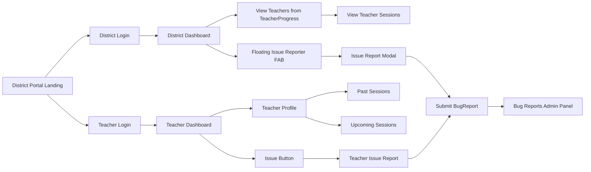

# Data Tracker & Issue Reporting

The **Data Tracker** allows districts and teachers to view participation data and flag issues directly from their dashboards.

## Overview

- **District Users**: View all teachers in their district; flag issues with context.
- **Teachers**: View their own session history (past & upcoming); flag own issues.

---

## For District Users

### Accessing the Dashboard

1. Log in via the **District Portal**.
2. View the **Teacher Progress** list to see completion status.
3. Click a teacher's name to view their **Session History**.

**Routes:**
- `/virtual/usage/district/<district_name>/teacher-progress` — Teacher progress tracking
- `/virtual/usage/district/<district_name>/teacher-breakdown` — Teacher breakdown by school
- `/virtual/usage/district/<district_name>` — District usage overview

### Reporting an Issue

A **Floating Action Button (FAB)** is available on the bottom-right of all screens.

1. Click the **Report Issue** button.
2. **Select Teacher**: Search for the teacher (filtered to your tracking list).
3. **School Information**: Auto-filled from selection, editable if needed.
4. **Select Session** (Optional): Choose a specific session if relevant.
5. **Category**: Choose "Missing Data" or "Incorrect Data".
6. **Notes**: Add details.
7. **Submit**.

> [!NOTE]
> You can only report issues for teachers currently in your district's tracking list (TeacherProgress entries).

---

## For Teachers

### Accessing Your History

**Route**: `/virtual/kck/teacher/<teacher_id>`

1. Log in via the **Teacher Login** option.
2. Your dashboard shows:
   - **Past Sessions**: Completed virtual sessions.
   - **Upcoming Sessions**: Scheduled sessions.

### Flagging an Issue

1. Click the **"Report Issue"** button on your dashboard.
2. Select issue category (Missing/Incorrect Data).
3. Describe the problem.
4. Submit.

---

## Data Visibility Rules

| User Type | Can See |
|-----------|---------|
| District | All sessions for teachers in their district's TeacherProgress list |
| Teacher | Only their own sessions (past and upcoming) |

No cross-district data visibility is allowed.

---

## Issue Review & Resolution

All reported issues appear in the **Bug Reports Admin Panel** at `/management/bug-reports`:

- Filter by Status (open/resolved/all)
- Filter by Type (bug/data_error/other/all)
- Search by description, page title, or URL
- Resolve issues with resolution notes

---

## System Flow

---

## API Reference

### District Issue Reporting

| Endpoint | Method | Description |
|----------|--------|-------------|
| `/virtual/issues/api/search-teachers` | GET | Search teachers filtered by TeacherProgress |
| `/virtual/issues/api/teacher-sessions` | GET | Get sessions for a teacher within date range |
| `/virtual/issues/report` | POST | Submit district issue report |

**Search Teachers Parameters:**
- `q` — Search query
- `virtual_year` — Required
- `district_name` — Required

**Teacher Sessions Parameters:**
- `teacher_id` — Required
- `district_name` — Required
- `date_from`, `date_to` — Optional

---

## Security & Access Control

- All endpoints require `@login_required`
- District endpoints require `@district_scoped_required`
- District access validated against `current_user.allowed_districts`
- Teacher search restricted to TeacherProgress entries

---

## Technical Scope & Traceability

| Component | Items |
|-----------|-------|
| **User Stories** | [US-506](user_stories#us-506), [US-507](user_stories#us-507) |
| **Requirements** | [FR-DISTRICT-525](requirements#fr-district-525), [FR-DISTRICT-526](requirements#fr-district-526), [FR-DISTRICT-527](requirements#fr-district-527), [FR-DISTRICT-528](requirements#fr-district-528) |

### Key Files

| Category | Files |
|----------|-------|
| **Routes** | `routes/virtual/district_portal.py`, `routes/virtual/teacher_dashboard.py`, `routes/virtual/issues.py` |
| **Templates** | `templates/virtual/district_portal/landing.html`, `templates/virtual/teacher_dashboard.html` |
| **Models** | `models/teacher_progress.py`, `models/bug_report.py` |
