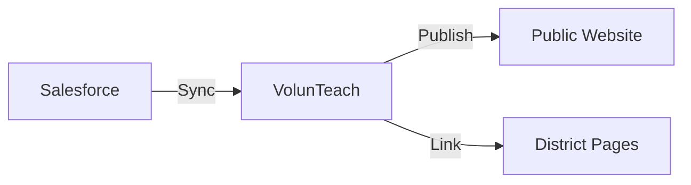

# In-Person Event Management

This guide explains how to create, manage, and publish in-person volunteer events using the Salesforce + VolunTeach integration.

## Overview

The VMS manages in-person events through a synchronized flow:
1.  **Creation**: Events are created and mastered in **Salesforce**.
2.  **Sync**: VolunTeach syncs data from Salesforce (hourly or manually).
3.  **Publication**: Staff control visibility on the **Public Website** and District Pages via VolunTeach.

## Prerequisites

- **Salesforce Access**: Permission to create/edit Campaign records (or Event objects).
- **VolunTeach Admin**: Access to the [VolunTeach Dashboard](https://voluntold-prepkc.pythonanywhere.com/dashboard).

## 1. Creating an Event in Salesforce

All in-person events originate in [Salesforce](https://prep-kc.my.salesforce.com/).

1.  **Navigate to Sessions Tab**: Log in to [Salesforce](https://prep-kc.my.salesforce.com/) and go to the **Sessions** tab (you may need to select it from the App Launcher).
2.  **Click New**: Hit the "New" button.
3.  **Select Record Type**: Choose **"Non-Connector Session"** and click **Next**.
4.  **Fill in Session Details**:
    -   **Session Name**: Use the standard format: `[Visit Type] / [School/District] / [Date] / [Grade]` (if possible).
        > [!TIP]
        > **Data in Action (DIA)**: If this is a DIA event, ensure **"DIA"** is included in the **Session Name** (or Session Type) so it automatically appears on the [Data in Action page](https://prepkc.org/dia.html).
    -   **Session Status**: Set to **"Requested"**.
    -   **School**: If it's a single school event, search and attach the school record.
    -   **Format**: Select **"In-Person"**.
    -   **Session Host**: Enter **"PREP-KC"** (Optional but recommended).
    -   **Times**: Enter **Start Time** and **End Time** (Optional but recommended).
5.  **Description & Location Information**:
    -   Fill these out carefully!

    > [!WARNING]
    > **Calendar Sync Behavior**: The **Location Information** and **Description** fields are only added to the calendar invite **at the point of Session creation**. Updating these fields later in Salesforce *will not* sync changes to the calendar invite.
    >
    > **Recommendation**: Ensure these are correct *before* saving. If you need to update them later, you should update the calendar event manually and choose the option to **NOT** send an update email to attendees.

6.  **Volunteer Job Summaries** (scrolling down):
    -   **Total Requested Volunteer Jobs**: enter the total number of volunteers needed (e.g., `20`).
    -   **Number of Job Types**: Enter the number of distinct roles (e.g., `4`).
    -   *Note: We typically just fill in the numbers.*
7.  **Click Save**.

### Open Questions / Clarifications
> [!NOTE]
> **Process Question**: Regarding "Total Requested Volunteer Jobs" vs "Number of Job Types" - we currently just fill in the numeric values (e.g., "Need 20 volunteers"). Clarification is needed on whether we should be mapping specific job roles in practice.

## 2. Syncing to VolunTeach

VolunTeach automatically syncs changes from Salesforce **every hour**. If you need to see changes immediately (e.g., after fixing a typo), performs a manual sync.

### Manual Sync Steps
1.  Log in to the [VolunTeach Dashboard](https://voluntold-prepkc.pythonanywhere.com/dashboard).
2.  Navigate to the **Events** or **Sync Status** page.
3.  Locate the **"Sync Events"** button (usually top right).

    

4.  Click it to start the process.
5.  Wait for the progress indicator to complete.
    - *Success*: A green banner confirms "Sync completed: X events processed."
    - *Failure*: A red error message will display details.

## 3. Managing Visibility

By default, synced events may be hidden or visible depending on default settings. Staff have full control over where events appear.

### Public Website Visibility
To show/hide an event on the main volunteer hub:
1.  In VolunTeach, find the event in the **Event List**.
2.  Look for the **"Show on Public Page"** toggle.
    - **ON (Pink)** : Visible to everyone on `prepkc.org/volunteer.html`.
    - **OFF (Purple)** : Hidden from the main list (useful for private/internal events).

### Data in Action (DIA) Events
**Exception to the Rule**: Events for "Data in Action" are handled with unique logic to ensure they are always available to volunteers.

-   **Identification**: The system identifies DIA events by matching **"DIA"** in the **Session Type** or **Event Name**.
-   **Automatic Visibility**: These events are served to the website **regardless** of the "Show on Public Page" toggle.
-   **Display Criteria**: A DIA event will appear if:
    1.  It has "DIA" in the Session Type/Name.
    2.  The start date is in the future.
    3.  There are available volunteer slots.
    4.  *(The display toggle is ignored)*.

> [!IMPORTANT]
> If you need to hide a DIA event that meets the above criteria, you must either cancel/delete it or change its name/type to remove "DIA". The visibility toggle will not hide it.

### District Page Visibility
To display an event on a specific district's customized page:
1.  Open the event details in VolunTeach.
2.  Find the **"Linked Districts"** section.
3.  Select the relevant district(s) (e.g., "Hickman Mills School District").
4.  **Save** changes.

> [!NOTE]
> Events linked to a district will appear on that district's page **even if** the main Public Page toggle is OFF. This allows for district-exclusive events.

## 4. Verifying Events on the Website

After publishing events, verify they appear correctly:

1. **Public In-Person Events Page**: [https://prepkc.org/inperson.html](https://prepkc.org/inperson.html)
   - Events with the "Show on Public Page" toggle ON appear here
   - Accessible to all volunteers and the general public

2. **District Overview Page**: [https://prepkc.org/districts/overview.html](https://prepkc.org/districts/overview.html)
   - Shows all district-specific events
   - Only accessible via direct link
   - Each district has their own dedicated page

3. **Data in Action Events Page**: [https://prepkc.org/dia.html](https://prepkc.org/dia.html)
   - Automatically displays events with "DIA" in the name/type
   - Accessible to volunteers specifically looking for DIA opportunities

> [!TIP]
> After making visibility changes in VolunTeach, refresh the website pages to confirm events appear as expected. Changes may take a few moments to propagate.

## Troubleshooting

### Event Not Appearing?
- **Check Salesforce**: Is the record saved? Is it the right record type?
- **Check Sync**: When was the last sync? Try a **Manual Sync**.
- **Check Visibility**: Is the visibility toggle incorrectly set to OFF?

### Data Mismatch?
- If the website shows old data (e.g., wrong time), update it in Salesforce first, then run a Manual Sync in VolunTeach. VolunTeach does not write back to Salesforce; Salesforce is the source of truth.

## Technical Scope & Traceability

This guide addresses the following scopes:

| Component | Items |
|---|---|
| **User Stories** | [US-101](user_stories#us-101), [US-102](user_stories#us-102), [US-103](user_stories#us-103), [US-104](user_stories#us-104) |
| **Requirements** | [FR-INPERSON-101](requirements#fr-inperson-101), [FR-INPERSON-102](requirements#fr-inperson-102), [FR-INPERSON-104](requirements#fr-inperson-104), [FR-INPERSON-107](requirements#fr-inperson-107) |
