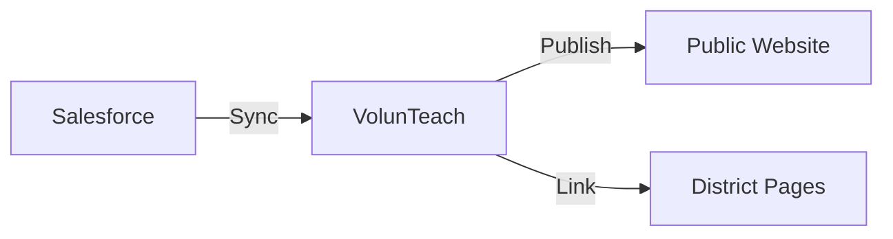

# In-Person Event Management

This guide explains how to create, manage, and publish in-person volunteer events using the Salesforce + VolunTeach integration.

## Overview

The VMS manages in-person events through a synchronized flow:
1.  **Creation**: Events are created and mastered in **Salesforce**.
2.  **Sync**: VolunTeach syncs data from Salesforce (hourly or manually).
3.  **Publication**: Staff control visibility on the **Public Website** and District Pages via VolunTeach.

## Prerequisites

- **Salesforce Access**: Permission to create/edit Campaign records (or Event objects).
- **VolunTeach Admin**: Access to the [VolunTeach Dashboard](https://voluntold-prepkc.pythonanywhere.com/dashboard).

## 1. Creating an Event in Salesforce

All in-person events originate in Salesforce.

1.  Log in to **Salesforce**.
2.  Navigate to the **Campaigns** (or Events) tab.
3.  Click **New**.
4.  Fill in the required fields:
    - **Event Name**: Clear, descriptive title.
    - **Date/Time**: Start and End times.
    - **Location**: School or venue address.
    - **Description**: Public-facing details for volunteers.
    - **Volunteer Slots Needed**: Specific count.
5.  **Save** the record.

> [!IMPORTANT]
> Ensure the event record type is set to "In-Person" to ensure it is picked up by the sync process.

## 2. Syncing to VolunTeach

VolunTeach automatically syncs changes from Salesforce **every hour**. If you need to see changes immediately (e.g., after fixing a typo), performs a manual sync.

### Manual Sync Steps
1.  Log in to the **VolunTeach Dashboard**.
2.  Navigate to the **Events** or **Sync Status** page.
3.  Locate the **"Sync Now"** button (usually top right).
4.  Click it to start the process.
5.  Wait for the progress indicator to complete.
    - *Success*: A green banner confirms "Sync completed: X events processed."
    - *Failure*: A red error message will display details.

## 3. Managing Visibility

By default, synced events may be hidden or visible depending on default settings. Staff have full control over where events appear.

### Public Website Visibility
To show/hide an event on the main volunteer hub:
1.  In VolunTeach, find the event in the **Event List**.
2.  Look for the **"Show on Public Page"** toggle.
    - **ON (Green)**: Visible to everyone on `prepkc.org/volunteer.html`.
    - **OFF (Grey)**: Hidden from the main list (useful for private/internal events).

### District Page Visibility
To display an event on a specific district's customized page:
1.  Open the event details in VolunTeach.
2.  Find the **"District Associations"** section.
3.  Select the relevant district(s) (e.g., "Kansas City Public Schools").
4.  **Save** changes.

> [!NOTE]
> Events linked to a district will appear on that district's page **even if** the main Public Page toggle is OFF. This allows for district-exclusive events.

## Troubleshooting

### Event Not Appearing?
- **Check Salesforce**: Is the record saved? Is it the right record type?
- **Check Sync**: When was the last sync? Try a **Manual Sync**.
- **Check Visibility**: Is the visibility toggle incorrectly set to OFF?

### Data Mismatch?
- If the website shows old data (e.g., wrong time), update it in Salesforce first, then run a Manual Sync in VolunTeach. VolunTeach does not write back to Salesforce; Salesforce is the source of truth.
