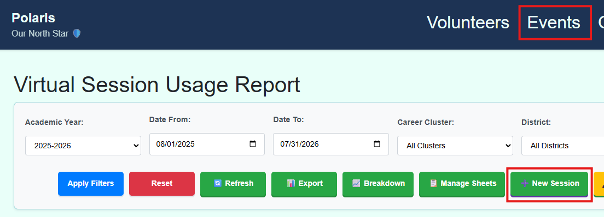
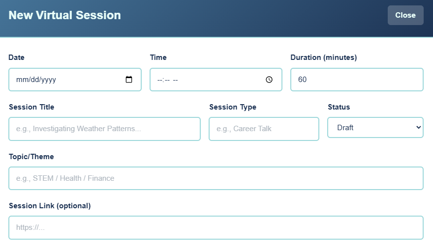
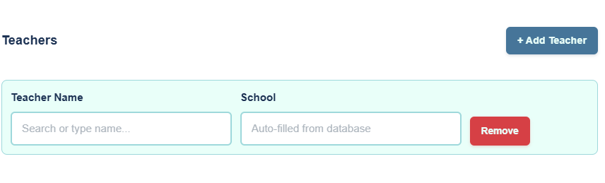
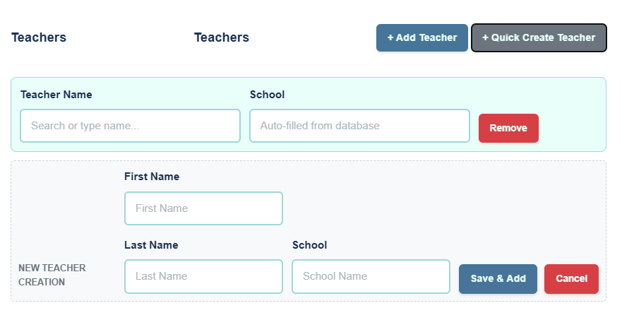
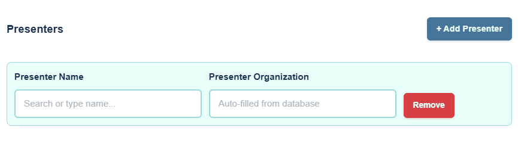

# Virtual Event Management

This guide covers the lifecycle of virtual events in Polaris, including creation, presenter recruitment, and attendance tracking.

## 1. Creating Virtual Events

Virtual events are managed directly in Polaris (unlike In-Person events which sync from Salesforce).

1.  Navigate to **Virtual** in the main menu.
    
2.  Click **"New Session"**.
3.  Fill in details: Title, Date/Time, School, District.
    
4.  **Tag Teachers**: Search/select teachers to associate them with the event.
    
    *   **Quick Create**: If the teacher is not found, click **"Quick Create Teacher"**. Enter the First Name, Last Name, and School, then click **"Save & Add"**. The teacher will be created and added immediately. You can remove the blank search row if it is no longer needed.
    
5.  **Tag Presenters**: Search/select volunteers acting as presenters.
    
    *   **Quick Create**: If the presenter is not found, click **"Quick Create Presenter"**. Enter the required details and click **"Save & Add"** to create and link them immediately.
6.  Click **"Create Session"**.

## 2. Presenter Recruitment

The **Presenter Recruitment View** helps identifying sessions that need volunteers.

-   **Access**: `Reports > Presenter Recruitment` (Admin/Global only).
-   **Status**:
    -   🔴 **Urgent**: ≤ 7 days.
    -   🟡 **Warning**: 8-14 days.
    -   🔵 **Normal**: > 14 days.
-   **Action**: Click an event to "Edit" and tag a presenter. Once a presenter is tagged, the event disappears from this list.

## 3. Importing Data

### Pathful Import
Polaris can ingest attendance data from Pathful exports.
1.  Go to **Import > Pathful**.
2.  Upload the CSV export.
3.  System updates participation records (idempotent; safe to re-run).

### Historical Import
Import past data (2-4 years) from Google Sheets archives.
1.  Go to **Import > Historical**.
2.  Select the Sheet/Year.
3.  Run import.

## Technical Scope & Traceability

This guide addresses the following scopes:

| Component | Items |
|---|---|
| **User Stories** | [US-301](user_stories#us-301), [US-302](user_stories#us-302), [US-303](user_stories#us-303), [US-304](user_stories#us-304), [US-306](user_stories#us-306), [US-307](user_stories#us-307) |
| **Requirements** | [FR-VIRTUAL-201](requirements#fr-virtual-201) through [FR-VIRTUAL-219](requirements#fr-virtual-219) |
